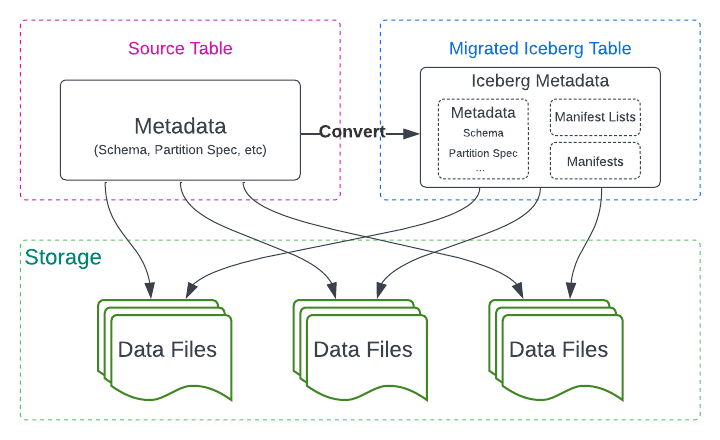
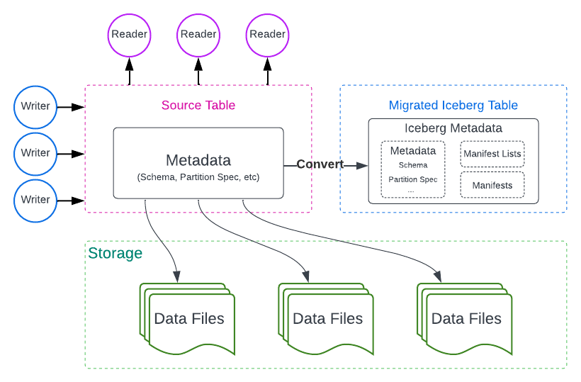
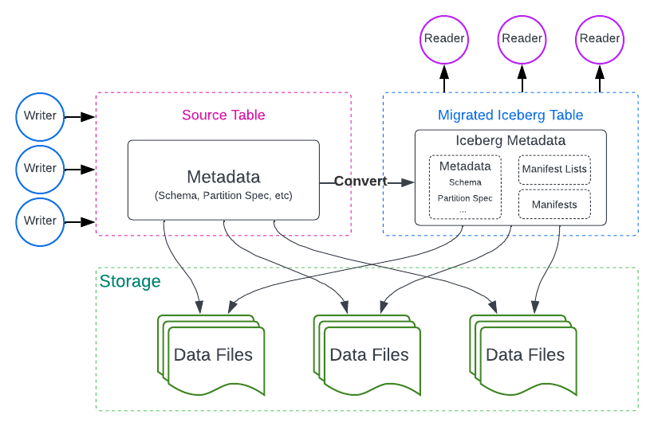
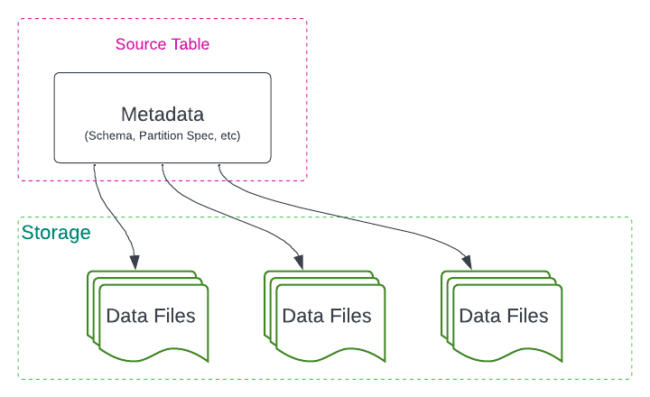
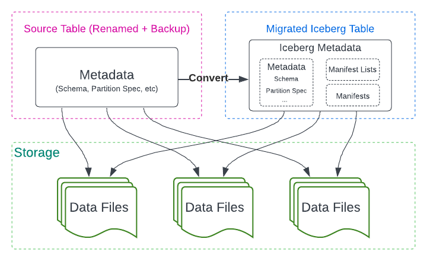
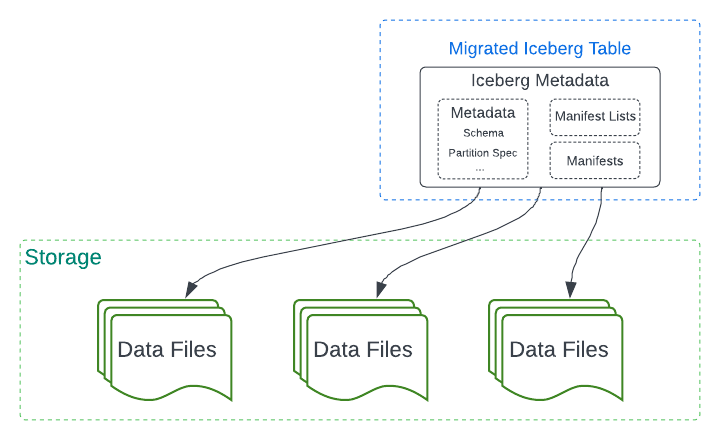

<!--
 - Licensed to the Apache Software Foundation (ASF) under one or more
 - contributor license agreements.  See the NOTICE file distributed with
 - this work for additional information regarding copyright ownership.
 - The ASF licenses this file to You under the Apache License, Version 2.0
 - (the "License"); you may not use this file except in compliance with
 - the License.  You may obtain a copy of the License at
 -
 -   http://www.apache.org/licenses/LICENSE-2.0
 -
 - Unless required by applicable law or agreed to in writing, software
 - distributed under the License is distributed on an "AS IS" BASIS,
 - WITHOUT WARRANTIES OR CONDITIONS OF ANY KIND, either express or implied.
 - See the License for the specific language governing permissions and
 - limitations under the License.
 -->

# Table Migration
Apache Iceberg supports converting existing tables in other formats to Iceberg tables. This section introduces the general concept of table migration, its approaches, and existing implementations in Iceberg.

## Migration Approaches
There are two methods for executing table migration: full data migration and in-place metadata migration.

Full data migration involves copying all data files from the source table to the new Iceberg table. This method makes the new table fully isolated from the source table, but is slower and doubles the space.
In practice, users can use operations like [Create-Table-As-Select](spark-ddl.md#create-table-as-select), [INSERT](spark-writes.md#insert-into), and Change-Data-Capture pipelines to perform such migration.

In-place metadata migration preserves the existing data files while incorporating Iceberg metadata on top of them.
This method is not only faster but also eliminates the need for data duplication. However, the new table and the source table are not fully isolated. In other words, if any processes vacuum data files from the source table, the new table will also be affected.

In this doc, we will describe more about in-place metadata migration.

Apache Iceberg supports the in-place metadata migration approach, which includes three important actions: **Snapshot Table**, **Migrate Table**, and **Add Files**.

## Snapshot Table
The Snapshot Table action creates a new iceberg table with a different name and with the same schema and partitioning as the source table, leaving the source table unchanged during and after the action.

- Create a new Iceberg table with the same metadata (schema, partition spec, etc.) as the source table and a different name. Readers and Writers on the source table can continue to work.

- Commit all data files across all partitions to the new Iceberg table. The source table remains unchanged. Readers can be switched to the new Iceberg table.

- Eventually, all writers can be switched to the new Iceberg table. Once all writers are transitioned to the new Iceberg table, the migration process will be considered complete.

## Migrate Table
The Migrate Table action also creates a new Iceberg table with the same schema and partitioning as the source table. However, during the action execution, it locks and drops the source table from the catalog.
Consequently, Migrate Table requires all modifications working on the source table to be stopped before the action is performed.

Stop all writers interacting with the source table. Readers that also support Iceberg may continue reading.

- Create a new Iceberg table with the same identifier and metadata (schema, partition spec, etc.) as the source table. Rename the source table for a backup in case of failure and rollback.

- Commit all data files across all partitions to the new Iceberg table. Drop the source table. Writers can start writing to the new Iceberg table.

## Add Files
After the initial step (either Snapshot Table or Migrate Table), it is common to find some data files that have not been migrated. These files often originate from concurrent writers who continue writing to the source table during or after the migration process.
In practice, these files can be new data files in Hive tables or new snapshots (versions) of Delta Lake tables. The Add Files action is essential for incorporating these files into the Iceberg table.

# Migrating From Different Table Formats
* [From Hive to Iceberg](hive-migration.md)
* [From Delta Lake to Iceberg](delta-lake-migration.md)
