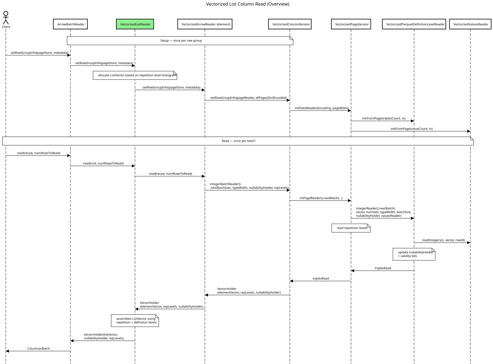

<!--
  - Licensed to the Apache Software Foundation (ASF) under one
  - or more contributor license agreements.  See the NOTICE file
  - distributed with this work for additional information
  - regarding copyright ownership.  The ASF licenses this file
  - to you under the Apache License, Version 2.0 (the
  - "License"); you may not use this file except in compliance
  - with the License.  You may obtain a copy of the License at
  -
  -   http://www.apache.org/licenses/LICENSE-2.0
  -
  - Unless required by applicable law or agreed to in writing,
  - software distributed under the License is distributed on an
  - "AS IS" BASIS, WITHOUT WARRANTIES OR CONDITIONS OF ANY
  - KIND, either express or implied.  See the License for the
  - specific language governing permissions and limitations
  - under the License.
  -->

# Vectorized Reads of Lists from Parquet Files

## Problem statement

Vectorized reads for primitive (scalar) columns work by bulk-copying raw page
bytes — either directly or through bulk decoders — into Arrow data buffers.
This approach does not work for list columns because Parquet and Arrow encode
lists in fundamentally different ways: Parquet uses a per-value Dremel triple
stream, while Arrow uses a validity bitmap plus an offsets buffer over a flat
child vector.

## Parquet three-level list representation and Dremel encoding

Parquet stores lists using the standard three-level nesting:

```
optional|required group my_list (LIST) {   // level 1 — the list field itself
  repeated group list {                    // level 2 — the repeated wrapper group
    optional|required int32 element;       // level 3 — the actual element
  }
}
```

### The Dremel encoding

Each leaf value in this structure is encoded as a **triple**:
`(repetition_level, definition_level, value)`. This is the Dremel encoding.

#### Repetition levels

The repetition level describes where in the list nesting a value falls:

| `rep_level`                | Meaning                                                          |
|----------------------------|------------------------------------------------------------------|
| `< list_repetition_level`  | Starts a new list at this or a higher nesting level              |
| `== list_repetition_level` | Continuation of the current list (next element in the same list) |

For a top-level (non-nested) list, `list_repetition_level == 1` and
`rep_level == 0` marks the start of a new row.

#### Definition levels

The definition level encodes how many optional/repeated fields along the path
are actually present. `max_def_level` depends on which parts of the schema are
`optional`. For the three-level list above:

| schema case (list × element) | `max_def_level` |
|------------------------------|-----------------|
| required × required          | 1               |
| required × optional          | 2               |
| optional × required          | 2               |
| optional × optional          | 3               |

The bottom rung `def_level = max_def_level` always means "the element itself is
present with a value". Working down from there:

- `def_level = max_def_level - 1` — reachable only if the element is optional;
  means the list is present but this slot's element is null.
- Next rung down — reachable only if the list is optional; means the list is
  present but empty (the repeated wrapper group has no children).
- `def_level = 0` — reachable only if the list is optional; means the list
  field itself is null.

As a concrete example, the `optional_list_optional_element` case
(`max_def_level = 3`):

| `def_level` | Meaning                                          |
|-------------|--------------------------------------------------|
| `0`         | The list field itself is null                    |
| `1`         | The list is present but empty                    |
| `2`         | The list has an element and that element is null |
| `3`         | The list has a non-null element                  |

Empty and null lists still produce one triple each (with `value = null`), so
consumers see a triple even when there is no element to read.

## The Arrow `ListVector` representation

Arrow stores lists in a `ListVector`, which consists of three buffers:

```
ListVector
├── validity bitmap buffer  — 1 bit per list row; 0 = null list, 1 = non-null list
├── offsets buffer          — int32[numRows + 1]; offsets[i]..offsets[i+1] is the range of elements for row i
└── data child vector       — flat FieldVector (e.g. IntVector) holding all elements end-to-end
    ├── validity bitmap buffer — 1 bit per element; 0 = null element, 1 = non-null element
    └── data buffer            — contiguous element values
```

An **empty** list and a **null** list are represented differently: an empty
list has `offsets[i] == offsets[i+1]` with the list-vector validity bit set,
while a null list has the validity bit cleared regardless of the offset value.

## Mapping between the two formats

| Concern          | Parquet                                                                                                                             | Arrow                                                    |
|------------------|-------------------------------------------------------------------------------------------------------------------------------------|----------------------------------------------------------|
| List nullability | `def_level == 0` (when the list is optional)                                                                                        | Bit `0` in `ListVector` validity buffer                  |
| Empty list       | `def_level` one above the null-list level (list-optional case), or `def_level == 0` (list-required case); no element triple follows | `offsets[i] == offsets[i+1]` (zero-length range)         |
| Null element     | `def_level == max_def_level - 1` (when the element is optional)                                                                     | Bit `0` in child vector validity buffer                  |
| Element value    | Encoded in the value payload of the triple                                                                                          | Stored in child vector data buffer or dictionary-encoded |
| Row boundary     | `rep_level == 0` starts a new top-level row                                                                                         | Encoded as an offset entry                               |

## Why the existing vectorized readers do not fit

Repeated columns break several assumptions of the primitive-column vectorized path:

1. **List data cannot be interpreted without the repetition level.** The
   existing vectorized infrastructure (`VectorizedPageIterator`,
   `VectorizedParquetDefinitionLevelReader`) is built around flat columns:
   it consumes one triple per row and has no concept of repetition levels.
2. **List data can span pages.**
   Lists can occupy multiple pages so state should be preserved between reads.
3. **The number of triples read is not the number of values in the list vector.**
   Reading a fixed number of triples may leave the last list unfinished; reading a fixed number of
   rows can produce an unbounded number of rows and blow memory budgets.
4. **Nullability has multiple levels.** The list itself may be null or empty.
   Each element within a list may also independently be null (for
   optional element types). The current `NullabilityHolder` stores binary information of nullability.
   So multiple levels nullability holders are required or a nullability holder with integer values.

### Repetition levels are ignored by the current vectorized readers

In the current vectorized reader chain — `VectorizedArrowReader` →
`VectorizedColumnIterator` → `VectorizedPageIterator` →
`VectorizedParquetDefinitionLevelReader` — repetition levels are read from the
page but never surfaced to callers.

## Design options considered

1. **Read primitives (with their repetition levels) first, reassemble on top.**
   The element reader emits a flat batch of `(value, rep_level, def_level)`;
   a new list-level reader walks those triples and builds the `ListVector`.

   **Pros**
   - Reuses existing vectorized primitive readers with minimal change.
   - Reading from storage stays truly vectorized.
   - Fits the current reader-builder pattern for nested structures.

   **Cons**
   - Extra complexity around page boundaries.
   - Extra memory allocation / data movement to reassemble the list.

   

2. **Make all vectorized readers repetition-aware.** Batch reads based on
   repetition levels instead of definition levels; write directly into the
   Arrow `ListVector` from the leaf reader.

   **Pros**
   - Reads to Arrow format in one pass; no reassembly copy.

   **Cons**
   - Higher-level structural concerns bleed into the low-level readers.
   - Further complicates element readers.
   - Requires changes at many levels of the reader stack.

## Chosen design

Option 1 is the current implementation. In three steps:

1. **Read element repetition levels.** They are stored in memory next to the
   values, the same way definition levels are.
2. **Read element values with their definition levels.** Same code path as the
   primitive vectorized reader, but the definition level for each slot is
   preserved (in `NullabilityHolder`) rather than collapsed into a null bit.
3. **Build the list vector.** `VectorizedListReader.read` walks the resulting
   triple stream and assembles the Arrow `ListVector`.

The list reader relies on two internal helpers:

- **`ElementIterator`** (an inner class of `VectorizedListReader`) hides the
  batching of the child element reader behind a per-triple view. It fetches
  a fresh element batch on demand when the current one is exhausted. `peek()`
  is idempotent — repeated calls return the same triple until `next()`
  advances past it. That invariant lets `read()` exit mid-batch when it has
  filled its row budget: it simply leaves the next-list's triple unconsumed
  so the following `read()` picks it up.
- **The main loop of `read()`.** For each triple: if
  `rep_level < list_repetition_level` the previous list (if any) is closed —
  either `listVector.setNull(i)` when its stored definition level says the
  list itself is null, or `listVector.endValue(i, listSize)` otherwise — and
  a new list is opened at `listIndex + 1`. Continuation triples inside the
  current list either write the value into the child vector or mark the
  element slot as null.

### Worked example (optional list of optional element)

Schema: `optional_list_optional_element`, `max_def_level = 3`,
`list_repetition_level = 1`.

Triple stream (four rows):

| triple | `rep` | `def` | meaning                                     |
|--------|-------|-------|---------------------------------------------|
| 0      | 0     | 0     | new row, list is null                       |
| 1      | 0     | 1     | new row, list is empty                      |
| 2      | 0     | 3     | new row, first element is a non-null value  |
| 3      | 1     | 3     | continuation of previous row, another value |
| 4      | 0     | 2     | new row, list has one null element          |

Resulting `ListVector`:

| row | validity bit | offsets | child slot(s)               |
|-----|--------------|---------|-----------------------------|
| 0   | 0 (null)     | 0..0    | —                           |
| 1   | 1 (empty)    | 0..0    | —                           |
| 2   | 1            | 0..2    | value, value                |
| 3   | 1            | 2..3    | null (child validity bit 0) |

## `NullabilityHolder` in the list context

`NullabilityHolder` tracks, per slot, whether the slot is null and the
definition level at which that decision was made. In the primitive path only
the null bit is used; in the list path the stored definition level is what
lets `VectorizedListReader` distinguish null lists from empty lists when it
closes a slot. Alongside `NullabilityHolder`, the returned `VectorHolder`
carries a `listRepetitionLevels` `IntVector` sized to the number of list
slots — this is what nested list readers need in order to walk their own
higher-level triple stream.

## Open questions and follow-ups

- Add performance tests comparing the vectorized list path to the
  non-vectorized reader.
- `NullabilityHolder` refactoring:
  - Store definition levels only for nested fields.
  - Use a bit vector instead of a byte array for the null flags.
- Intermediate lists have no `ColumnDescriptor` (they are not columns in the
  Parquet file); the reader construction path needs to keep coping with that.
- `TestArrowReader` does not support null values.
- How should batch size be interpreted for list columns — number of rows
  (lists) or number of elements? Triples are neither, and the current code
  effectively treats them as rows.
- `VectorizedArrowReader` appears to always read the whole row group
  (`numValsToRead` is only used to check page-size fit).
- How do we detect end-of-list at a page boundary? An extra page read may be
  needed to be sure a list is not spilling into the next page.
- Arrow Java indexes vectors with `int`, but Parquet allows more than
  `Integer.MAX_VALUE` values in a list. Arrow buffers support 64-bit
  addressing, so this is an inconvenience rather than a correctness
  problem. Batch size previously provided an upper bound for indexes.