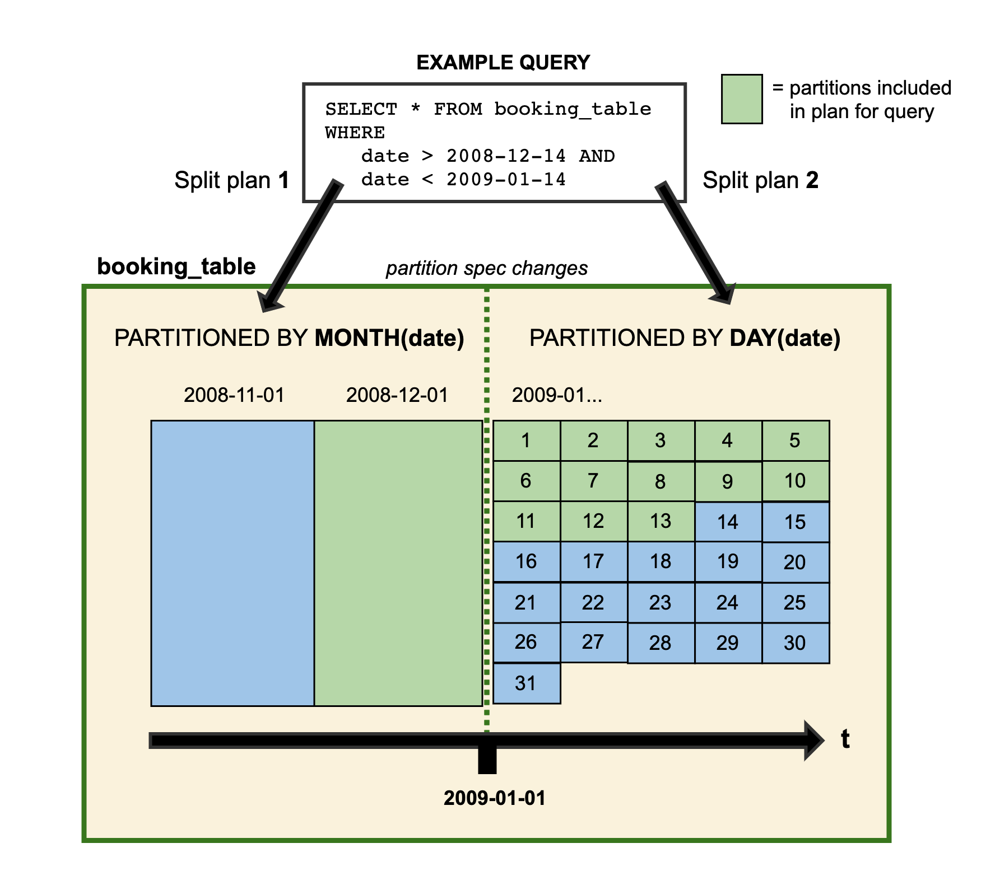

<!--
 - Licensed to the Apache Software Foundation (ASF) under one or more
 - contributor license agreements.  See the NOTICE file distributed with
 - this work for additional information regarding copyright ownership.
 - The ASF licenses this file to You under the Apache License, Version 2.0
 - (the "License"); you may not use this file except in compliance with
 - the License.  You may obtain a copy of the License at
 -
 -   http://www.apache.org/licenses/LICENSE-2.0
 -
 - Unless required by applicable law or agreed to in writing, software
 - distributed under the License is distributed on an "AS IS" BASIS,
 - WITHOUT WARRANTIES OR CONDITIONS OF ANY KIND, either express or implied.
 - See the License for the specific language governing permissions and
 - limitations under the License.
 -->
 
# Evolution

Iceberg supports **in-place table evolution**. You can [evolve a table schema](#schema-evolution) just like SQL -- even in nested structures -- or [change partition layout](#partition-evolution) when data volume changes. Iceberg does not require costly distractions, like rewriting table data or migrating to a new table.

For example, Hive table partitioning cannot change so moving from a daily partition layout to an hourly partition layout requires a new table. And because queries are dependent on partitions, queries must be rewritten for the new table. In some cases, even changes as simple as renaming a column are either not supported, or can cause [data correctness](#correctness) problems.

## Schema evolution

Iceberg supports the following schema evolution changes:

* **Add** -- add a new column to the table or to a nested struct
* **Drop** -- remove an existing column from the table or a nested struct
* **Rename** -- rename an existing column or field in a nested struct
* **Update** -- widen the type of a column, struct field, map key, map value, or list element
* **Reorder** -- change the order of columns or fields in a nested struct

Iceberg schema updates are **metadata changes**, so no data files need to be rewritten to perform the update.

Note that map keys do not support adding or dropping struct fields that would change equality.

### Correctness

Iceberg guarantees that **schema evolution changes are independent and free of side-effects**, without rewriting files:

1.  Added columns never read existing values from another column.
2.  Dropping a column or field does not change the values in any other column.
3.  Updating a column or field does not change values in any other column.
4.  Changing the order of columns or fields in a struct does not change the values associated with a column or field name.

Iceberg uses unique IDs to track each column in a table. When you add a column, it is assigned a new ID so existing data is never used by mistake.

* Formats that track columns by name can inadvertently un-delete a column if a name is reused, which violates #1.
* Formats that track columns by position cannot delete columns without changing the names that are used for each column, which violates #2.


## Partition evolution

Iceberg table partitioning can be updated in an existing table because queries do not reference partition values directly.

When you evolve a partition spec, the old data written with an earlier spec remains unchanged. New data is written using the new spec in a new layout. Metadata for each of the partition versions is kept separately. Because of this, when you start writing queries, you get split planning. This is where each partition layout plans files separately using the filter it derives for that specific partition layout. Here's a visual representation of a contrived example: 


*The data for 2008 is partitioned by month. Starting from 2009 the table is updated so that the data is instead partitioned by day. Both partitioning layouts are able to coexist in the same table.*

Iceberg uses [hidden partitioning](partitioning.md), so you don't *need* to write queries for a specific partition layout to be fast. Instead, you can write queries that select the data you need, and Iceberg automatically prunes out files that don't contain matching data.

Partition evolution is a metadata operation and does not eagerly rewrite files.

Iceberg's Java table API provides `updateSpec` API to update partition spec. 
For example, the following code could be used to update the partition spec to add a new partition field that places `id` column values into 8 buckets and remove an existing partition field `category`:

```java
Table sampleTable = ...;
sampleTable.updateSpec()
    .addField(bucket("id", 8))
    .removeField("category")
    .commit();
```

Spark supports updating partition spec through its `ALTER TABLE` SQL statement, see more details in [Spark SQL](spark-ddl.md#alter-table-add-partition-field).

## Sort order evolution

Similar to partition spec, Iceberg sort order can also be updated in an existing table.
When you evolve a sort order, the old data written with an earlier order remains unchanged.
Engines can always choose to write data in the latest sort order or unsorted when sorting is prohibitively expensive.

Iceberg's Java table API provides `replaceSortOrder` API to update sort order. 
For example, the following code could be used to create a new sort order 
with `id` column sorted in ascending order with nulls last,
and `category` column sorted in descending order with nulls first:

```java
Table sampleTable = ...;
sampleTable.replaceSortOrder()
   .asc("id", NullOrder.NULLS_LAST)
   .dec("category", NullOrder.NULL_FIRST)
   .commit();
```

Spark supports updating sort order through its `ALTER TABLE` SQL statement, see more details in [Spark SQL](spark-ddl.md#alter-table-write-ordered-by).
