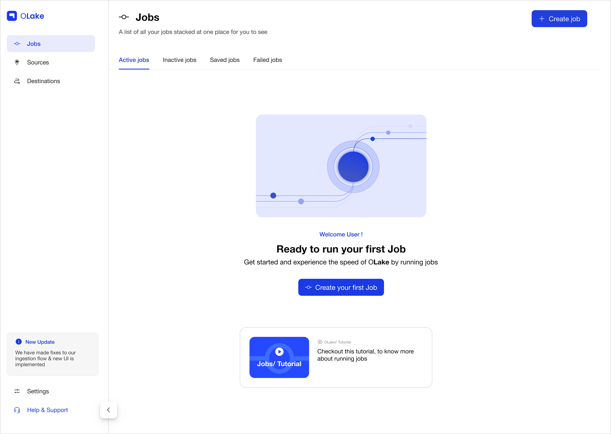

<!--
 - Licensed to the Apache Software Foundation (ASF) under one or more
 - contributor license agreements.  See the NOTICE file distributed with
 - this work for additional information regarding copyright ownership.
 - The ASF licenses this file to You under the Apache License, Version 2.0
 - (the "License"); you may not use this file except in compliance with
 - the License.  You may obtain a copy of the License at
 -
 -   http://www.apache.org/licenses/LICENSE-2.0
 -
 - Unless required by applicable law or agreed to in writing, software
 - distributed under the License is distributed on an "AS IS" BASIS,
 - WITHOUT WARRANTIES OR CONDITIONS OF ANY KIND, either express or implied.
 - See the License for the specific language governing permissions and
 - limitations under the License.
 -->

# OLake

[OLake](https://olake.io/) is an open-source ELT tool specialised for replicating databases to Apache Iceberg™ data lakehouses. It integrates natively with PostgreSQL, MySQL, MongoDB, Oracle, and Kafka, facilitating real-time data ingestion without the need for intermediary layers like Debezium, Kafka or Spark. The platform features a modular architecture that supports full-load operations, continuous Change Data Capture (CDC), and incremental synchronization with bookmark/cursor column support with resumable syncs and schema evolution handling. By leveraging a parallelized & resumable chunking strategy for faster historical snapshot, and CDC cursor preservation guarantees that incremental updates capture all events.

OLake supports key **Apache Iceberg™ features**:

- Partitioning
- Equality deletes
- All catalog types (with respective documentation)
- V2 specification (V3 coming soon)
- Exactly-once delivery semantics
- Optimal file sizes (256 MB–512 MB) for historical snapshots
- Apache Arrow–based fast writes (coming soon)
- Automatic equality-to-positional deletes (coming soon)
- Lightweight compaction (coming soon)
- Fully managed compaction (coming soon)

## Supported Connectors

Currently we support the following connectors:

- [Postgres](https://olake.io/docs/connectors/postgres/overview)
- [MySQL](https://olake.io/docs/connectors/mysql/overview)
- [MongoDB](https://olake.io/docs/connectors/mongodb/overview)
- [Oracle](https://olake.io/docs/connectors/oracle/overview)
- [Kafka](https://olake.io/docs/connectors/kafka/overview)

Keep checking [OLake Docs](https://olake.io/docs) for more upcoming connectors.

## Supported Destinations

OLake supports the following destinations:

- Iceberg
- Parquet

## Quickstart (OLake UI)

OLake UI is a web-based interface for managing OLake jobs, sources, destinations, and configurations. You can run the entire OLake stack (UI, Backend, and all dependencies) using Docker Compose. This is the recommended way to get started. Run the UI, connect your source DB, and start syncing in minutes.



```bash
curl -sSL https://raw.githubusercontent.com/datazip-inc/olake-ui/master/docker-compose.yml | docker compose -f - up -d
```

### Access the UI

- OLake UI at `http://localhost:8000`
- Log in with default credentials: `admin` / `password`

### Creating Your First Job

With the UI running, you can create a data pipeline in a few steps:

1. Create a Job: Navigate to the Jobs tab and click Create Job.
2. Configure Source: Set up your source connection (e.g., PostgreSQL, MySQL, MongoDB).
3. Configure Destination: Set up your destination (e.g., Apache Iceberg™ with a Glue, REST, Hive, or JDBC catalog).
4. Select Streams: Choose which tables to sync and configure their sync mode (CDC or Full Refresh).
5. Configure & Run: Give your job a name, set a schedule, and click Create Job to finish.

For a detailed walkthrough, refer to the [Jobs Documentation](https://olake.io/docs/jobs/create-jobs)

### CLI Usage (Advanced)

For advanced users and automation, OLake's core logic is exposed via a powerful CLI. The core framework handles state management, configuration validation, logging, and type detection. It interacts with drivers using four main commands:

- `spec`: Returns a renderable JSON Schema for a connector's configuration.
- `check`: Validates connection configurations for sources and destinations.
- `discover`: Returns all available streams (e.g., tables) and their schemas from a source.
- `sync`: Executes the data replication job, extracting from the source and writing to the destination.

Find out more about OLake CLI [here](https://olake.io/docs/core/cli).

### Helm Installation

If you prefer running OLake on Kubernetes, you can use our official [Helm Chart](https://olake.io/docs/install/kubernetes). This sets up the OLake backend, UI, and dependencies inside your cluster with a single command.
