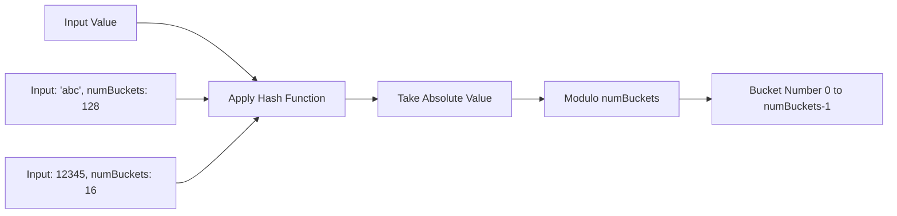
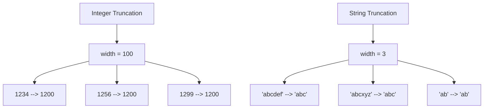

<!--
 - Licensed to the Apache Software Foundation (ASF) under one or more
 - contributor license agreements.  See the NOTICE file distributed with
 - this work for additional information regarding copyright ownership.
 - The ASF licenses this file to You under the Apache License, Version 2.0
 - (the "License"); you may not use this file except in compliance with
 - the License.  You may obtain a copy of the License at
 -
 -   http://www.apache.org/licenses/LICENSE-2.0
 -
 - Unless required by applicable law or agreed to in writing, software
 - distributed under the License is distributed on an "AS IS" BASIS,
 - WITHOUT WARRANTIES OR CONDITIONS OF ANY KIND, either express or implied.
 - See the License for the specific language governing permissions and
 - limitations under the License.
 -->

# Spark SQL Functions for Iceberg Transforms

Iceberg provides several Spark SQL functions that correspond to its partition transforms. These functions are useful for data partitioning, filtering, and analysis operations. All functions are available in the `system` namespace or can be accessed directly when using Iceberg catalogs.

## Available Functions

### Temporal Transform Functions

#### `years(timestamp)`
Extracts the year from a timestamp, returning an integer.

**Syntax:**
```sql
years(timestamp) -> int
```

**Parameters:**
- `timestamp`: A timestamp or date value

**Return Type:** `int`

**Examples:**
```sql
-- Extract year from timestamp
SELECT system.years(TIMESTAMP '2023-12-25 15:30:00') AS year;
-- Result: 2023

-- Extract year from date
SELECT system.years(DATE '2023-12-25') AS year;
-- Result: 2023

-- Use in queries
SELECT event_name, event_timestamp
FROM events
WHERE system.years(event_timestamp) = 2023;
```

#### `months(timestamp)`
Extracts the year and month from a timestamp, returning an integer in format `YYYYMM`.

**Syntax:**
```sql
months(timestamp) -> int
```

**Parameters:**
- `timestamp`: A timestamp or date value

**Return Type:** `int`

**Examples:**
```sql
-- Extract year-month from timestamp
SELECT system.months(TIMESTAMP '2023-12-25 15:30:00') AS year_month;
-- Result: 202312

-- Use for monthly partitioning
SELECT COUNT(*) as event_count
FROM events
GROUP BY system.months(event_timestamp)
ORDER BY year_month;
```

#### `days(timestamp)`
Extracts the year, month, and day from a timestamp, returning an integer in format `YYYYMMDD`.

**Syntax:**
```sql
days(timestamp) -> int
```

**Parameters:**
- `timestamp`: A timestamp or date value

**Return Type:** `int`

**Examples:**
```sql
-- Extract year-month-day from timestamp
SELECT system.days(TIMESTAMP '2023-12-25 15:30:00') AS date_int;
-- Result: 20231225

-- Daily aggregation
SELECT system.days(event_timestamp) AS event_date,
       COUNT(*) as daily_events
FROM events
GROUP BY system.days(event_timestamp);
```

#### `hours(timestamp)`
Extracts the year, month, day, and hour from a timestamp, returning a long integer in format `YYYYMMDDHH`.

**Syntax:**
```sql
hours(timestamp) -> bigint
```

**Parameters:**
- `timestamp`: A timestamp value

**Return Type:** `bigint`

**Examples:**
```sql
-- Extract hour from timestamp
SELECT system.hours(TIMESTAMP '2023-12-25 15:30:00') AS hour_int;
-- Result: 2023122515

-- Hourly analysis
SELECT system.hours(event_timestamp) AS event_hour,
       AVG(processing_time) as avg_processing_time
FROM events
GROUP BY system.hours(event_timestamp);
```

### Data Distribution Functions

#### `bucket(numBuckets, value)`
Distributes values into a specified number of buckets using a consistent hashing algorithm.

**Syntax:**
```sql
bucket(numBuckets, value) -> int
```

**Parameters:**
- `numBuckets`: Number of buckets (tinyint, smallint, or int)
- `value`: Value to bucket (supports multiple data types)

**Supported Data Types:**
- Integer types: `tinyint`, `smallint`, `int`, `bigint`
- Floating point: `float`, `double`
- Decimal: `decimal(precision, scale)`
- Temporal: `date`, `timestamp`, `timestamp_ntz`
- String: `string`
- Binary: `binary`

**Return Type:** `int`

**Examples:**
```sql
-- Bucket string values
SELECT system.bucket(100, 'user123') AS user_bucket;
-- Result: 45

-- Bucket integers
SELECT system.bucket(16, 12345) AS int_bucket;
-- Result: 9

-- Bucket by user_id for even distribution
SELECT user_bucket, COUNT(*) as user_count
FROM (
  SELECT system.bucket(100, user_id) AS user_bucket
  FROM users
) t
GROUP BY user_bucket;

-- Create balanced partitions
CREATE TABLE events (
  event_id BIGINT,
  user_id STRING,
  event_data STRING,
  event_timestamp TIMESTAMP
) PARTITIONED BY (
  BUCKET(16, user_id),
  DAYS(event_timestamp)
);
```

**Bucket Algorithm Flow:**



#### `truncate(width, value)`
Truncates a value to a specified width, useful for creating hierarchical partitions.

**Syntax:**
```sql
truncate(width, value) -> same_type_as_value
```

**Parameters:**
- `width`: Truncation width (tinyint, smallint, or int)
- `value`: Value to truncate (supports multiple data types)

**Supported Data Types:**
- Integer types: `tinyint`, `smallint`, `int`, `bigint`
- Decimal: `decimal(precision, scale)`
- String: `string`
- Binary: `binary`

**Return Type:** Same as input value type

**Examples:**
```sql
-- Truncate integers
SELECT system.truncate(100, 1234) AS truncated_int;
-- Result: 1200

-- Truncate decimals
SELECT system.truncate(2, 123.456) AS truncated_decimal;
-- Result: 123.45

-- Truncate strings
SELECT system.truncate(5, 'hello_world') AS truncated_string;
-- Result: 'hello'

-- Create hierarchical partitions
CREATE TABLE logs (
  log_id BIGINT,
  log_level STRING,
  message STRING,
  log_timestamp TIMESTAMP
) PARTITIONED BY (
  HOURS(log_timestamp),
  TRUNCATE(2, log_level)  -- Group similar log levels
);

-- Geographic partitioning
SELECT system.truncate(1000000, latitude) as lat_bucket,
       system.truncate(1000000, longitude) as lon_bucket,
       COUNT(*) as location_count
FROM locations
GROUP BY lat_bucket, lon_bucket;
```

**Truncation Behavior:**



### Utility Functions

#### `iceberg_version()`
Returns the current Iceberg version.

**Syntax:**
```sql
iceberg_version() -> string
```

**Return Type:** `string`

**Examples:**
```sql
-- Check Iceberg version
SELECT system.iceberg_version() AS version;
-- Result: '1.5.0'

-- Use in scripts to verify compatibility
SELECT CASE
  WHEN system.iceberg_version() >= '1.4.0'
  THEN 'Bucket functions available'
  ELSE 'Upgrade Iceberg for bucket functions'
END AS feature_check;
```

## Performance Considerations

### Function Usage Guidelines

1. **Use appropriate partition functions** for your data distribution:
   - `years()`, `months()`, `days()`, `hours()` for time-based data
   - `bucket()` for high-cardinality columns needing even distribution
   - `truncate()` for hierarchical or range-based partitioning

2. **Avoid function calls on every row** in WHERE clauses when possible:
   ```sql
   -- Less efficient - function call per row
   SELECT * FROM events
   WHERE system.days(event_timestamp) = 20231225;

   -- More efficient - use date range
   SELECT * FROM events
   WHERE event_timestamp BETWEEN '2023-12-25' AND '2023-12-25 23:59:59';
   ```

3. **Use bucket functions** for join optimization:
   ```sql
   -- Optimized join using bucket distribution
   SELECT o.order_id, o.customer_id, c.customer_name
   FROM orders o
   JOIN customers c ON system.bucket(100, o.customer_id) = system.bucket(100, c.customer_id)
                    AND o.customer_id = c.customer_id;
   ```

### Partition Strategy Recommendations

```mermaid
flowchart TD
    A[Data Type] --> B{Temporal Data?}
    B -->|Yes| C[Time Range?]
    C -->|Years| D[years()]
    C -->|Months| E[months()]
    C -->|Days| F[days()]
    C -->|Hours| G[hours()]

    B -->|No| H{High Cardinality?}
    H -->|Yes| I[bucket()]
    H -->|No| J{Hierarchical?}
    J -->|Yes| K[truncate()]
    J -->|No| L[No partition needed]

    M[String Data] --> N{Length varies?}
    N -->|Yes| O[truncate()]
    N -->|No| P[bucket() or direct]
```

## Examples and Use Cases

### Time Series Analysis
```sql
-- Daily active users calculation
SELECT
  system.days(event_timestamp) AS activity_date,
  COUNT(DISTINCT user_id) AS daily_active_users
FROM user_events
WHERE event_type = 'login'
GROUP BY system.days(event_timestamp)
ORDER BY activity_date;

-- Monthly retention analysis
WITH monthly_users AS (
  SELECT
    user_id,
    system.months(event_timestamp) AS activity_month
  FROM user_events
  WHERE event_type = 'login'
)
SELECT
  m1.activity_month AS month,
  COUNT(DISTINCT m1.user_id) AS total_users,
  COUNT(DISTINCT CASE WHEN m2.user_id IS NOT NULL THEN m1.user_id END) AS retained_users,
  ROUND(COUNT(DISTINCT CASE WHEN m2.user_id IS NOT NULL THEN m1.user_id END) * 100.0 /
        COUNT(DISTINCT m1.user_id), 2) AS retention_rate
FROM monthly_users m1
LEFT JOIN monthly_users m2 ON m1.user_id = m2.user_id
  AND m2.activity_month = m1.activity_month + 1
GROUP BY m1.activity_month
ORDER BY m1.activity_month;
```

### User Segmentation with Bucketing
```sql
-- Create balanced user segments for A/B testing
CREATE TABLE user_segments (
  user_id STRING,
  segment_id INT,
  created_at TIMESTAMP DEFAULT CURRENT_TIMESTAMP()
) AS
SELECT
  user_id,
  system.bucket(10, user_id) AS segment_id
FROM users
WHERE registration_date >= '2023-01-01';

-- Analyze segment performance
SELECT
  segment_id,
  COUNT(*) AS user_count,
  AVG(total_purchases) AS avg_purchases,
  AVG(session_duration) AS avg_session_duration
FROM user_segments u
JOIN user_metrics m ON u.user_id = m.user_id
GROUP BY segment_id
ORDER BY segment_id;
```

### Geographic Data Analysis
```sql
-- Create geographic grids for spatial analysis
SELECT
  system.truncate(1000000, latitude) AS lat_grid,
  system.truncate(1000000, longitude) AS lon_grid,
  COUNT(*) AS location_count,
  AVG(price) AS avg_price,
  MIN(created_at) AS first_listing,
  MAX(created_at) AS last_listing
FROM property_listings
WHERE latitude BETWEEN 25 AND 49
  AND longitude BETWEEN -125 AND -66  -- Continental USA
GROUP BY system.truncate(1000000, latitude),
         system.truncate(1000000, longitude)
ORDER BY location_count DESC;
```

## Integration with Partition Evolution

Iceberg's transform functions work seamlessly with partition evolution:

```sql
-- Start with daily partitioning
CREATE TABLE events (
  id BIGINT,
  user_id STRING,
  event_data STRING,
  event_timestamp TIMESTAMP
) PARTITIONED BY (days(event_timestamp));

-- Later add bucketing for better distribution
ALTER TABLE events
ADD PARTITION FIELD bucket(16, user_id);

-- Query uses both partition transforms efficiently
SELECT *
FROM events
WHERE system.days(event_timestamp) = 20231225
  AND system.bucket(16, user_id) = 8;
```

## Error Handling

### Common Errors and Solutions

1. **Invalid data types**:
   ```sql
   -- Error: Invalid data type for bucket function
   SELECT system.bucket(10, ARRAY(1, 2, 3)) AS bucket_num;

   -- Solution: Use supported data types
   SELECT system.bucket(10, 'array_string_representation') AS bucket_num;
   ```

2. **Invalid number of buckets**:
   ```sql
   -- Error: Number of buckets must be positive
   SELECT system.bucket(0, 'test') AS bucket_num;

   -- Solution: Use positive number of buckets
   SELECT system.bucket(10, 'test') AS bucket_num;
   ```

3. **Width too large for truncate**:
   ```sql
   -- Error: Truncation width exceeds string length
   SELECT system.truncate(100, 'short') AS truncated;

   -- Solution: Handle with COALESCE or validation
   SELECT COALESCE(system.truncate(100, 'short'), 'short') AS truncated;
   ```

## Best Practices

1. **Test function behavior** with your specific data:
   ```sql
   -- Test bucket distribution
   SELECT
     system.bucket(100, user_id) AS bucket_num,
     COUNT(*) as count
   FROM users
   GROUP BY system.bucket(100, user_id)
   ORDER BY bucket_num;
   ```

2. **Document transform functions** used in table definitions:
   ```sql
   -- Add table comment documenting partition strategy
   CREATE TABLE user_events (
     user_id STRING,
     event_type STRING,
     event_timestamp TIMESTAMP
   ) PARTITIONED BY (
     bucket(16, user_id),  -- Distributes users evenly across 16 buckets
     days(event_timestamp) -- Daily time partitions
   )
   COMMENT 'User events partitioned by user bucket and day for balanced query performance';
   ```

3. **Monitor partition sizes** and adjust as needed:
   ```sql
   -- Monitor partition sizes
   SELECT
     system.days(event_timestamp) AS partition_date,
     system.bucket(16, user_id) AS bucket_num,
     COUNT(*) as record_count,
     SUM(data_size) as total_bytes
   FROM events
   GROUP BY system.days(event_timestamp), system.bucket(16, user_id)
   ORDER BY total_bytes DESC
   LIMIT 100;
   ```

By leveraging Iceberg's transform functions in Spark SQL, you can create efficient partitioning strategies that improve query performance while maintaining data organization flexibility.