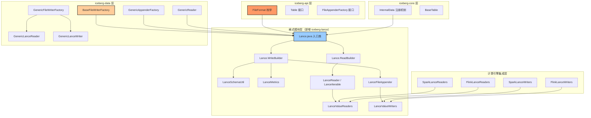
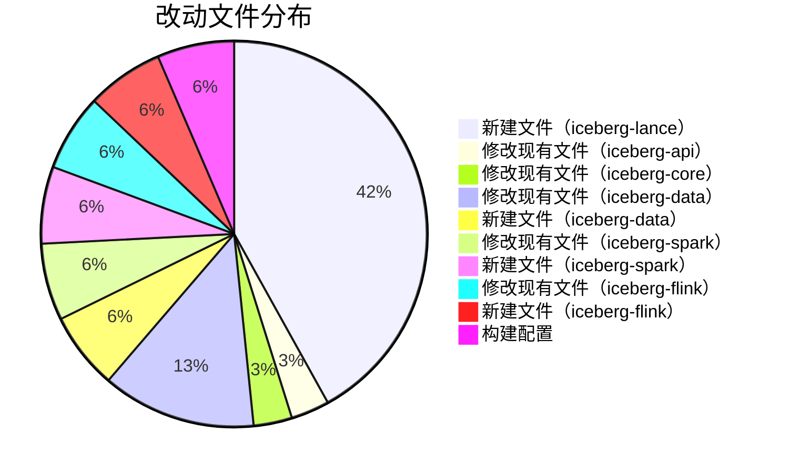
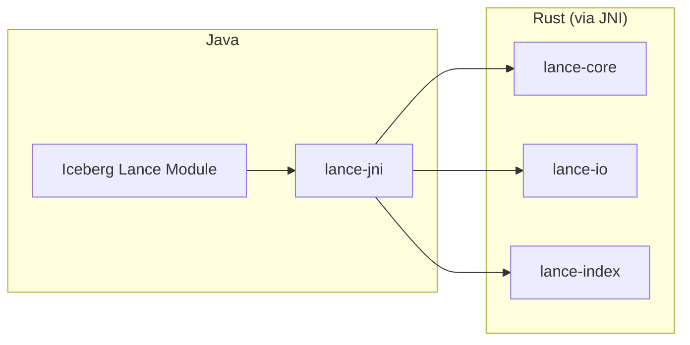
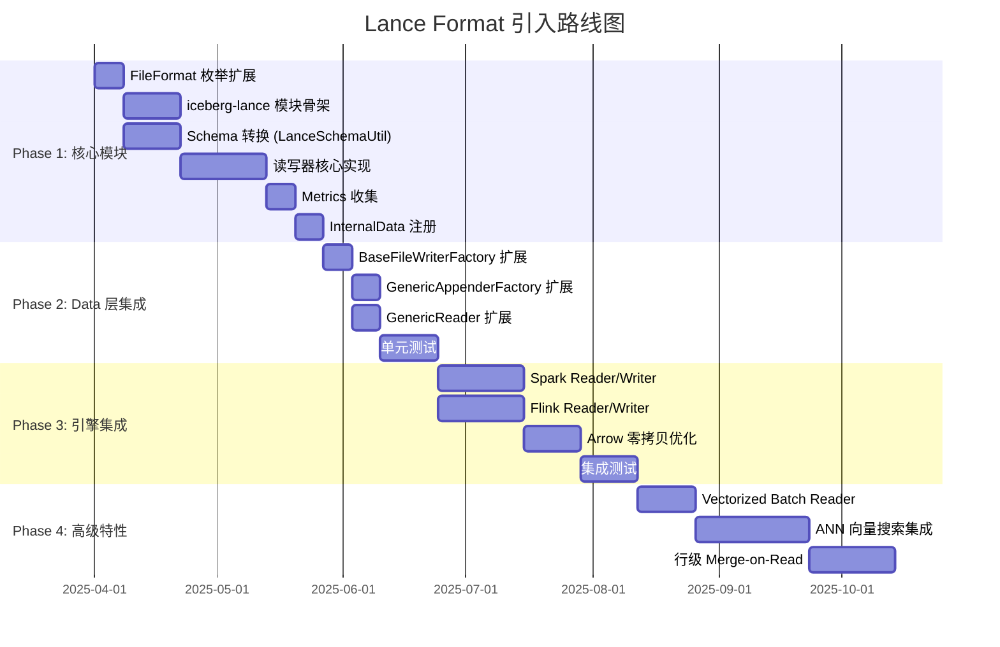

# Iceberg 引入 Lance Format 支持 —— 架构设计分析

## 一、背景与动机

### 1.1 Lance Format 简介

[Lance](https://github.com/lancedb/lance) 是一种现代化的列式数据格式，专为机器学习和 AI 工作负载优化。其核心特性包括：

- **高性能随机访问**：支持 O(1) 的行级随机读取，适合向量搜索和 AI 推理场景
- **原生向量搜索**：内置 ANN（Approximate Nearest Neighbor）索引支持
- **零拷贝版本控制**：类似 Iceberg 的版本快照机制，支持 ACID 事务
- **自动数据版本管理**：支持 append、overwrite、时间旅行
- **与 Arrow 生态深度兼容**：底层基于 Apache Arrow 列式内存格式

### 1.2 为什么要在 Iceberg 中引入 Lance？

| 维度 | Parquet/ORC | Lance | 差异价值 |
|------|-------------|-------|---------|
| 随机访问性能 | 需要扫描整个 RowGroup/Stripe | O(1) 行级随机访问 | AI 推理场景 10-100x 提升 |
| 向量搜索 | 不原生支持 | 内置 ANN 索引 | 无需外挂向量数据库 |
| 更新效率 | Copy-on-Write 全文件重写 | 原生行级更新 | 频繁更新场景 |
| Arrow 集成 | 需要序列化/反序列化 | 零拷贝 Arrow 映射 | 内存效率 |
| 文件扩展名 | `.parquet` / `.orc` | `.lance` | 新的数据文件格式 |

---

## 二、Iceberg 现有文件格式扩展架构分析

### 2.1 核心扩展点全景图

在引入 Lance format 之前，必须先理解 Iceberg 现有的文件格式扩展机制。以下是需要修改/扩展的所有关键位置：



### 2.2 现有格式模块的标准结构（以 Parquet 和 ORC 为参照）

通过分析 `iceberg-parquet` 和 `iceberg-orc` 模块，每个格式模块遵循以下标准结构：

```
iceberg-{format}/
├── src/main/java/org/apache/iceberg/{format}/
│   ├── {Format}.java                  # 入口类，包含 ReadBuilder 和 WriteBuilder
│   ├── {Format}SchemaUtil.java        # Iceberg Schema ↔ 格式 Schema 转换
│   ├── {Format}Metrics.java           # 文件级统计信息收集
│   ├── {Format}FileAppender.java      # FileAppender 实现
│   ├── {Format}Iterable.java          # 读取迭代器
│   ├── {Format}ValueReaders.java      # 列值读取器
│   ├── {Format}ValueWriters.java      # 列值写入器
│   ├── {Format}SchemaVisitor.java     # Schema 遍历 Visitor
│   └── ApplyNameMapping.java          # 列名映射支持
├── src/main/java/org/apache/iceberg/
│   └── Internal{Format}.java          # InternalData 注册桥接类
├── src/main/java/org/apache/iceberg/data/{format}/
│   ├── Generic{Format}Reader.java     # 通用数据 Reader
│   └── Generic{Format}Writer.java     # 通用数据 Writer
└── src/test/
```

### 2.3 关键扩展点详细分析

#### 2.3.1 `FileFormat` 枚举（`iceberg-api`）

```java
// 当前定义：api/src/main/java/org/apache/iceberg/FileFormat.java
public enum FileFormat {
  PUFFIN("puffin", false),
  ORC("orc", true),
  PARQUET("parquet", true),
  AVRO("avro", true),
  METADATA("metadata.json", false);
  // ...
}
```

**改动**：需要新增 `LANCE("lance", true)` 枚举值。Lance 文件格式是可分片的（splittable），因此第二个参数为 `true`。

#### 2.3.2 入口类的 Builder 模式（核心设计）

每个格式模块都有一个核心入口类（如 `Parquet.java`、`ORC.java`），提供静态工厂方法和 Builder：

```java
// Parquet.java 的设计模式：
public class Parquet {
    public static WriteBuilder write(OutputFile file) { ... }
    public static ReadBuilder read(InputFile file) { ... }
    public static DataWriteBuilder writeData(EncryptedOutputFile file) { ... }
    public static DeleteWriteBuilder writeDeletes(EncryptedOutputFile file) { ... }

    public static class WriteBuilder implements InternalData.WriteBuilder { ... }
    public static class ReadBuilder implements InternalData.ReadBuilder { ... }
    public static class DataWriteBuilder { ... }
    public static class DeleteWriteBuilder { ... }
}
```

#### 2.3.3 `InternalData` 注册机制（`iceberg-core`）

```java
// core/src/main/java/org/apache/iceberg/InternalData.java
public class InternalData {
    // 通过反射动态加载格式模块（可选依赖）
    private static void registerSupportedFormats() {
        // Avro 直接注册（core 内置）
        InternalData.register(FileFormat.AVRO, ...);

        // Parquet 通过反射注册（可选模块）
        try {
            DynMethods.StaticMethod registerParquet =
                DynMethods.builder("register")
                    .impl("org.apache.iceberg.InternalParquet")
                    .buildStaticChecked();
            registerParquet.invoke();
        } catch (NoSuchMethodException e) {
            LOG.info("Unable to register Parquet ...");
        }
    }
}
```

#### 2.3.4 `BaseFileWriterFactory` 的格式分发（`iceberg-data`）

```java
// data/src/main/java/org/apache/iceberg/data/BaseFileWriterFactory.java
public abstract class BaseFileWriterFactory<T> {
    // 每种格式需要 3 组 abstract 方法（共 9 个）：
    protected abstract void configureDataWrite(Avro.DataWriteBuilder builder);
    protected abstract void configureDataWrite(Parquet.DataWriteBuilder builder);
    protected abstract void configureDataWrite(ORC.DataWriteBuilder builder);
    // + configureEqualityDelete × 3
    // + configurePositionDelete × 3

    // switch-case 分发：
    public DataWriter<T> newDataWriter(...) {
        switch (dataFileFormat) {
            case AVRO:    ...
            case PARQUET: ...
            case ORC:     ...
            default: throw new UnsupportedOperationException(...);
        }
    }
}
```

#### 2.3.5 `GenericAppenderFactory` / `FlinkAppenderFactory` 中的 switch-case

计算引擎的 `AppenderFactory` 同样使用 switch-case 来分发不同格式的 reader/writer 创建：

```java
// FlinkAppenderFactory.newAppender():
switch (format) {
    case AVRO:    return Avro.write(outputFile)...build();
    case ORC:     return ORC.write(outputFile)...build();
    case PARQUET: return Parquet.write(outputFile)...build();
    default:      throw new UnsupportedOperationException(...);
}
```

---

## 三、Lance Format 引入的架构设计方案

### 3.1 整体方案概览

```mermaid
flowchart LR
    subgraph Phase1["Phase 1: 核心格式模块"]
        A1[iceberg-api: FileFormat.LANCE]
        A2[iceberg-lance: 核心读写模块]
        A3[iceberg-core: InternalData 注册]
    end

    subgraph Phase2["Phase 2: 数据层集成"]
        B1[iceberg-data: Generic Reader/Writer]
        B2[BaseFileWriterFactory 扩展]
        B3[GenericAppenderFactory 扩展]
    end

    subgraph Phase3["Phase 3: 引擎层集成"]
        C1[Spark Lance Reader/Writer]
        C2[Flink Lance Reader/Writer]
        C3[Arrow 集成优化]
    end

    subgraph Phase4["Phase 4: 高级特性"]
        D1[ANN 向量索引集成]
        D2[行级 Merge-on-Read]
        D3[Vectorized Batch Reader]
    end

    Phase1 --> Phase2 --> Phase3 --> Phase4
```



### 3.2 新增模块目录结构

```
iceberg-lance/                                          # 新增 Gradle 模块
├── build.gradle
├── src/main/java/org/apache/iceberg/lance/
│   ├── Lance.java                                      # 入口类（ReadBuilder + WriteBuilder）
│   ├── Lance.ReadBuilder                               # 读取构建器
│   ├── Lance.WriteBuilder                              # 写入构建器
│   ├── Lance.DataWriteBuilder                          # 数据写入构建器
│   ├── Lance.DeleteWriteBuilder                        # 删除文件写入构建器
│   ├── LanceSchemaUtil.java                            # Iceberg Schema ↔ Lance/Arrow Schema 转换
│   ├── LanceMetrics.java                               # Lance 文件统计信息收集
│   ├── LanceFileAppender.java                          # FileAppender 实现
│   ├── LanceIterable.java                              # 读取迭代器
│   ├── LanceValueReaders.java                          # 列值读取器
│   ├── LanceValueWriters.java                          # 列值写入器
│   ├── LanceSchemaVisitor.java                         # Schema 遍历 Visitor
│   ├── LanceUtil.java                                  # 工具类
│   └── ApplyNameMapping.java                           # 列名映射支持
├── src/main/java/org/apache/iceberg/
│   └── InternalLance.java                              # InternalData 注册桥接
├── src/main/java/org/apache/iceberg/data/lance/
│   ├── GenericLanceReader.java                         # 通用 Record Reader
│   └── GenericLanceWriter.java                         # 通用 Record Writer
└── src/test/java/org/apache/iceberg/lance/
    ├── TestLanceSchemaUtil.java
    ├── TestLanceMetrics.java
    ├── TestLanceDataWriter.java
    ├── TestLanceDataReader.java
    └── TestLanceReadProjection.java
```

### 3.3 各层详细设计

---

#### 3.3.1 Layer 1: `iceberg-api` — FileFormat 枚举扩展

**文件**: `api/src/main/java/org/apache/iceberg/FileFormat.java`

```java
public enum FileFormat {
  PUFFIN("puffin", false),
  ORC("orc", true),
  PARQUET("parquet", true),
  AVRO("avro", true),
  LANCE("lance", true),          // 新增：Lance 格式，支持文件分片
  METADATA("metadata.json", false);
  // ...
}
```

**设计考量**：
- `splittable = true`：Lance 文件支持按 Fragment 分片读取，每个 Fragment 可以独立定位和读取
- 文件扩展名 `.lance`：与 Lance 社区标准一致

---

#### 3.3.2 Layer 2: `iceberg-lance` — 核心格式模块

##### Lance.java（入口类）

```java
package org.apache.iceberg.lance;

public class Lance {

    public static WriteBuilder write(OutputFile file) {
        return new WriteBuilder(file);
    }

    public static ReadBuilder read(InputFile file) {
        return new ReadBuilder(file);
    }

    public static DataWriteBuilder writeData(EncryptedOutputFile file) {
        return new DataWriteBuilder(file);
    }

    public static DeleteWriteBuilder writeDeletes(EncryptedOutputFile file) {
        return new DeleteWriteBuilder(file);
    }

    // ============ WriteBuilder ============
    public static class WriteBuilder implements InternalData.WriteBuilder {
        private final OutputFile file;
        private Schema schema;
        private Map<String, String> properties = Maps.newHashMap();
        private MetricsConfig metricsConfig = MetricsConfig.getDefault();
        private Function<org.apache.arrow.vector.types.pojo.Schema,
                         LanceValueWriter<?>> createWriterFunc;
        private boolean overwrite = false;

        public WriteBuilder schema(Schema newSchema) { ... }
        public WriteBuilder setAll(Map<String, String> props) { ... }
        public WriteBuilder metricsConfig(MetricsConfig config) { ... }
        public WriteBuilder createWriterFunc(
            Function<org.apache.arrow.vector.types.pojo.Schema,
                     LanceValueWriter<?>> func) { ... }
        public WriteBuilder overwrite() { ... }

        public <T> FileAppender<T> build() throws IOException { ... }
    }

    // ============ ReadBuilder ============
    public static class ReadBuilder implements InternalData.ReadBuilder {
        private final InputFile file;
        private Schema schema;
        private Expression filter;
        private boolean caseSensitive = true;
        private NameMapping nameMapping;
        private Function<org.apache.arrow.vector.types.pojo.Schema,
                         LanceValueReader<?>> createReaderFunc;

        public ReadBuilder project(Schema newSchema) { ... }
        public ReadBuilder filter(Expression newFilter) { ... }
        public ReadBuilder caseSensitive(boolean sensitive) { ... }
        public ReadBuilder createReaderFunc(
            Function<org.apache.arrow.vector.types.pojo.Schema,
                     LanceValueReader<?>> func) { ... }

        public <T> CloseableIterable<T> build() { ... }
    }

    // ============ DataWriteBuilder ============
    public static class DataWriteBuilder { ... }

    // ============ DeleteWriteBuilder ============
    public static class DeleteWriteBuilder { ... }
}
```

**关键设计决策**：

| 决策点 | 方案 | 理由 |
|--------|------|------|
| Builder 参数类型 | `Arrow Schema` 作为 `createWriterFunc` 参数 | Lance 底层基于 Arrow，直接使用 Arrow Schema 避免多次转换 |
| 依赖方式 | 通过 JNI 桥接 `lance-jni` | Lance 核心实现为 Rust，Java 通过 JNI 调用 |
| 文件读取 | 基于 `InputFile` 抽象 | 保持与 Iceberg FileIO 的兼容性 |
| 分片策略 | 基于 Lance Fragment | 每个 Fragment 对应一个 Split |

##### LanceSchemaUtil.java（Schema 转换）


**类型映射表**：

| Iceberg Type | Arrow Type | Lance Type | 备注 |
|-------------|------------|------------|------|
| `BooleanType` | `Bool` | `Bool` | 直接映射 |
| `IntegerType` | `Int32` | `Int32` | 直接映射 |
| `LongType` | `Int64` | `Int64` | 直接映射 |
| `FloatType` | `Float32` | `Float32` | 直接映射 |
| `DoubleType` | `Float64` | `Float64` | 直接映射 |
| `DateType` | `Date32` | `Date32` | 天数偏移 |
| `TimeType` | `Time64(µs)` | `Time64(µs)` | 微秒精度 |
| `TimestampType` | `Timestamp(µs)` | `Timestamp(µs)` | 带/不带时区 |
| `StringType` | `Utf8` | `Utf8` | 直接映射 |
| `BinaryType` | `Binary` | `Binary` | 直接映射 |
| `FixedType(n)` | `FixedSizeBinary(n)` | `FixedSizeBinary(n)` | 定长 |
| `DecimalType(p,s)` | `Decimal128(p,s)` | `Decimal128(p,s)` | 定点数 |
| `UUIDType` | `FixedSizeBinary(16)` | `FixedSizeBinary(16)` | 16字节定长 |
| `ListType` | `List` | `List` | 嵌套类型 |
| `MapType` | `Map` | `Map` | 嵌套类型 |
| `StructType` | `Struct` | `Struct` | 嵌套类型 |
| `FixedSizeList(n, Float32)` | `FixedSizeList(n)` | `Vector(n)` | **向量类型特殊映射** |

**核心亮点**：Lance 原生支持向量类型（`FixedSizeList<Float32>`），可以将 Iceberg 的 `FixedSizeList` 映射为 Lance 的 `Vector` 类型以获得 ANN 索引加速。

##### LanceMetrics.java（统计信息收集）

```java
public class LanceMetrics {
    // 从 Lance 文件中提取 Iceberg Metrics
    public static Metrics fromInputFile(InputFile file, MetricsConfig metricsConfig) {
        // 1. 读取 Lance 文件的 Fragment 统计信息
        // 2. 提取 rowCount, columnSizes, valueCounts
        // 3. 提取 nullCounts, lowerBounds, upperBounds
        // 4. 返回 Iceberg Metrics 对象
    }

    // 从 Writer 中提取 Metrics
    static Metrics fromWriter(LanceWriter writer,
                              Stream<FieldMetrics<?>> fieldMetrics,
                              MetricsConfig metricsConfig) { ... }
}
```

**Lance 统计信息映射**：

| Lance 统计信息 | Iceberg Metrics 字段 | 说明 |
|---------------|---------------------|------|
| `fragment.num_rows` | `recordCount` | 行数 |
| `column.statistics.null_count` | `nullValueCounts` | 空值计数 |
| `column.statistics.min_value` | `lowerBounds` | 列最小值 |
| `column.statistics.max_value` | `upperBounds` | 列最大值 |
| `column.statistics.num_values` | `valueCounts` | 值计数 |
| `column.byte_length` | `columnSizes` | 列大小 |

---

#### 3.3.3 Layer 3: `iceberg-core` — InternalData 注册

**文件**: `iceberg-lance` 模块中的 `InternalLance.java`

```java
package org.apache.iceberg;

public class InternalLance {
    private InternalLance() {}

    public static void register() {
        InternalData.register(
            FileFormat.LANCE,
            InternalLance::writeInternal,
            InternalLance::readInternal);
    }

    private static Lance.WriteBuilder writeInternal(OutputFile outputFile) {
        return Lance.write(outputFile)
            .createWriterFunc(InternalLanceWriter::createWriter);
    }

    private static Lance.ReadBuilder readInternal(InputFile inputFile) {
        return Lance.read(inputFile)
            .createReaderFunc(InternalLanceReader.readerFunction());
    }
}
```

**文件**: `iceberg-core` 中的 `InternalData.java` 新增注册

```java
// 在 registerSupportedFormats() 中新增：
try {
    DynMethods.StaticMethod registerLance =
        DynMethods.builder("register")
            .impl("org.apache.iceberg.InternalLance")
            .buildStaticChecked();
    registerLance.invoke();
} catch (NoSuchMethodException e) {
    LOG.info("Unable to register Lance for metadata files: {}", e.getMessage());
}
```

---

#### 3.3.4 Layer 4: `iceberg-data` — 通用读写适配

##### BaseFileWriterFactory 扩展

```java
// 新增 3 个 abstract 方法：
protected abstract void configureDataWrite(Lance.DataWriteBuilder builder);
protected abstract void configureEqualityDelete(Lance.DeleteWriteBuilder builder);
protected abstract void configurePositionDelete(Lance.DeleteWriteBuilder builder);

// newDataWriter() 中新增 case：
case LANCE:
    Lance.DataWriteBuilder lanceBuilder =
        Lance.writeData(file)
            .schema(dataSchema)
            .setAll(properties)
            .setAll(writerProperties)
            .metricsConfig(metricsConfig)
            .withSpec(spec)
            .withPartition(partition)
            .withKeyMetadata(keyMetadata)
            .withSortOrder(dataSortOrder)
            .overwrite();
    configureDataWrite(lanceBuilder);
    return lanceBuilder.build();
```

##### GenericFileWriterFactory 扩展

```java
@Override
protected void configureDataWrite(Lance.DataWriteBuilder builder) {
    builder.createWriterFunc(GenericLanceWriter::buildWriter);
}

@Override
protected void configureEqualityDelete(Lance.DeleteWriteBuilder builder) {
    builder.createWriterFunc(GenericLanceWriter::buildWriter);
}

@Override
protected void configurePositionDelete(Lance.DeleteWriteBuilder builder) {
    builder.createWriterFunc(GenericLanceWriter::buildWriter);
}
```

##### GenericAppenderFactory 扩展

```java
// newAppender() 中新增 case：
case LANCE:
    return Lance.write(outputFile)
        .schema(schema)
        .createWriterFunc(GenericLanceWriter::buildWriter)
        .setAll(config)
        .metricsConfig(metricsConfig)
        .overwrite()
        .build();
```

---

#### 3.3.5 Layer 5: 计算引擎集成

##### Spark 集成

```java
// SparkLanceReaders.java - 在 iceberg-spark 模块中
public class SparkLanceReaders {
    public static LanceValueReader<InternalRow> buildReader(
            Schema expectedSchema,
            org.apache.arrow.vector.types.pojo.Schema lanceSchema) {
        // 利用 Arrow-to-Spark 的零拷贝转换
        // Lance -> Arrow VectorSchemaRoot -> Spark ColumnarBatch
    }
}

// SparkLanceWriters.java
public class SparkLanceWriters {
    public static LanceValueWriter<InternalRow> buildWriter(
            org.apache.arrow.vector.types.pojo.Schema lanceSchema) {
        // Spark InternalRow -> Arrow VectorSchemaRoot -> Lance
    }
}
```

##### Flink 集成

```java
// FlinkLanceReaders.java - 在 iceberg-flink 模块中
public class FlinkLanceReaders {
    public static LanceValueReader<RowData> buildReader(
            Schema expectedSchema,
            org.apache.arrow.vector.types.pojo.Schema lanceSchema) {
        // Lance -> Arrow -> Flink RowData
    }
}

// FlinkLanceWriters.java
public class FlinkLanceWriters {
    public static LanceValueWriter<RowData> buildWriter(
            org.apache.arrow.vector.types.pojo.Schema lanceSchema) {
        // Flink RowData -> Arrow -> Lance
    }
}
```

**关键优化**：Lance 基于 Arrow 的零拷贝特性，可以直接与 `iceberg-arrow` 模块共享 Arrow 向量化读取路径。

---

### 3.4 构建系统集成

#### settings.gradle 修改

```groovy
include 'lance'
project(':lance').name = 'iceberg-lance'
```

#### lance/build.gradle 示例

```groovy
project(':iceberg-lance') {
    dependencies {
        implementation project(':iceberg-api')
        implementation project(':iceberg-core')
        implementation project(':iceberg-bundled-guava')

        // Lance JNI 桥接
        implementation "com.lancedb:lance-jni:${lanceVersion}"

        // Arrow 依赖（Lance 底层基于 Arrow）
        implementation project(':iceberg-arrow')
        implementation "org.apache.arrow:arrow-vector:${arrowVersion}"
        implementation "org.apache.arrow:arrow-memory-netty:${arrowVersion}"

        // 测试依赖
        testImplementation project(':iceberg-data')
    }
}
```

---

## 四、全量改动点清单

### 4.1 改动矩阵

| 层级 | 文件 | 改动类型 | 改动内容 |
|------|------|---------|---------|
| **iceberg-api** | `FileFormat.java` | 修改 | 新增 `LANCE("lance", true)` 枚举值 |
| **iceberg-core** | `InternalData.java` | 修改 | 新增 Lance 的反射注册逻辑 |
| **iceberg-lance** (新) | `Lance.java` | 新建 | 入口类：ReadBuilder / WriteBuilder / DataWriteBuilder / DeleteWriteBuilder |
| | `LanceSchemaUtil.java` | 新建 | Iceberg Schema ↔ Arrow/Lance Schema 转换 |
| | `LanceMetrics.java` | 新建 | 文件统计信息收集 |
| | `LanceFileAppender.java` | 新建 | FileAppender 实现 |
| | `LanceIterable.java` | 新建 | 读取迭代器 |
| | `LanceValueReaders.java` | 新建 | 列值读取器（基于 Arrow Vector） |
| | `LanceValueWriters.java` | 新建 | 列值写入器（基于 Arrow Vector） |
| | `LanceSchemaVisitor.java` | 新建 | Schema 遍历 Visitor |
| | `LanceUtil.java` | 新建 | 工具类 |
| | `ApplyNameMapping.java` | 新建 | 列名映射 |
| | `InternalLance.java` | 新建 | InternalData 注册桥接 |
| **iceberg-data** | `BaseFileWriterFactory.java` | 修改 | 新增 `configureDataWrite(Lance.DataWriteBuilder)` 等 3 组 abstract 方法 + switch-case |
| | `GenericFileWriterFactory.java` | 修改 | 实现 Lance 相关的 configure 方法 |
| | `GenericAppenderFactory.java` | 修改 | 新增 LANCE case 分支 |
| | `GenericReader.java` | 修改 | 新增 LANCE case 分支 |
| | `GenericLanceReader.java` | 新建 | 通用 Lance Record Reader |
| | `GenericLanceWriter.java` | 新建 | 通用 Lance Record Writer |
| **iceberg-spark** | `SparkAppenderFactory.java` | 修改 | 新增 LANCE case 分支 |
| | `RowDataFileScanTaskReader.java` | 修改 | 新增 LANCE 读取分支 |
| | `SparkLanceReaders.java` | 新建 | Spark 行 → Arrow → Lance 读取器 |
| | `SparkLanceWriters.java` | 新建 | Spark 行 → Arrow → Lance 写入器 |
| **iceberg-flink** | `FlinkAppenderFactory.java` | 修改 | 新增 LANCE case 分支 |
| | `RowDataFileScanTaskReader.java` | 修改 | 新增 LANCE 读取分支 |
| | `FlinkLanceReaders.java` | 新建 | Flink RowData → Arrow → Lance |
| | `FlinkLanceWriters.java` | 新建 | Flink RowData → Arrow → Lance |
| **构建** | `settings.gradle` | 修改 | 新增 `include 'lance'` |
| | `lance/build.gradle` | 新建 | Lance 模块构建配置 |

### 4.2 影响面评估



---

## 五、关键技术挑战与解决方案

### 5.1 JNI 桥接层设计

Lance 核心使用 Rust 实现，Java 需要通过 JNI 调用：



**方案**：直接依赖 `com.lancedb:lance-jni`（Lance 官方提供的 Java 绑定），避免自己维护 JNI 层。

**风险**：
- JNI 调用有额外开销（约 50-100ns/call）→ 通过批量操作（Arrow RecordBatch）摊平
- 内存管理跨越 JVM 和 Native → 使用 Arrow 的 `BufferAllocator` 统一管理
- 多平台 native library 分发 → lance-jni 已通过 Maven Central 发布多平台 jar

### 5.2 FileIO 兼容性

Lance 原生使用 `object_store` (Rust) 访问存储，但 Iceberg 使用 `FileIO` 抽象：

| 方案 | 优点 | 缺点 |
|------|------|------|
| **A: 适配 FileIO → Lance** | 完全兼容 Iceberg 现有 FileIO | 性能损失（双重 IO 抽象） |
| **B: Lance 直接使用 object_store** | 最佳 IO 性能 | 需要同步配置（S3 credentials 等） |
| **C: 混合方案** | 元数据走 FileIO，数据读写走 object_store | 平衡性能和兼容性 |

**推荐方案 C**：
- 写入时：通过 `FileIO.newOutputFile()` 获取路径，然后传递给 Lance native writer
- 读取时：通过 `FileIO.newInputFile()` 获取路径，然后传递给 Lance native reader
- 配置同步：从 Iceberg table properties 中提取存储凭证，传递给 Lance 的 `object_store` 配置

### 5.3 Metrics 收集完整性

Lance 的统计信息与 Iceberg 的 `Metrics` 需要完整映射：

```java
public class LanceMetrics {
    static Metrics fromWriter(LanceWriter writer, ...) {
        // Lance 写入完成后，从 Fragment 统计信息中提取
        // 1. rowCount → 直接获取
        // 2. columnSizes → 从 Fragment 的 column metadata 获取
        // 3. valueCounts → 从 column statistics 获取
        // 4. nullCounts → 从 column statistics 获取
        // 5. lowerBounds → 从 column min statistics 获取
        // 6. upperBounds → 从 column max statistics 获取
        // 7. nanCounts → 从 field metrics stream 获取
    }
}
```

**注意**：Lance 的统计信息粒度是 Fragment 级别（类似 Parquet 的 RowGroup），需要聚合所有 Fragment 的统计信息。

### 5.4 向量搜索的独特优势

Lance 独有的 ANN 索引能力可以通过 Iceberg 的 Expression 体系暴露：

```java
// 未来扩展：自定义 Expression 支持向量搜索
Expression vectorSearch = LanceExpressions.nearestNeighbors(
    "embedding_column",   // 向量列
    queryVector,          // 查询向量
    10,                   // Top-K
    "L2"                  // 距离度量
);

table.newScan()
    .filter(vectorSearch)
    .planFiles();
```

> 这是 Phase 4 的高级特性，初期实现不包含此功能。

---

## 六、实施路线图



### 里程碑定义

| 里程碑 | 目标 | 验收标准 |
|--------|------|---------|
| **M1: 基础可用** | 通过 Iceberg API 直接读写 Lance 文件 | `GenericAppenderFactory` + `GenericReader` 通过单元测试 |
| **M2: Spark 可用** | Spark SQL 可以读写 Lance 格式的 Iceberg 表 | `CREATE TABLE ... USING iceberg TBLPROPERTIES('write.format.default'='lance')` 成功 |
| **M3: Flink 可用** | Flink 可以读写 Lance 格式的 Iceberg 表 | Flink Table API 读写通过集成测试 |
| **M4: 向量搜索** | 支持 ANN 索引的向量搜索查询 | 百万级向量 Top-K 查询延迟 < 100ms |

---

## 七、风险评估

| 风险 | 影响 | 概率 | 缓解措施 |
|------|------|------|---------|
| Lance JNI 稳定性不足 | 生产环境崩溃 | 中 | 充分的 Stress 测试 + Native 内存泄漏检测 |
| Lance 格式规范不稳定 | 向前兼容性问题 | 中 | 锁定 Lance 版本 + 格式版本协商 |
| 多平台 Native Library | Linux/macOS/Windows 兼容性 | 低 | lance-jni 已覆盖主流平台 |
| Iceberg 社区接受度 | PR 无法合入主线 | 中 | 先作为第三方扩展发布，待成熟后合入 |
| FileIO 适配性能损失 | IO 瓶颈 | 低 | 混合方案 + 性能基准测试 |
| `BaseFileWriterFactory` 的 switch-case 膨胀 | 代码维护性降低 | 低 | 可考虑后续重构为 SPI 注册机制 |

---

## 八、总结

### 架构设计原则

1. **遵循现有模式**：完全参照 `iceberg-parquet` 和 `iceberg-orc` 的模块结构和设计模式，降低学习成本
2. **可选依赖**：`iceberg-lance` 作为可选模块，通过反射动态注册，不影响现有功能
3. **渐进式集成**：分 4 个 Phase 逐步推进，每个阶段独立可用
4. **性能优先**：充分利用 Lance 的 Arrow 零拷贝特性和原生向量搜索能力
5. **最小侵入**：对现有代码的修改集中在 `FileFormat` 枚举、`InternalData` 注册、和 `switch-case` 分发点

### 核心价值

引入 Lance format 后，Iceberg 表将具备：
- 🚀 **高性能随机访问**：AI 推理场景的行级随机读取
- 🔍 **原生向量搜索**：无需外挂向量数据库的 ANN 查询
- ⚡ **零拷贝 Arrow 集成**：减少序列化/反序列化开销
- 🔄 **高效行级更新**：频繁更新场景的性能优势
