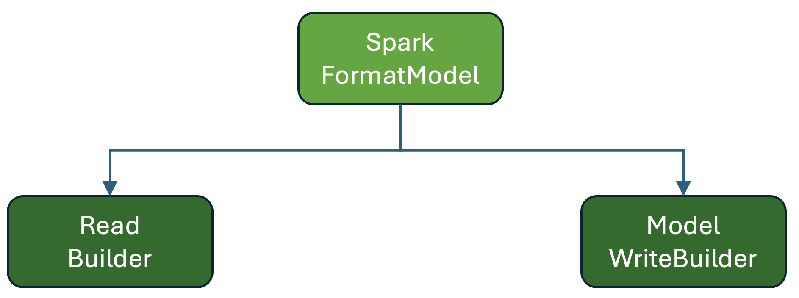
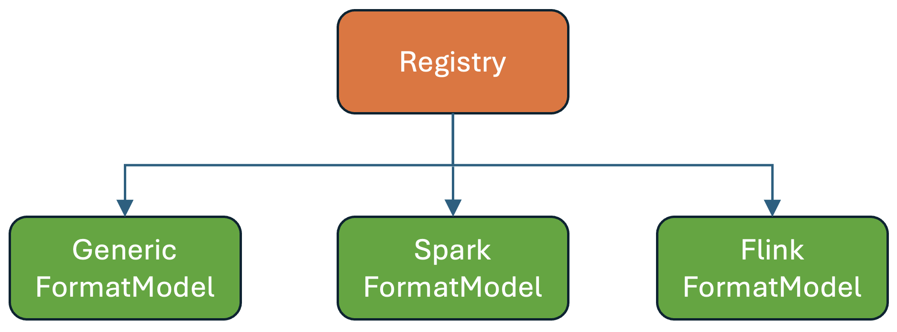
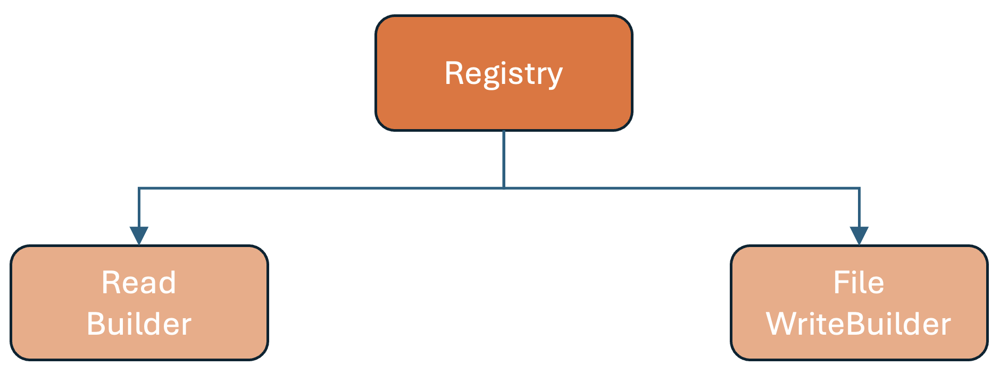

<!--
 - Licensed to the Apache Software Foundation (ASF) under one or more
 - contributor license agreements.  See the NOTICE file distributed with
 - this work for additional information regarding copyright ownership.
 - The ASF licenses this file to You under the Apache License, Version 2.0
 - (the "License"); you may not use this file except in compliance with
 - the License.  You may obtain a copy of the License at
 -
 -   http://www.apache.org/licenses/LICENSE-2.0
 -
 - Unless required by applicable law or agreed to in writing, software
 - distributed under the License is distributed on an "AS IS" BASIS,
 - WITHOUT WARRANTIES OR CONDITIONS OF ANY KIND, either express or implied.
 - See the License for the specific language governing permissions and
 - limitations under the License.
 -->

The Apache Iceberg community is excited to announce the finalization of the File Format API, a major architectural milestone that makes file formats **pluggable**, **consistent**, and **engine‑agnostic** across the Iceberg Java codebase.

<!-- more -->

For years, Iceberg has delivered high‑quality support for **Parquet**, **Avro**, and **ORC**, but the data landscape has evolved dramatically. New formats now emphasize extremely fast random access, GPU‑native encodings, flexible file layouts, and built‑in indexing structures. Opening up the possibility of integrating such formats required a new foundation.

The File Format API introduces a unified, extensible layer that engines can rely on when reading and writing Iceberg data files in any supported format.

## Why a New File Format API Was Needed

Iceberg’s original format‑handling code grew organically as support for Parquet, Avro, and ORC matured. Over time, this approach revealed several limitations.

### Fragmented and duplicated logic
Each engine Apache Spark, Apache Flink, and the generic Java implementation—maintained its own format‑specific readers, writers, and feature handling. Trying out a new format required deep modifications across multiple layers.

### Large branching code paths
Support for multiple formats was implemented through large switch statements or branching logic, making it difficult to extend and easy to introduce inconsistencies.

### Uneven feature support
Basic capabilities such as projection, filtering, and delete file handling needed custom work for each format/engine combination, slowing feature development, leaving features unavailable for some formats, and increasing maintenance cost.

### Accelerating innovation in the ecosystem
New formats have emerged with capabilities such as:

- Adaptive encodings for strings, numerics, or complex types  
- Integrated indexes for fast point/range lookups  
- CPU‑ and GPU‑optimized layouts  
- File structures that do not match traditional row‑group‑based designs  

Enabling possible support for these formats cleanly required a more flexible architectural contract.

## What the File Format API Provides

The File Format API introduces a well‑defined, pluggable interface for integrating new formats into Iceberg. It allows engines to interact with formats through a standardized set of builders and metadata structures.

### Core concepts include:

#### **FormatModel**
A format implementation provides a FormatModel describing:

- The name/identifier of the file format  
- Reader construction  
- Writer construction  
- Format‑specific configuration or capabilities  



#### **FormatModelRegistry**
A registry stores the available FormatModels. This decouples engines from specific formats and allows new formats to be added without modifying engine code.

```
FormatModelRegistry.register(FormatModel)
```




#### **Read and Write Builders**
Instead of hard‑coded file‑format logic in engines, all operations now go through the Registry, which provides builders for read/write operations. These builder classes are fetched from the registry like this:

```
FormatModelRegistry.readBuilder(fileFormat, clazz, inputFile)
FormatModelRegistry.dataWriteBuilder(fileFormat, clazz, outputFile)
FormatModelRegistry.equalityDeleteWriteBuilder(fileFormat, clazz, outputFile)
FormatModelRegistry.positionDeleteWriteBuilder(fileFormat, clazz, outputFile)
```



## What the New API Unlocks

### **1. Integration of New File Formats**
The new architecture allows us to try out formats such as Vortex and Lance to integrate cleanly using predictable APIs. This would allow us to leverage their unique capabilities, such as GPU‑native encodings and index structures, without complex engine‑specific code.

### **2. Column Families**
The API enables vertically split storage layouts—column families—which support:

- Partial updates without rewriting entire files  
- Higher parallelism  
- Smaller metadata footers  
- More efficient selective reads  

## Current State

### ✔ API Finalized
### ✔ Generic Model Implemented
### ✔ Engine Integrations Merged
### ✖ TCK In Progress

The Technology Compatibility Kit (TCK) is one of the most important next steps. It will validate correctness, semantics, feature completeness, type support, and compatibility for new format implementations.

## Next Steps

### **1. Vortex Integration**
A full Vortex integration will demonstrate the power of the new File Format API.

### **2. Completing the TCK**
Essential for ensuring stable, long‑term compatibility.

### **3. Column Families**
We expect that implementing Column Families will illustrate how vertically split layouts can be implemented cleanly using the new API.

## Getting Involved

The community welcomes all contributors. You can help by testing integrations, participating in TCK development, or experimenting with new formats.

## Conclusion

Finalizing the File Format API marks a major milestone for Apache Iceberg. It enables clean extensibility, encourages innovation across file formats, and prepares Iceberg for the next generation of analytics and AI workloads. Work on the TCK and Vortex integration is already underway, and we are excited to see what the community builds next.
