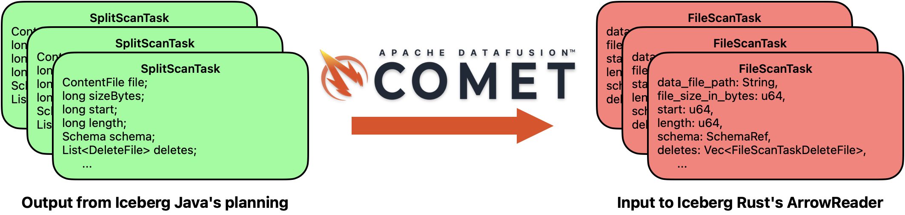

<!--
 - Licensed to the Apache Software Foundation (ASF) under one or more
 - contributor license agreements.  See the NOTICE file distributed with
 - this work for additional information regarding copyright ownership.
 - The ASF licenses this file to You under the Apache License, Version 2.0
 - (the "License"); you may not use this file except in compliance with
 - the License.  You may obtain a copy of the License at
 -
 -   http://www.apache.org/licenses/LICENSE-2.0
 -
 - Unless required by applicable law or agreed to in writing, software
 - distributed under the License is distributed on an "AS IS" BASIS,
 - WITHOUT WARRANTIES OR CONDITIONS OF ANY KIND, either express or implied.
 - See the License for the specific language governing permissions and
 - limitations under the License.
 -->

<!-- more -->

Apache Iceberg provides a universal table format that serves as a foundation for modern data
lakehouse
platforms. With Iceberg, users store their tables with the benefit of being able to access
and modify their data from a number of different query engines.
[Apache Spark](https://spark.apache.org) is the engine most closely associated with Iceberg. The
[Iceberg Java repository](https://github.com/apache/iceberg), effectively the reference
implementation of the Iceberg spec, ships Spark as its most mature integration. It is also the
engine most teams rely on for table maintenance like compaction and snapshot expiration.
In addition to Java, the Iceberg community maintains a number
of other Iceberg implementations like [C++](https://github.com/apache/iceberg-cpp),
[Go](https://github.com/apache/iceberg-go), and [Rust](https://github.com/apache/iceberg-rust).
These other implementations benefit not only from the Iceberg specification, but also the lessons
learned and design decisions of the Java project's community. Furthermore, the Java repository's extensive
test suites include over 10,000 correctness tests driven by Spark.

While Spark remains a powerful and robust engine, a number of projects exist to accelerate its
JVM-backed execution. One such solution is
[Apache DataFusion Comet](https://datafusion.apache.org/comet/), which was donated by Apple in 2024
as a subproject of the [Apache DataFusion](https://datafusion.apache.org) query engine. Comet's
native execution engine runs CPU-bound jobs faster and IO-bound jobs with
fewer resources, giving users control over how they want to optimize their Spark jobs.

## Accelerating Spark Queries with Comet

Comet builds upon several related Apache projects including DataFusion (for its efficient operator
implementations like joins and aggregations), [Arrow-rs](https://github.com/apache/arrow-rs)
(for its standardized in-memory format and robust Parquet reader), and, somewhat surprisingly,
both the Java and the Rust implementations of Iceberg. To accelerate Spark queries, Comet
intercepts execution
at the physical plan level. After Spark has parsed, planned, and optimized a user's query,
Comet's JVM code runs as one final optimizer rule to convert Spark plan nodes to Comet plan nodes.
These Comet plan nodes have a superpower: they execute in DataFusion's Rust engine over columnar Arrow
data.

<figure markdown="span"><figcaption>Comet converts a Spark physical plan into an equivalent DataFusion physical plan.</figcaption></figure>

So how does Comet use *both* Iceberg libraries to accelerate Spark queries over Iceberg tables?
As previously mentioned, Iceberg provides robust integrations with Spark, enabling users to query
their Iceberg tables regardless of the Spark API they are using (*e.g.*, SQL, Scala, or PySpark).
Iceberg relies on Spark's
[`Data Source v2`](https://spark.apache.org/docs/4.2.0-preview4/sql-data-sources-v2.html) API to
integrate with query planning, a process that
Apache Iceberg PMC member Russell Spitzer recently described in a talk titled 
["An Extremely Technical Overview of How Apache Iceberg Planning Actually Works"](https://www.youtube.com/watch?v=kJaD0WuQ1Bg).
The short version of the talk is that given a query reading an Iceberg table, the Java 
library inspects table metadata (*e.g.*,
version history, schema, statistics, file layout) to construct `FileScanTask` objects that describe the
low-level operations (*e.g.*, file paths and byte ranges) needed to
read Iceberg tables and provide data for downstream query operators.

Comet still relies on Iceberg Java for this planning. Acceleration is possible because Iceberg Rust
has its own `FileScanTask`, so Comet uses it as the common abstraction between the two libraries: it
takes the `FileScanTask` objects that Iceberg Java produced and hands them to Iceberg Rust, which
reads the described files into the in-memory Arrow batches that feed the rest of the plan.

<figure markdown="span"><figcaption>Comet translates Iceberg Java's <code>FileScanTask</code> objects into Iceberg Rust's <code>FileScanTask</code> objects.</figcaption></figure>

To measure Comet's impact on real workloads, the AWS Data on EKS team benchmarked Comet against
Spark alone on the TPC-DS 3 TB workload over Iceberg tables. Comet completed the suite roughly
40% faster (2,803.80s versus 4,665.47s) and accelerated 102 of the 103 TPC-DS queries, with only
a single query regressing. See the
[full benchmark writeup](https://awslabs.github.io/data-on-eks/docs/benchmarks/spark-datafusion-comet-benchmark)
for the complete methodology and per-query results.

<figure markdown="span">{ width="500" }<figcaption>TPC-DS 3 TB (Iceberg) on AWS EKS: Spark with Comet completes the suite ~40% faster.</figcaption></figure> 

Comet does not yet accelerate all Iceberg table reads. For example, Comet currently falls back to
Iceberg Java any time it encounters a table in format
[version 3](https://iceberg.apache.org/spec/#version-3-extended-types-and-capabilities) or newer. 
This fallback behavior can be due to gaps in Comet or gaps in the underlying Iceberg Rust library.
However, Comet makes it easier to build new Iceberg Rust features and close those gaps.

## Accelerating Iceberg Rust Development with Comet

While the specification remains the reference for Iceberg developers, the lessons learned and
edge cases encountered by the Iceberg Java implementation provide an excellent corpus for other
implementers. Comet turns that corpus into a development tool for Iceberg Rust.

The idea is to decouple execution from planning. Iceberg Java and Spark handle planning and produce
a trusted result, so they serve as an oracle. Comet and Iceberg Rust handle native execution, so
they become the system under test. Running them side by side is a form of differential testing: a
query that Comet executes natively should return exactly what Spark returns on its own, and any
difference points to a gap in Iceberg Rust or in Comet's translation between the two libraries.

Comet's fallback behavior is what makes this practical. By default, Comet falls back to Iceberg Java
whenever it encounters a feature that Iceberg Rust cannot yet handle. Relaxing a fallback forces the
native path and exposes exactly where it breaks, which turns the process into ordinary test-driven
development against Iceberg Java's suite of over 10,000 Spark tests. A developer relaxes a fallback,
runs the tests that exercise the feature, inspects what the Java planner produces, and implements
whatever Iceberg Rust is missing to match it.

The first iterations are noisy. Early on, a single test run could produce hundreds of failures.
Rather than triage them by hand, contributors have used AI assistants to read the relevant Iceberg
Java code and group the failures by root cause, then tackle whichever gap accounts for the
most. A wall of red becomes a prioritized backlog.

This model is already producing results, with Comet contributors submitting [over 40 pull
requests](https://github.com/search?q=repo%3Aapache%2Ficeberg-rust+is%3Apr+author%3Ambutrovich+author%3Aparthchandra+author%3Ahsiang-c&type=pullrequests)
to Iceberg Rust spanning bug fixes, new features, and performance optimizations. For example, Comet has recently begun adding [preliminary Iceberg V3
support](https://github.com/apache/datafusion-comet/pull/4887), reading deletion vectors against
an in-progress Iceberg Rust branch, with its fixes now being peeled off into standalone Iceberg
Rust contributions. Similarly, [adding Iceberg 1.11 support to
Comet](https://github.com/apache/datafusion-comet/pull/4840) surfaced two bugs in Iceberg Rust that
were [quickly](https://github.com/apache/iceberg-rust/pull/2781)
[fixed](https://github.com/apache/iceberg-rust/pull/2783).

The comparison cuts both ways. Iceberg Java is usually the oracle, but sometimes Iceberg Rust's
behavior is the reference for the correct result. For example, Comet helped validate the fix for
[a bug in Iceberg Java's manifest delete file size after a rewrite table
action](https://github.com/apache/iceberg/pull/15470), confirming the corrected behavior against
Iceberg Rust.

This workflow is becoming part of how both projects test. Comet's CI runs Iceberg Java's Spark
tests on every Comet pull request, so the shared corpus continuously guards the native path against
regressions. When a Comet contributor fixes a bug or adds a feature on an Iceberg Rust branch, they
typically open a Comet draft pull request that points at that branch and demonstrates previously
failing Iceberg Java tests passing end to end. The same setup is used informally to validate Iceberg
Rust release candidates. Comet is not a formal CI check for Iceberg Rust, but its developers are
encouraged to run their changes through Comet when validating a new feature.

On its own, an open table format is little more than data at rest. Paired with an open source query
engine like DataFusion, it becomes the foundation of an open data platform. The work described here
is a small but growing example of what that looks like in practice: two communities building on
each other's strengths to make Iceberg faster to query and quicker to evolve. We are thrilled by the
deepening collaboration between the Iceberg and DataFusion communities, and we encourage anyone
interested to find a way to get involved.

## Getting Involved

Both Comet and Iceberg Rust welcome contributions. Comet tracks work through
GitHub [issues](https://github.com/apache/datafusion-comet/issues) and discussion happens through the
[Apache DataFusion communication channels](https://datafusion.apache.org/contributor-guide/communication.html),
while Iceberg Rust uses GitHub [issues](https://github.com/apache/iceberg-rust/issues) and the
[Apache Iceberg community channels](https://iceberg.apache.org/community/).

There are several ways to get involved:

- Give Comet a try to accelerate your Spark queries over Iceberg tables: see the
  [Comet user guide](https://datafusion.apache.org/comet/user-guide/index.html) to get started,
  point it at your existing workloads, and report any issues you encounter.
- Help close the gaps that cause Comet to fall back to Iceberg Java by contributing features to
  [Iceberg Rust](https://github.com/apache/iceberg-rust).
- Review the contributor guides for
  [Comet](https://datafusion.apache.org/comet/contributor-guide/index.html) and
  [Iceberg Rust](https://github.com/apache/iceberg-rust/blob/main/CONTRIBUTING.md).
- Look for good first issues in
  [Comet](https://github.com/apache/datafusion-comet/issues) and
  [Iceberg Rust](https://github.com/apache/iceberg-rust/issues).

For more information, visit the [Comet](https://github.com/apache/datafusion-comet) and
[Iceberg Rust](https://github.com/apache/iceberg-rust) repositories.