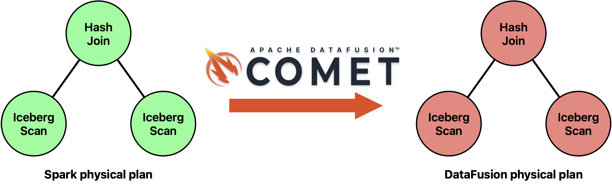
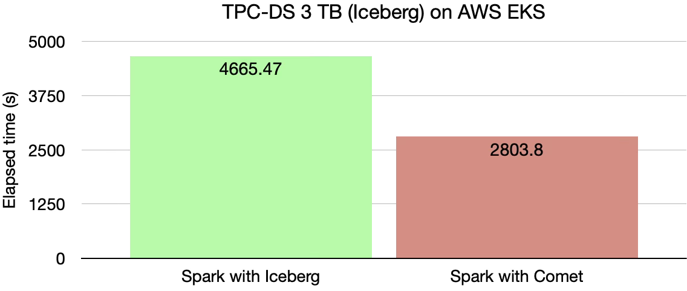
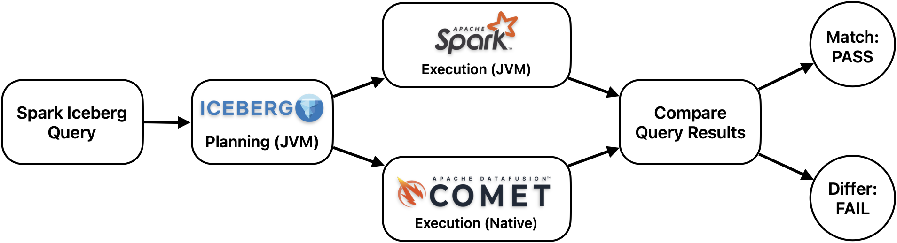
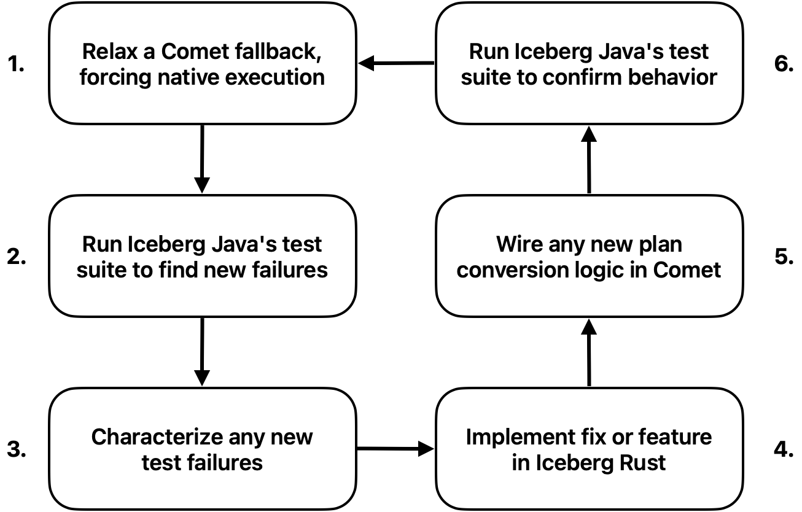

<!--
 - Licensed to the Apache Software Foundation (ASF) under one or more
 - contributor license agreements.  See the NOTICE file distributed with
 - this work for additional information regarding copyright ownership.
 - The ASF licenses this file to You under the Apache License, Version 2.0
 - (the "License"); you may not use this file except in compliance with
 - the License.  You may obtain a copy of the License at
 -
 -   http://www.apache.org/licenses/LICENSE-2.0
 -
 - Unless required by applicable law or agreed to in writing, software
 - distributed under the License is distributed on an "AS IS" BASIS,
 - WITHOUT WARRANTIES OR CONDITIONS OF ANY KIND, either express or implied.
 - See the License for the specific language governing permissions and
 - limitations under the License.
 -->

Apache Iceberg's ecosystem spans multiple query engines and language implementations that work
together to give users a consistent experience across the data lakehouse. This post explores one
integration within that ecosystem, [Iceberg Rust](https://github.com/apache/iceberg-rust) and
[Apache DataFusion Comet](https://datafusion.apache.org/comet/), and the two benefits their
relationship brings.
Comet accelerates Apache Spark's reads over Iceberg tables by running them natively through Iceberg
Rust. That same integration turns Iceberg Java's nearly 10,000 Spark tests into a differential-testing
harness whose benefits run both ways: Iceberg Rust gets exercised against a broad corpus of
real-world scenarios, and the comparison has even caught bugs in Iceberg Java. The resulting fixes
land upstream and benefit every project built on these libraries, not just Comet, as the Iceberg and
DataFusion communities build on each other's strengths.

<!-- more -->

## Background

Apache Iceberg provides a universal table format that serves as a foundation for modern data
lakehouse
platforms. With Iceberg, users store their tables with the benefit of being able to access
and modify their data from a number of different query engines.
The
[Iceberg Java repository](https://github.com/apache/iceberg), the *de facto* reference
implementation of the Iceberg specification, ships a mature [Apache Spark](https://spark.apache.org)
integration. Beyond querying their data, teams also use Spark for table maintenance like compaction and
snapshot expiration.
In addition to Java, the Iceberg community maintains a number
of other Iceberg implementations like [C++](https://github.com/apache/iceberg-cpp),
[Go](https://github.com/apache/iceberg-go), [Python](https://github.com/apache/iceberg-python), and
[Rust](https://github.com/apache/iceberg-rust).
These other implementations benefit not only from the Iceberg specification, but also the lessons
learned and design decisions of the Java project's community. The Java repository's extensive
test suites, for instance, include nearly 10,000 correctness tests driven by Spark (as of Iceberg
1.11 with Spark 4.1). Each implementation maintains its own test suite and can look to Iceberg Java
as a reference for both correct behavior and test coverage. None of them, however, can run Java's
tests directly against their own code.

While Spark remains widely used for working with Iceberg, a number of projects exist to accelerate
its JVM-backed execution. One such solution is Comet, which Apple donated in 2024 as a subproject of
the [Apache DataFusion](https://datafusion.apache.org) query engine. Comet's native execution engine
aims to run CPU-bound jobs faster and IO-bound jobs with fewer resources. As we will see, it does
more than speed up queries: the same design that makes it fast also makes it a tool for accelerating
Iceberg Rust's development.

## Accelerating Spark Queries with Comet

Comet builds upon several related Apache projects including DataFusion (for its efficient operator
implementations like joins and aggregations), [Arrow-rs](https://github.com/apache/arrow-rs)
(for its standardized in-memory format and robust Parquet reader), and both the Java and Rust
implementations of Iceberg. To accelerate Spark queries, Comet
intercepts execution
at the physical plan level. After Spark has parsed, planned, and optimized a user's query,
Comet's JVM code runs as one final optimizer rule to convert Spark plan nodes to Comet plan nodes.
These Comet plan nodes have a superpower: they execute in DataFusion's Rust engine over columnar Arrow
data.

<figure markdown="span">{ width="750" }<figcaption>Comet converts a Spark physical plan into an equivalent DataFusion physical plan.</figcaption></figure>

So how does Comet use *both* Iceberg libraries to accelerate Spark queries over Iceberg tables?
As previously mentioned, Iceberg provides robust integrations with Spark, enabling users to query
their Iceberg tables regardless of the Spark API they are using (*e.g.*, SQL, Scala, or PySpark).
Iceberg relies on Spark's
[`Data Source v2`](https://spark.apache.org/docs/latest/api/java/org/apache/spark/sql/connector/read/package-summary.html) API to
integrate with query planning, a process that
Apache Iceberg PMC member Russell Spitzer recently described in a talk titled 
["An Extremely Technical Overview of How Apache Iceberg Planning Actually Works"](https://www.youtube.com/watch?v=kJaD0WuQ1Bg).
The short version of the talk is that given a query reading an Iceberg table, the Java 
library inspects table metadata (*e.g.*, version history, schema, statistics, file layout) to
construct `FileScanTask` objects. These objects describe the low-level operations (*e.g.*, file paths
and byte ranges) needed to read the table and feed data to downstream query operators.

Comet still relies on Iceberg Java for this planning. Acceleration is possible because Iceberg Rust
has its own `FileScanTask`, so Comet uses it as the common abstraction between the two libraries: it
takes the `FileScanTask` objects that Iceberg Java produced and hands them to Iceberg Rust, which
reads the described files into the in-memory Arrow batches that feed the rest of the plan.

<figure markdown="span">{ width="750" }<figcaption>Comet translates Iceberg Java's <code>FileScanTask</code> objects into Iceberg Rust's <code>FileScanTask</code> objects.</figcaption></figure>

To measure Comet's impact on real workloads, the AWS Data on EKS team benchmarked Comet against
Spark alone on the TPC-DS 3 TB workload over Iceberg tables. Comet completed the suite roughly
40% faster (2,803.80s versus 4,665.47s) and accelerated 102 of the 103 TPC-DS queries, with only
a single query regressing. See the
[full benchmark writeup](https://awslabs.github.io/data-on-eks/docs/benchmarks/spark-datafusion-comet-benchmark)
for the complete methodology and per-query results.

<figure markdown="span">{ width="500" }<figcaption>TPC-DS 3 TB (Iceberg) on AWS EKS: Spark with Comet completes the suite ~40% faster.</figcaption></figure> 

Raw speed only matters if the answers are correct. Comet prioritizes correctness and compatibility
with the libraries it accelerates. In addition to its own exhaustive test suites, Comet goes
further by running Iceberg Java's Spark test suites with Comet enabled as regression tests,
continuously checking the native path against the same corpus that guards the reference
implementation.

Comet uses Iceberg Rust to accelerate reads but does not yet accelerate writes, which still go
through Iceberg Java. Even among table reads, it does not accelerate all of them. For example, Comet currently falls back to
Iceberg Java any time it encounters a table using [table format version
3](https://iceberg.apache.org/spec/#version-3-extended-types-and-capabilities) or newer. 
This fallback behavior can be due to gaps in Comet or gaps in the underlying Iceberg Rust library.
A consequence is that when Comet runs Iceberg Java's Spark suites, many tests silently take the
Iceberg Java path rather than exercising Comet's native execution, so not every passing test
reflects an accelerated read. That same graceful fallback, however, is also what makes these
suites useful for improving Iceberg Rust itself.

## Accelerating Iceberg Rust Development with Comet

While the specification remains the reference for Iceberg developers, the lessons learned and
edge cases encountered by the Java implementation provide an excellent corpus for other
implementers. Historically, a non-Java implementation could only study that corpus and reimplement
equivalent tests by hand. Comet changes that: it lets Iceberg Rust execute directly against Iceberg
Java's Spark test suites. To our knowledge, no other Iceberg implementation (*e.g.*, C++ or Go) has
any comparable way to test itself against the Java corpus.

Comet accelerates queries by keeping Iceberg Java's planning and swapping in native execution.
Accelerating development reuses that same split. Iceberg Java and Spark handle planning and produce
a trusted result, so they serve as an oracle. Comet and Iceberg Rust handle native execution, so
they become the system under test. Running them side by side is a form of differential testing: a
query that Comet executes natively should return exactly what Spark returns on its own, and any
difference points to a gap in Iceberg Rust or in Comet's translation between the two libraries.

<figure markdown="span">{ width="750" }<figcaption>Planning is held constant while execution varies: Spark's JVM path is the trusted oracle, Comet's native path (via Iceberg Rust) is the system under test, and any difference in results flags a gap.</figcaption></figure>

Comet's fallback behavior is what makes this practical. By default, Comet falls back to Iceberg Java
whenever it encounters a feature that Iceberg Rust cannot yet handle. Relaxing a fallback forces the
native path and exposes exactly where it breaks, which turns the process into ordinary test-driven
development against Iceberg Java's suite of nearly 10,000 Spark tests. A developer relaxes a fallback,
runs the tests that exercise the feature, inspects what the Java planner produces, implements
whatever Iceberg Rust is missing to match it, wires up any new plan-conversion logic Comet needs, and
re-runs the suite to confirm the native path now passes.

<figure markdown="span">{ width="500" }<figcaption>Relaxing a fallback turns Iceberg Java's Spark tests into a test-driven development loop for both Iceberg Rust and Comet.</figcaption></figure>

The first iterations are noisy. Early on, a single test run could produce hundreds of failures
buried in enormous logs. To make that tractable, contributors have leaned on AI assistants to digest
the volume of test output and characterize the failures by root cause, so they can tackle whichever
gap accounts for the most. The humans still reason about the underlying code themselves; the AI just
turns a wall of red into a prioritized backlog.

This model is already producing results, with Comet contributors submitting [over 40 pull
requests](https://github.com/search?q=repo%3Aapache%2Ficeberg-rust+is%3Apr+author%3Ambutrovich+author%3Aparthchandra+author%3Ahsiang-c&type=pullrequests)
to Iceberg Rust spanning bug fixes, new features, and performance optimizations. For example, Comet has recently begun adding [preliminary support for table format version
3](https://github.com/apache/datafusion-comet/pull/4887), reading deletion vectors against
an in-progress Iceberg Rust branch. Contributors are now peeling those fixes off into standalone
Iceberg Rust contributions. Similarly, [adding Iceberg 1.11 support to
Comet](https://github.com/apache/datafusion-comet/pull/4840) surfaced two bugs in Iceberg Rust that
Comet contributors [quickly](https://github.com/apache/iceberg-rust/pull/2781)
[fixed](https://github.com/apache/iceberg-rust/pull/2783). Future contributions could follow the
same model to close the rest of the table format version 3 gap in Iceberg Rust: new data types
(variant, geometry, and geography), row lineage, default column values, and table encryption. The
write path is an opportunity too, since the same approach could bootstrap native write support next.

Crucially, none of these contributions are Comet-specific. They land upstream in Iceberg Rust and
close feature gaps with Iceberg Java, so every system built on the library benefits, not just
Comet. For the developers building Iceberg Rust, the payoff is direct: instead of mirroring Iceberg
Java's tests by hand, they get a stream of real, production-hardened behaviors to implement and
verify against, so the library matures faster and ships with more confidence. Comet is simply the
workload that surfaces the gaps; the fixes belong to the whole community.

The comparison cuts both ways. Iceberg Java is usually the oracle, but sometimes Iceberg Rust's
behavior is the reference for the correct result. For example, Comet helped validate the fix for
[a bug in Iceberg Java's manifest delete file size after a rewrite table
action](https://github.com/apache/iceberg/pull/15470), confirming the corrected behavior against
Iceberg Rust.

This workflow is becoming part of how both projects test. When a
Comet contributor fixes a bug or adds a feature on an Iceberg Rust branch, they
typically open a Comet draft pull request that points at that branch and demonstrates previously
failing Iceberg Java tests passing end to end. The same setup also serves as an informal way to
validate Iceberg Rust release candidates. Comet is not a formal CI check for Iceberg Rust, but the
Iceberg Rust community encourages developers to run their changes through Comet when validating a
new feature.

On its own, an open table format is little more than data at rest. Paired with an open source query
engine like DataFusion, it becomes the foundation of an open data platform. The work described here
is a small but growing example of what that looks like in practice: two communities building on
each other's strengths to accelerate Iceberg on both fronts. Users who query Iceberg get faster
results, and the developers who build it get a faster path to shipping and validating new features.
We are thrilled by the deepening collaboration between the Iceberg and DataFusion communities, and we
encourage anyone interested to find a way to get involved.

## Getting Involved

Both Comet and Iceberg Rust welcome contributions. Comet tracks work through
GitHub [issues](https://github.com/apache/datafusion-comet/issues) and discussion happens through the
[Apache DataFusion communication channels](https://datafusion.apache.org/contributor-guide/communication.html),
while Iceberg Rust uses GitHub [issues](https://github.com/apache/iceberg-rust/issues) and the
[Apache Iceberg community channels](https://iceberg.apache.org/community/).

There are several ways to get involved:

- Give Comet a try to accelerate your Spark queries over Iceberg tables: see the
  [Comet user guide](https://datafusion.apache.org/comet/user-guide/index.html) to get started,
  point it at your existing workloads, and report any issues you encounter.
- Help close the gaps that cause Comet to fall back to Iceberg Java by contributing features to
  [Iceberg Rust](https://github.com/apache/iceberg-rust).
- Review the contributor guides for
  [Comet](https://datafusion.apache.org/comet/contributor-guide/index.html) and
  [Iceberg Rust](https://github.com/apache/iceberg-rust/blob/main/CONTRIBUTING.md).
- Look for good first issues in
  [Comet](https://github.com/apache/datafusion-comet/issues) and
  [Iceberg Rust](https://github.com/apache/iceberg-rust/issues).

For more information, visit the [Comet](https://github.com/apache/datafusion-comet) and
[Iceberg Rust](https://github.com/apache/iceberg-rust) repositories.