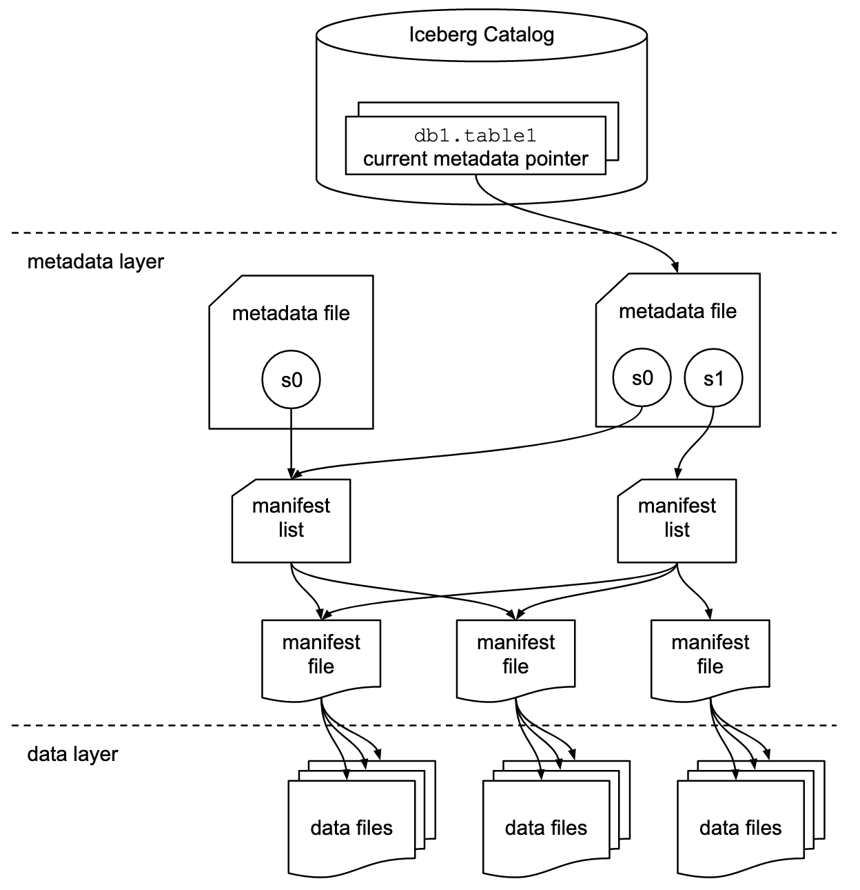

<!--
 - Licensed to the Apache Software Foundation (ASF) under one or more
 - contributor license agreements.  See the NOTICE file distributed with
 - this work for additional information regarding copyright ownership.
 - The ASF licenses this file to You under the Apache License, Version 2.0
 - (the "License"); you may not use this file except in compliance with
 - the License.  You may obtain a copy of the License at
 -
 -   http://www.apache.org/licenses/LICENSE-2.0
 -
 - Unless required by applicable law or agreed to in writing, software
 - distributed under the License is distributed on an "AS IS" BASIS,
 - WITHOUT WARRANTIES OR CONDITIONS OF ANY KIND, either express or implied.
 - See the License for the specific language governing permissions and
 - limitations under the License.
 -->

# Iceberg Table Spec

This is a specification for the Iceberg table format that is designed to manage a large, slow-changing collection of files in a distributed file system or key-value store as a table.

## Format Versioning

Versions 1 and 2 of the Iceberg spec are complete and adopted by the community.

The format version number is incremented when new features are added that will break forward-compatibility---that is, when older readers would not read newer table features correctly. Tables may continue to be written with an older version of the spec to ensure compatibility by not using features that are not yet implemented by processing engines.

#### Version 1: Analytic Data Tables

Version 1 of the Iceberg spec defines how to manage large analytic tables using immutable file formats: Parquet, Avro, and ORC.

All version 1 data and metadata files are valid after upgrading a table to version 2. [Appendix E](#version-2) documents how to default version 2 fields when reading version 1 metadata.

#### Version 2: Row-level Deletes

Version 2 of the Iceberg spec adds row-level updates and deletes for analytic tables with immutable files.

The primary change in version 2 adds delete files to encode rows that are deleted in existing data files. This version can be used to delete or replace individual rows in immutable data files without rewriting the files.

In addition to row-level deletes, version 2 makes some requirements stricter for writers. The full set of changes are listed in [Appendix E](#version-2).


## Goals

* **Serializable isolation** -- Reads will be isolated from concurrent writes and always use a committed snapshot of a table’s data. Writes will support removing and adding files in a single operation and are never partially visible. Readers will not acquire locks.
* **Speed** -- Operations will use O(1) remote calls to plan the files for a scan and not O(n) where n grows with the size of the table, like the number of partitions or files.
* **Scale** -- Job planning will be handled primarily by clients and not bottleneck on a central metadata store. Metadata will include information needed for cost-based optimization.
* **Evolution** -- Tables will support full schema and partition spec evolution. Schema evolution supports safe column add, drop, reorder and rename, including in nested structures.
* **Dependable types** -- Tables will provide well-defined and dependable support for a core set of types.
* **Storage separation** -- Partitioning will be table configuration. Reads will be planned using predicates on data values, not partition values. Tables will support evolving partition schemes.
* **Formats** -- Underlying data file formats will support identical schema evolution rules and types. Both read-optimized and write-optimized formats will be available.

## Overview



This table format tracks individual data files in a table instead of directories. This allows writers to create data files in-place and only adds files to the table in an explicit commit.

Table state is maintained in metadata files. All changes to table state create a new metadata file and replace the old metadata with an atomic swap. The table metadata file tracks the table schema, partitioning config, custom properties, and snapshots of the table contents. A snapshot represents the state of a table at some time and is used to access the complete set of data files in the table.

Data files in snapshots are tracked by one or more manifest files that contain a row for each data file in the table, the file's partition data, and its metrics. The data in a snapshot is the union of all files in its manifests. Manifest files are reused across snapshots to avoid rewriting metadata that is slow-changing. Manifests can track data files with any subset of a table and are not associated with partitions.

The manifests that make up a snapshot are stored in a manifest list file. Each manifest list stores metadata about manifests, including partition stats and data file counts. These stats are used to avoid reading manifests that are not required for an operation.

#### Optimistic Concurrency

An atomic swap of one table metadata file for another provides the basis for serializable isolation. Readers use the snapshot that was current when they load the table metadata and are not affected by changes until they refresh and pick up a new metadata location.

Writers create table metadata files optimistically, assuming that the current version will not be changed before the writer's commit. Once a writer has created an update, it commits by swapping the table’s metadata file pointer from the base version to the new version.

If the snapshot on which an update is based is no longer current, the writer must retry the update based on the new current version. Some operations support retry by re-applying metadata changes and committing, under well-defined conditions. For example, a change that rewrites files can be applied to a new table snapshot if all of the rewritten files are still in the table.

The conditions required by a write to successfully commit determines the isolation level. Writers can select what to validate and can make different isolation guarantees.

#### Sequence Numbers

The relative age of data and delete files relies on a sequence number that is assigned to every successful commit. When a snapshot is created for a commit, it is optimistically assigned the next sequence number, and it is written into the snapshot's metadata. If the commit fails and must be retried, the sequence number is reassigned and written into new snapshot metadata.

All manifests, data files, and delete files created for a snapshot inherit the snapshot's sequence number. Manifest file metadata in the manifest list stores a manifest's sequence number. New data and metadata file entries are written with `null` in place of a sequence number, which is replaced with the manifest's sequence number at read time. When a data or delete file is written to a new manifest (as "existing"), the inherited sequence number is written to ensure it does not change after it is first inherited.

Inheriting the sequence number from manifest metadata allows writing a new manifest once and reusing it in commit retries. To change a sequence number for a retry, only the manifest list must be rewritten -- which would be rewritten anyway with the latest set of manifests.


#### Row-level Deletes

Row-level deletes are stored in delete files.

There are two ways to encode a row-level delete:

* [_Position deletes_](#position-delete-files) mark a row deleted by data file path and the row position in the data file
* [_Equality deletes_](#equality-delete-files) mark a row deleted by one or more column values, like `id = 5`

Like data files, delete files are tracked by partition. In general, a delete file must be applied to older data files with the same partition; see [Scan Planning](#scan-planning) for details. Column metrics can be used to determine whether a delete file's rows overlap the contents of a data file or a scan range.


#### File System Operations

Iceberg only requires that file systems support the following operations:

* **In-place write** -- Files are not moved or altered once they are written.
* **Seekable reads** -- Data file formats require seek support.
* **Deletes** -- Tables delete files that are no longer used.

These requirements are compatible with object stores, like S3.

Tables do not require random-access writes. Once written, data and metadata files are immutable until they are deleted.

Tables do not require rename, except for tables that use atomic rename to implement the commit operation for new metadata files.


## Specification

#### Terms

* **Schema** -- Names and types of fields in a table.
* **Partition spec** -- A definition of how partition values are derived from data fields.
* **Snapshot** -- The state of a table at some point in time, including the set of all data files.
* **Manifest list** -- A file that lists manifest files; one per snapshot.
* **Manifest** -- A file that lists data or delete files; a subset of a snapshot.
* **Data file** -- A file that contains rows of a table.
* **Delete file** -- A file that encodes rows of a table that are deleted by position or data values.

#### Writer requirements

Some tables in this spec have columns that specify requirements for v1 and v2 tables. These requirements are intended for writers when adding metadata files to a table with the given version.

| Requirement | Write behavior |
|-------------|----------------|
| (blank)     | The field should be omitted |
| _optional_  | The field can be written |
| _required_  | The field must be written |

Readers should be more permissive because v1 metadata files are allowed in v2 tables so that tables can be upgraded to v2 without rewriting the metadata tree. For manifest list and manifest files, this table shows the expected v2 read behavior:

| v1         | v2         | v2 read behavior |
|------------|------------|------------------|
|            | _optional_ | Read the field as _optional_ |
|            | _required_ | Read the field as _optional_; it may be missing in v1 files |
| _optional_ |            | Ignore the field |
| _optional_ | _optional_ | Read the field as _optional_ |
| _optional_ | _required_ | Read the field as _optional_; it may be missing in v1 files |
| _required_ |            | Ignore the field |
| _required_ | _optional_ | Read the field as _optional_ |
| _required_ | _required_ | Fill in a default or throw an exception if the field is missing |

Readers may be more strict for metadata JSON files because the JSON files are not reused and will always match the table version. Required v2 fields that were not present in v1 or optional in v1 may be handled as required fields. For example, a v2 table that is missing `last-sequence-number` can throw an exception.

### Schemas and Data Types

A table's **schema** is a list of named columns. All data types are either primitives or nested types, which are maps, lists, or structs. A table schema is also a struct type.

For the representations of these types in Avro, ORC, and Parquet file formats, see Appendix A.

#### Nested Types

A **`struct`** is a tuple of typed values. Each field in the tuple is named and has an integer id that is unique in the table schema. Each field can be either optional or required, meaning that values can (or cannot) be null. Fields may be any type. Fields may have an optional comment or doc string. Fields can have [default values](#default-values).

A **`list`** is a collection of values with some element type. The element field has an integer id that is unique in the table schema. Elements can be either optional or required. Element types may be any type.

A **`map`** is a collection of key-value pairs with a key type and a value type. Both the key field and value field each have an integer id that is unique in the table schema. Map keys are required and map values can be either optional or required. Both map keys and map values may be any type, including nested types.

#### Primitive Types

| Primitive type     | Description                                                              | Requirements                                     |
|--------------------|--------------------------------------------------------------------------|--------------------------------------------------|
| **`boolean`**      | True or false                                                            |                                                  |
| **`int`**          | 32-bit signed integers                                                   | Can promote to `long`                            |
| **`long`**         | 64-bit signed integers                                                   |                                                  |
| **`float`**        | [32-bit IEEE 754](https://en.wikipedia.org/wiki/IEEE_754) floating point | Can promote to double                            |
| **`double`**       | [64-bit IEEE 754](https://en.wikipedia.org/wiki/IEEE_754) floating point |                                                  |
| **`decimal(P,S)`** | Fixed-point decimal; precision P, scale S                                | Scale is fixed [1], precision must be 38 or less |
| **`date`**         | Calendar date without timezone or time                                   |                                                  |
| **`time`**         | Time of day without date, timezone                                       | Microsecond precision [2]                        |
| **`timestamp`**    | Timestamp without timezone                                               | Microsecond precision [2]                        |
| **`timestamptz`**  | Timestamp with timezone                                                  | Stored as UTC [2]                                |
| **`string`**       | Arbitrary-length character sequences                                     | Encoded with UTF-8 [3]                           |
| **`uuid`**         | Universally unique identifiers                                           | Should use 16-byte fixed                         |
| **`fixed(L)`**     | Fixed-length byte array of length L                                      |                                                  |
| **`binary`**       | Arbitrary-length byte array                                              |                                                  |

Notes:

1. Decimal scale is fixed and cannot be changed by schema evolution. Precision can only be widened.
2. All time and timestamp values are stored with microsecond precision.
    - Timestamps _with time zone_ represent a point in time: values are stored as UTC and do not retain a source time zone (`2017-11-16 17:10:34 PST` is stored/retrieved as `2017-11-17 01:10:34 UTC` and these values are considered identical).
    - Timestamps _without time zone_ represent a date and time of day regardless of zone: the time value is independent of zone adjustments (`2017-11-16 17:10:34` is always retrieved as `2017-11-16 17:10:34`). Timestamp values are stored as a long that encodes microseconds from the unix epoch.
3. Character strings must be stored as UTF-8 encoded byte arrays.

For details on how to serialize a schema to JSON, see Appendix C.


#### Default values

Default values can be tracked for struct fields (both nested structs and the top-level schema's struct). There can be two defaults with a field:
- `initial-default` is used to populate the field's value for all records that were written before the field was added to the schema
- `write-default` is used to populate the field's value for any records written after the field was added to the schema, if the writer does not supply the field's value

The `initial-default` is set only when a field is added to an existing schema. The `write-default` is initially set to the same value as `initial-default` and can be changed through schema evolution. If either default is not set for an optional field, then the default value is null for compatibility with older spec versions.

The `initial-default` and `write-default` produce SQL default value behavior, without rewriting data files. SQL default value behavior when a field is added handles all existing rows as though the rows were written with the new field's default value. Default value changes may only affect future records and all known fields are written into data files. Omitting a known field when writing a data file is never allowed. The write default for a field must be written if a field is not supplied to a write. If the write default for a required field is not set, the writer must fail.

Default values are attributes of fields in schemas and serialized with fields in the JSON format. See [Appendix C](#appendix-c-json-serialization).


#### Schema Evolution

Schemas may be evolved by type promotion or adding, deleting, renaming, or reordering fields in structs (both nested structs and the top-level schema’s struct).

Evolution applies changes to the table's current schema to produce a new schema that is identified by a unique schema ID, is added to the table's list of schemas, and is set as the table's current schema.

Valid type promotions are:

* `int` to `long`
* `float` to `double`
* `decimal(P, S)` to `decimal(P', S)` if `P' > P` -- widen the precision of decimal types.

Any struct, including a top-level schema, can evolve through deleting fields, adding new fields, renaming existing fields, reordering existing fields, or promoting a primitive using the valid type promotions. Adding a new field assigns a new ID for that field and for any nested fields. Renaming an existing field must change the name, but not the field ID. Deleting a field removes it from the current schema. Field deletion cannot be rolled back unless the field was nullable or if the current snapshot has not changed.

Grouping a subset of a struct’s fields into a nested struct is **not** allowed, nor is moving fields from a nested struct into its immediate parent struct (`struct<a, b, c> ↔ struct<a, struct<b, c>>`). Evolving primitive types to structs is **not** allowed, nor is evolving a single-field struct to a primitive (`map<string, int> ↔ map<string, struct<int>>`).

Struct evolution requires the following rules for default values:
* The `initial-default` must be set when a field is added and cannot change
* The `write-default` must be set when a field is added and may change
* When a required field is added, both defaults must be set to a non-null value
* When an optional field is added, the defaults may be null and should be explicitly set
* When a new field is added to a struct with a default value, updating the struct's default is optional
* If a field value is missing from a struct's `initial-default`, the field's `initial-default` must be used for the field
* If a field value is missing from a struct's `write-default`, the field's `write-default` must be used for the field


#### Column Projection

Columns in Iceberg data files are selected by field id. The table schema's column names and order may change after a data file is written, and projection must be done using field ids. If a field id is missing from a data file, its value for each row should be `null`.

For example, a file may be written with schema `1: a int, 2: b string, 3: c double` and read using projection schema `3: measurement, 2: name, 4: a`. This must select file columns `c` (renamed to `measurement`), `b` (now called `name`), and a column of `null` values called `a`; in that order.

Tables may also define a property `schema.name-mapping.default` with a JSON name mapping containing a list of field mapping objects. These mappings provide fallback field ids to be used when a data file does not contain field id information. Each object should contain

* `names`: A required list of 0 or more names for a field. 
* `field-id`: An optional Iceberg field ID used when a field's name is present in `names`
* `fields`: An optional list of field mappings for child field of structs, maps, and lists.

Field mapping fields are constrained by the following rules:

* A name may contain `.` but this refers to a literal name, not a nested field. For example, `a.b` refers to a field named `a.b`, not child field `b` of field `a`. 
* Each child field should be defined with their own field mapping under `fields`. 
* Multiple values for `names` may be mapped to a single field ID to support cases where a field may have different names in different data files. For example, all Avro field aliases should be listed in `names`.
* Fields which exist only in the Iceberg schema and not in imported data files may use an empty `names` list.
* Fields that exist in imported files but not in the Iceberg schema may omit `field-id`.
* List types should contain a mapping in `fields` for `element`. 
* Map types should contain mappings in `fields` for `key` and `value`. 
* Struct types should contain mappings in `fields` for their child fields.

For details on serialization, see [Appendix C](#name-mapping-serialization).

#### Identifier Field IDs

A schema can optionally track the set of primitive fields that identify rows in a table, using the property `identifier-field-ids` (see JSON encoding in Appendix C).

Two rows are the "same"---that is, the rows represent the same entity---if the identifier fields are equal. However, uniqueness of rows by this identifier is not guaranteed or required by Iceberg and it is the responsibility of processing engines or data providers to enforce.

Identifier fields may be nested in structs but cannot be nested within maps or lists. Float, double, and optional fields cannot be used as identifier fields and a nested field cannot be used as an identifier field if it is nested in an optional struct, to avoid null values in identifiers.


#### Reserved Field IDs

Iceberg tables must not use field ids greater than 2147483447 (`Integer.MAX_VALUE - 200`). This id range is reserved for metadata columns that can be used in user data schemas, like the `_file` column that holds the file path in which a row was stored.

The set of metadata columns is:

| Field id, name              | Type          | Description |
|-----------------------------|---------------|-------------|
| **`2147483646  _file`**     | `string`      | Path of the file in which a row is stored |
| **`2147483645  _pos`**      | `long`        | Ordinal position of a row in the source data file |
| **`2147483644  _deleted`**  | `boolean`     | Whether the row has been deleted |
| **`2147483643  _spec_id`**  | `int`         | Spec ID used to track the file containing a row |
| **`2147483642  _partition`** | `struct`     | Partition to which a row belongs |
| **`2147483546  file_path`** | `string`      | Path of a file, used in position-based delete files |
| **`2147483545  pos`**       | `long`        | Ordinal position of a row, used in position-based delete files |
| **`2147483544  row`**       | `struct<...>` | Deleted row values, used in position-based delete files |


### Partitioning

Data files are stored in manifests with a tuple of partition values that are used in scans to filter out files that cannot contain records that match the scan’s filter predicate. Partition values for a data file must be the same for all records stored in the data file. (Manifests store data files from any partition, as long as the partition spec is the same for the data files.)

Tables are configured with a **partition spec** that defines how to produce a tuple of partition values from a record. A partition spec has a list of fields that consist of:

*   A **source column id** from the table’s schema
*   A **partition field id** that is used to identify a partition field and is unique within a partition spec. In v2 table metadata, it is unique across all partition specs.
*   A **transform** that is applied to the source column to produce a partition value
*   A **partition name**

The source column, selected by id, must be a primitive type and cannot be contained in a map or list, but may be nested in a struct. For details on how to serialize a partition spec to JSON, see Appendix C.

Partition specs capture the transform from table data to partition values. This is used to transform predicates to partition predicates, in addition to transforming data values. Deriving partition predicates from column predicates on the table data is used to separate the logical queries from physical storage: the partitioning can change and the correct partition filters are always derived from column predicates. This simplifies queries because users don’t have to supply both logical predicates and partition predicates. For more information, see Scan Planning below.


#### Partition Transforms

| Transform name    | Description                                                  | Source types                                                                                              | Result type |
|-------------------|--------------------------------------------------------------|-----------------------------------------------------------------------------------------------------------|-------------|
| **`identity`**    | Source value, unmodified                                     | Any                                                                                                       | Source type |
| **`bucket[N]`**   | Hash of value, mod `N` (see below)                           | `int`, `long`, `decimal`, `date`, `time`, `timestamp`, `timestamptz`, `string`, `uuid`, `fixed`, `binary` | `int`       |
| **`truncate[W]`** | Value truncated to width `W` (see below)                     | `int`, `long`, `decimal`, `string`                                                                        | Source type |
| **`year`**        | Extract a date or timestamp year, as years from 1970         | `date`, `timestamp`, `timestamptz`                                                                        | `int`       |
| **`month`**       | Extract a date or timestamp month, as months from 1970-01-01 | `date`, `timestamp`, `timestamptz`                                                                        | `int`       |
| **`day`**         | Extract a date or timestamp day, as days from 1970-01-01     | `date`, `timestamp`, `timestamptz`                                                                        | `int`      |
| **`hour`**        | Extract a timestamp hour, as hours from 1970-01-01 00:00:00  | `timestamp`, `timestamptz`                                                                                        | `int`       |
| **`void`**        | Always produces `null`                                       | Any                                                                                                       | Source type or `int` |

All transforms must return `null` for a `null` input value.

The `void` transform may be used to replace the transform in an existing partition field so that the field is effectively dropped in v1 tables. See partition evolution below.


#### Bucket Transform Details

Bucket partition transforms use a 32-bit hash of the source value. The 32-bit hash implementation is the 32-bit Murmur3 hash, x86 variant, seeded with 0.

Transforms are parameterized by a number of buckets [1], `N`. The hash mod `N` must produce a positive value by first discarding the sign bit of the hash value. In pseudo-code, the function is:

```
  def bucket_N(x) = (murmur3_x86_32_hash(x) & Integer.MAX_VALUE) % N
```

Notes:

1. Changing the number of buckets as a table grows is possible by evolving the partition spec.

For hash function details by type, see Appendix B.


#### Truncate Transform Details

| **Type**      | **Config**            | **Truncate specification**                                       | **Examples**                     |
|---------------|-----------------------|------------------------------------------------------------------|----------------------------------|
| **`int`**     | `W`, width            | `v - (v % W)`	remainders must be positive	[1]                    | `W=10`: `1` ￫ `0`, `-1` ￫ `-10`  |
| **`long`**    | `W`, width            | `v - (v % W)`	remainders must be positive	[1]                    | `W=10`: `1` ￫ `0`, `-1` ￫ `-10`  |
| **`decimal`** | `W`, width (no scale) | `scaled_W = decimal(W, scale(v))` `v - (v % scaled_W)`		[1, 2] | `W=50`, `s=2`: `10.65` ￫ `10.50` |
| **`string`**  | `L`, length           | Substring of length `L`: `v.substring(0, L)` [3]                    | `L=3`: `iceberg` ￫ `ice`         |

Notes:

1. The remainder, `v % W`, must be positive. For languages where `%` can produce negative values, the correct truncate function is: `v - (((v % W) + W) % W)`
2. The width, `W`, used to truncate decimal values is applied using the scale of the decimal column to avoid additional (and potentially conflicting) parameters.
3. Strings are truncated to a valid UTF-8 string with no more than `L` code points.


#### Partition Evolution

Table partitioning can be evolved by adding, removing, renaming, or reordering partition spec fields.

Changing a partition spec produces a new spec identified by a unique spec ID that is added to the table's list of partition specs and may be set as the table's default spec.

When evolving a spec, changes should not cause partition field IDs to change because the partition field IDs are used as the partition tuple field IDs in manifest files.

In v2, partition field IDs must be explicitly tracked for each partition field. New IDs are assigned based on the last assigned partition ID in table metadata.

In v1, partition field IDs were not tracked, but were assigned sequentially starting at 1000 in the reference implementation. This assignment caused problems when reading metadata tables based on manifest files from multiple specs because partition fields with the same ID may contain different data types. For compatibility with old versions, the following rules are recommended for partition evolution in v1 tables:

1. Do not reorder partition fields
2. Do not drop partition fields; instead replace the field's transform with the `void` transform
3. Only add partition fields at the end of the previous partition spec


### Sorting

Users can sort their data within partitions by columns to gain performance. The information on how the data is sorted can be declared per data or delete file, by a **sort order**.

A sort order is defined by a sort order id and a list of sort fields. The order of the sort fields within the list defines the order in which the sort is applied to the data. Each sort field consists of:

*   A **source column id** from the table's schema
*   A **transform** that is used to produce values to be sorted on from the source column. This is the same transform as described in [partition transforms](#partition-transforms).
*   A **sort direction**, that can only be either `asc` or `desc`
*   A **null order** that describes the order of null values when sorted. Can only be either `nulls-first` or `nulls-last`

Order id `0` is reserved for the unsorted order. 

Sorting floating-point numbers should produce the following behavior: `-NaN` < `-Infinity` < `-value` < `-0` < `0` < `value` < `Infinity` < `NaN`. This aligns with the implementation of Java floating-point types comparisons. 

A data or delete file is associated with a sort order by the sort order's id within [a manifest](#manifests). Therefore, the table must declare all the sort orders for lookup. A table could also be configured with a default sort order id, indicating how the new data should be sorted by default. Writers should use this default sort order to sort the data on write, but are not required to if the default order is prohibitively expensive, as it would be for streaming writes.


### Manifests

A manifest is an immutable Avro file that lists data files or delete files, along with each file’s partition data tuple, metrics, and tracking information. One or more manifest files are used to store a [snapshot](#snapshots), which tracks all of the files in a table at some point in time. Manifests are tracked by a [manifest list](#manifest-lists) for each table snapshot.

A manifest is a valid Iceberg data file: files must use valid Iceberg formats, schemas, and column projection.

A manifest may store either data files or delete files, but not both because manifests that contain delete files are scanned first during job planning. Whether a manifest is a data manifest or a delete manifest is stored in manifest metadata.

A manifest stores files for a single partition spec. When a table’s partition spec changes, old files remain in the older manifest and newer files are written to a new manifest. This is required because a manifest file’s schema is based on its partition spec (see below). The partition spec of each manifest is also used to transform predicates on the table's data rows into predicates on partition values that are used during job planning to select files from a manifest.

A manifest file must store the partition spec and other metadata as properties in the Avro file's key-value metadata:

| v1         | v2         | Key                 | Value                                                                        |
|------------|------------|---------------------|------------------------------------------------------------------------------|
| _required_ | _required_ | `schema`            | JSON representation of the table schema at the time the manifest was written |
| _optional_ | _required_ | `schema-id`         | ID of the schema used to write the manifest as a string                      |
| _required_ | _required_ | `partition-spec`    | JSON fields representation of the partition spec used to write the manifest  |
| _optional_ | _required_ | `partition-spec-id` | ID of the partition spec used to write the manifest as a string              |
| _optional_ | _required_ | `format-version`    | Table format version number of the manifest as a string                      |
|            | _required_ | `content`           | Type of content files tracked by the manifest: "data" or "deletes"           |

The schema of a manifest file is a struct called `manifest_entry` with the following fields:

| v1         | v2         | Field id, name                | Type                                                      | Description |
| ---------- | ---------- |-------------------------------|-----------------------------------------------------------|-------------|
| _required_ | _required_ | **`0  status`**               | `int` with meaning: `0: EXISTING` `1: ADDED` `2: DELETED` | Used to track additions and deletions. Deletes are informational only and not used in scans. |
| _required_ | _optional_ | **`1  snapshot_id`**          | `long`                                                    | Snapshot id where the file was added, or deleted if status is 2. Inherited when null. |
|            | _optional_ | **`3  sequence_number`**      | `long`                                                    | Data sequence number of the file. Inherited when null and status is 1 (added). |
|            | _optional_ | **`4  file_sequence_number`** | `long`                                                    | File sequence number indicating when the file was added. Inherited when null and status is 1 (added). |
| _required_ | _required_ | **`2  data_file`**            | `data_file` `struct` (see below)                          | File path, partition tuple, metrics, ... |

`data_file` is a struct with the following fields:

| v1         | v2         | Field id, name                    | Type                         | Description |
| ---------- | ---------- |-----------------------------------|------------------------------|-------------|
|            | _required_ | **`134  content`**                | `int` with meaning: `0: DATA`, `1: POSITION DELETES`, `2: EQUALITY DELETES` | Type of content stored by the data file: data, equality deletes, or position deletes (all v1 files are data files) |
| _required_ | _required_ | **`100  file_path`**              | `string`                     | Full URI for the file with FS scheme |
| _required_ | _required_ | **`101  file_format`**            | `string`                     | String file format name, avro, orc or parquet |
| _required_ | _required_ | **`102  partition`**              | `struct<...>`                | Partition data tuple, schema based on the partition spec output using partition field ids for the struct field ids |
| _required_ | _required_ | **`103  record_count`**           | `long`                       | Number of records in this file |
| _required_ | _required_ | **`104  file_size_in_bytes`**     | `long`                       | Total file size in bytes |
| _required_ |            | ~~**`105 block_size_in_bytes`**~~ | `long`                       | **Deprecated. Always write a default in v1. Do not write in v2.** |
| _optional_ |            | ~~**`106  file_ordinal`**~~       | `int`                        | **Deprecated. Do not write.** |
| _optional_ |            | ~~**`107  sort_columns`**~~       | `list<112: int>`             | **Deprecated. Do not write.** |
| _optional_ | _optional_ | **`108  column_sizes`**           | `map<117: int, 118: long>`   | Map from column id to the total size on disk of all regions that store the column. Does not include bytes necessary to read other columns, like footers. Leave null for row-oriented formats (Avro) |
| _optional_ | _optional_ | **`109  value_counts`**           | `map<119: int, 120: long>`   | Map from column id to number of values in the column (including null and NaN values) |
| _optional_ | _optional_ | **`110  null_value_counts`**      | `map<121: int, 122: long>`   | Map from column id to number of null values in the column |
| _optional_ | _optional_ | **`137  nan_value_counts`**       | `map<138: int, 139: long>`   | Map from column id to number of NaN values in the column |
| _optional_ | _optional_ | **`111  distinct_counts`**        | `map<123: int, 124: long>`   | Map from column id to number of distinct values in the column; distinct counts must be derived using values in the file by counting or using sketches, but not using methods like merging existing distinct counts |
| _optional_ | _optional_ | **`125  lower_bounds`**           | `map<126: int, 127: binary>` | Map from column id to lower bound in the column serialized as binary [1]. Each value must be less than or equal to all non-null, non-NaN values in the column for the file [2] |
| _optional_ | _optional_ | **`128  upper_bounds`**           | `map<129: int, 130: binary>` | Map from column id to upper bound in the column serialized as binary [1]. Each value must be greater than or equal to all non-null, non-Nan values in the column for the file [2] |
| _optional_ | _optional_ | **`131  key_metadata`**           | `binary`                     | Implementation-specific key metadata for encryption |
| _optional_ | _optional_ | **`132  split_offsets`**          | `list<133: long>`            | Split offsets for the data file. For example, all row group offsets in a Parquet file. Must be sorted ascending |
|            | _optional_ | **`135  equality_ids`**           | `list<136: int>`             | Field ids used to determine row equality in equality delete files. Required when `content=2` and should be null otherwise. Fields with ids listed in this column must be present in the delete file |
| _optional_ | _optional_ | **`140  sort_order_id`**          | `int`                        | ID representing sort order for this file [3]. |

Notes:

1. Single-value serialization for lower and upper bounds is detailed in Appendix D.
2. For `float` and `double`, the value `-0.0` must precede `+0.0`, as in the IEEE 754 `totalOrder` predicate. NaNs are not permitted as lower or upper bounds.
3. If sort order ID is missing or unknown, then the order is assumed to be unsorted. Only data files and equality delete files should be written with a non-null order id. [Position deletes](#position-delete-files) are required to be sorted by file and position, not a table order, and should set sort order id to null. Readers must ignore sort order id for position delete files.
4. The following field ids are reserved on `data_file`: 141.

The `partition` struct stores the tuple of partition values for each file. Its type is derived from the partition fields of the partition spec used to write the manifest file. In v2, the partition struct's field ids must match the ids from the partition spec.

The column metrics maps are used when filtering to select both data and delete files. For delete files, the metrics must store bounds and counts for all deleted rows, or must be omitted. Storing metrics for deleted rows ensures that the values can be used during job planning to find delete files that must be merged during a scan.


#### Manifest Entry Fields

The manifest entry fields are used to keep track of the snapshot in which files were added or logically deleted. The `data_file` struct is nested inside of the manifest entry so that it can be easily passed to job planning without the manifest entry fields.

When a file is added to the dataset, its manifest entry should store the snapshot ID in which the file was added and set status to 1 (added).

When a file is replaced or deleted from the dataset, its manifest entry fields store the snapshot ID in which the file was deleted and status 2 (deleted). The file may be deleted from the file system when the snapshot in which it was deleted is garbage collected, assuming that older snapshots have also been garbage collected [1].

Iceberg v2 adds data and file sequence numbers to the entry and makes the snapshot ID optional. Values for these fields are inherited from manifest metadata when `null`. That is, if the field is `null` for an entry, then the entry must inherit its value from the manifest file's metadata, stored in the manifest list.
The `sequence_number` field represents the data sequence number and must never change after a file is added to the dataset. The data sequence number represents a relative age of the file content and should be used for planning which delete files apply to a data file.
The `file_sequence_number` field represents the sequence number of the snapshot that added the file and must also remain unchanged upon assigning at commit. The file sequence number can't be used for pruning delete files as the data within the file may have an older data sequence number. 
The data and file sequence numbers are inherited only if the entry status is 1 (added). If the entry status is 0 (existing) or 2 (deleted), the entry must include both sequence numbers explicitly.

Notes:

1. Technically, data files can be deleted when the last snapshot that contains the file as “live” data is garbage collected. But this is harder to detect and requires finding the diff of multiple snapshots. It is easier to track what files are deleted in a snapshot and delete them when that snapshot expires.  It is not recommended to add a deleted file back to a table. Adding a deleted file can lead to edge cases where incremental deletes can break table snapshots.
2. Manifest list files are required in v2, so that the `sequence_number` and `snapshot_id` to inherit are always available.

#### Sequence Number Inheritance

Manifests track the sequence number when a data or delete file was added to the table.

When adding a new file, its data and file sequence numbers are set to `null` because the snapshot's sequence number is not assigned until the snapshot is successfully committed. When reading, sequence numbers are inherited by replacing `null` with the manifest's sequence number from the manifest list.
It is also possible to add a new file with data that logically belongs to an older sequence number. In that case, the data sequence number must be provided explicitly and not inherited. However, the file sequence number must be always assigned when the snapshot is successfully committed.

When writing an existing file to a new manifest or marking an existing file as deleted, the data and file sequence numbers must be non-null and set to the original values that were either inherited or provided at the commit time.

Inheriting sequence numbers through the metadata tree allows writing a new manifest without a known sequence number, so that a manifest can be written once and reused in commit retries. To change a sequence number for a retry, only the manifest list must be rewritten.

When reading v1 manifests with no sequence number column, sequence numbers for all files must default to 0.


### Snapshots

A snapshot consists of the following fields:

| v1         | v2         | Field                    | Description |
| ---------- | ---------- | ------------------------ | ----------- |
| _required_ | _required_ | **`snapshot-id`**        | A unique long ID |
| _optional_ | _optional_ | **`parent-snapshot-id`** | The snapshot ID of the snapshot's parent. Omitted for any snapshot with no parent |
|            | _required_ | **`sequence-number`**    | A monotonically increasing long that tracks the order of changes to a table |
| _required_ | _required_ | **`timestamp-ms`**       | A timestamp when the snapshot was created, used for garbage collection and table inspection |
| _optional_ | _required_ | **`manifest-list`**      | The location of a manifest list for this snapshot that tracks manifest files with additional metadata |
| _optional_ |            | **`manifests`**          | A list of manifest file locations. Must be omitted if `manifest-list` is present |
| _optional_ | _required_ | **`summary`**            | A string map that summarizes the snapshot changes, including `operation` (see below) |
| _optional_ | _optional_ | **`schema-id`**          | ID of the table's current schema when the snapshot was created |

The snapshot summary's `operation` field is used by some operations, like snapshot expiration, to skip processing certain snapshots. Possible `operation` values are:

*   `append` -- Only data files were added and no files were removed.
*   `replace` -- Data and delete files were added and removed without changing table data; i.e., compaction, changing the data file format, or relocating data files.
*   `overwrite` -- Data and delete files were added and removed in a logical overwrite operation.
*   `delete` -- Data files were removed and their contents logically deleted and/or delete files were added to delete rows.

Data and delete files for a snapshot can be stored in more than one manifest. This enables:

*   Appends can add a new manifest to minimize the amount of data written, instead of adding new records by rewriting and appending to an existing manifest. (This is called a “fast append”.)
*   Tables can use multiple partition specs. A table’s partition configuration can evolve if, for example, its data volume changes. Each manifest uses a single partition spec, and queries do not need to change because partition filters are derived from data predicates.
*   Large tables can be split across multiple manifests so that implementations can parallelize job planning or reduce the cost of rewriting a manifest.

Manifests for a snapshot are tracked by a manifest list.

Valid snapshots are stored as a list in table metadata. For serialization, see Appendix C.


#### Manifest Lists

Snapshots are embedded in table metadata, but the list of manifests for a snapshot are stored in a separate manifest list file.

A new manifest list is written for each attempt to commit a snapshot because the list of manifests always changes to produce a new snapshot. When a manifest list is written, the (optimistic) sequence number of the snapshot is written for all new manifest files tracked by the list.

A manifest list includes summary metadata that can be used to avoid scanning all of the manifests in a snapshot when planning a table scan. This includes the number of added, existing, and deleted files, and a summary of values for each field of the partition spec used to write the manifest.

A manifest list is a valid Iceberg data file: files must use valid Iceberg formats, schemas, and column projection.

Manifest list files store `manifest_file`, a struct with the following fields:

| v1         | v2         | Field id, name                 | Type                                        | Description |
| ---------- | ---------- |--------------------------------|---------------------------------------------|-------------|
| _required_ | _required_ | **`500 manifest_path`**        | `string`                                    | Location of the manifest file |
| _required_ | _required_ | **`501 manifest_length`**      | `long`                                      | Length of the manifest file in bytes |
| _required_ | _required_ | **`502 partition_spec_id`**    | `int`                                       | ID of a partition spec used to write the manifest; must be listed in table metadata `partition-specs` |
|            | _required_ | **`517 content`**              | `int` with meaning: `0: data`, `1: deletes` | The type of files tracked by the manifest, either data or delete files; 0 for all v1 manifests |
|            | _required_ | **`515 sequence_number`**      | `long`                                      | The sequence number when the manifest was added to the table; use 0 when reading v1 manifest lists |
|            | _required_ | **`516 min_sequence_number`**  | `long`                                      | The minimum data sequence number of all live data or delete files in the manifest; use 0 when reading v1 manifest lists |
| _required_ | _required_ | **`503 added_snapshot_id`**    | `long`                                      | ID of the snapshot where the  manifest file was added |
| _optional_ | _required_ | **`504 added_files_count`**    | `int`                                       | Number of entries in the manifest that have status `ADDED` (1), when `null` this is assumed to be non-zero |
| _optional_ | _required_ | **`505 existing_files_count`** | `int`                                       | Number of entries in the manifest that have status `EXISTING` (0), when `null` this is assumed to be non-zero |
| _optional_ | _required_ | **`506 deleted_files_count`**  | `int`                                       | Number of entries in the manifest that have status `DELETED` (2), when `null` this is assumed to be non-zero |
| _optional_ | _required_ | **`512 added_rows_count`**     | `long`                                      | Number of rows in all of files in the manifest that have status `ADDED`, when `null` this is assumed to be non-zero |
| _optional_ | _required_ | **`513 existing_rows_count`**  | `long`                                      | Number of rows in all of files in the manifest that have status `EXISTING`, when `null` this is assumed to be non-zero |
| _optional_ | _required_ | **`514 deleted_rows_count`**   | `long`                                      | Number of rows in all of files in the manifest that have status `DELETED`, when `null` this is assumed to be non-zero |
| _optional_ | _optional_ | **`507 partitions`**           | `list<508: field_summary>` (see below)      | A list of field summaries for each partition field in the spec. Each field in the list corresponds to a field in the manifest file’s partition spec. |
| _optional_ | _optional_ | **`519 key_metadata`**         | `binary`                                    | Implementation-specific key metadata for encryption |

`field_summary` is a struct with the following fields:

| v1         | v2         | Field id, name          | Type          | Description |
| ---------- | ---------- |-------------------------|---------------|-------------|
| _required_ | _required_ | **`509 contains_null`** | `boolean`     | Whether the manifest contains at least one partition with a null value for the field |
| _optional_ | _optional_ | **`518 contains_nan`**  | `boolean`     | Whether the manifest contains at least one partition with a NaN value for the field |
| _optional_ | _optional_ | **`510 lower_bound`**   | `bytes`   [1] | Lower bound for the non-null, non-NaN values in the partition field, or null if all values are null or NaN [2] |
| _optional_ | _optional_ | **`511 upper_bound`**   | `bytes`   [1] | Upper bound for the non-null, non-NaN values in the partition field, or null if all values are null or NaN [2] |

Notes:

1. Lower and upper bounds are serialized to bytes using the single-object serialization in Appendix D. The type of used to encode the value is the type of the partition field data.
2. If -0.0 is a value of the partition field, the `lower_bound` must not be +0.0, and if +0.0 is a value of the partition field, the `upper_bound` must not be -0.0.

#### Scan Planning

Scans are planned by reading the manifest files for the current snapshot. Deleted entries in data and delete manifests (those marked with status "DELETED") are not used in a scan.

Manifests that contain no matching files, determined using either file counts or partition summaries, may be skipped.

For each manifest, scan predicates, which filter data rows, are converted to partition predicates, which filter data and delete files. These partition predicates are used to select the data and delete files in the manifest. This conversion uses the partition spec used to write the manifest file.

Scan predicates are converted to partition predicates using an _inclusive projection_: if a scan predicate matches a row, then the partition predicate must match that row’s partition. This is called _inclusive_ [1] because rows that do not match the scan predicate may be included in the scan by the partition predicate.

For example, an `events` table with a timestamp column named `ts` that is partitioned by `ts_day=day(ts)` is queried by users with ranges over the timestamp column: `ts > X`. The inclusive projection is `ts_day >= day(X)`, which is used to select files that may have matching rows. Note that, in most cases, timestamps just before `X` will be included in the scan because the file contains rows that match the predicate and rows that do not match the predicate.

Scan predicates are also used to filter data and delete files using column bounds and counts that are stored by field id in manifests. The same filter logic can be used for both data and delete files because both store metrics of the rows either inserted or deleted. If metrics show that a delete file has no rows that match a scan predicate, it may be ignored just as a data file would be ignored [2].

Data files that match the query filter must be read by the scan. 

Note that for any snapshot, all file paths marked with "ADDED" or "EXISTING" may appear at most once across all manifest files in the snapshot. If a file path appears more than once, the results of the scan are undefined. Reader implementations may raise an error in this case, but are not required to do so.


Delete files that match the query filter must be applied to data files at read time, limited by the scope of the delete file using the following rules.

* A _position_ delete file must be applied to a data file when all of the following are true:
    - The data file's data sequence number is _less than or equal to_ the delete file's data sequence number
    - The data file's partition (both spec and partition values) is equal to the delete file's partition
* An _equality_ delete file must be applied to a data file when all of the following are true:
    - The data file's data sequence number is _strictly less than_ the delete's data sequence number
    - The data file's partition (both spec and partition values) is equal to the delete file's partition _or_ the delete file's partition spec is unpartitioned

In general, deletes are applied only to data files that are older and in the same partition, except for two special cases:

* Equality delete files stored with an unpartitioned spec are applied as global deletes. Otherwise, delete files do not apply to files in other partitions.
* Position delete files must be applied to data files from the same commit, when the data and delete file data sequence numbers are equal. This allows deleting rows that were added in the same commit.


Notes:

1. An alternative, *strict projection*, creates a partition predicate that will match a file if all of the rows in the file must match the scan predicate. These projections are used to calculate the residual predicates for each file in a scan.
2. For example, if `file_a` has rows with `id` between 1 and 10 and a delete file contains rows with `id` between 1 and 4, a scan for `id = 9` may ignore the delete file because none of the deletes can match a row that will be selected.

#### Snapshot Reference

Iceberg tables keep track of branches and tags using snapshot references. 
Tags are labels for individual snapshots. Branches are mutable named references that can be updated by committing a new snapshot as the branch's referenced snapshot using the [Commit Conflict Resolution and Retry](#commit-conflict-resolution-and-retry) procedures.

The snapshot reference object records all the information of a reference including snapshot ID, reference type and [Snapshot Retention Policy](#snapshot-retention-policy).

| v1         | v2         | Field name                   | Type      | Description |
| ---------- | ---------- | ---------------------------- | --------- | ----------- |
| _required_ | _required_ | **`snapshot-id`**            | `long`    | A reference's snapshot ID. The tagged snapshot or latest snapshot of a branch. |
| _required_ | _required_ | **`type`**                   | `string`  | Type of the reference, `tag` or `branch` |
| _optional_ | _optional_ | **`min-snapshots-to-keep`**  | `int`     | For `branch` type only, a positive number for the minimum number of snapshots to keep in a branch while expiring snapshots. Defaults to table property `history.expire.min-snapshots-to-keep`. |
| _optional_ | _optional_ | **`max-snapshot-age-ms`**    | `long`    | For `branch` type only, a positive number for the max age of snapshots to keep when expiring, including the latest snapshot. Defaults to table property `history.expire.max-snapshot-age-ms`. |
| _optional_ | _optional_ | **`max-ref-age-ms`**         | `long`    | For snapshot references except the `main` branch, a positive number for the max age of the snapshot reference to keep while expiring snapshots. Defaults to table property `history.expire.max-ref-age-ms`. The `main` branch never expires. |

Valid snapshot references are stored as the values of the `refs` map in table metadata. For serialization, see Appendix C.

#### Snapshot Retention Policy

Table snapshots expire and are removed from metadata to allow removed or replaced data files to be physically deleted.
The snapshot expiration procedure removes snapshots from table metadata and applies the table's retention policy.
Retention policy can be configured both globally and on snapshot reference through properties `min-snapshots-to-keep`, `max-snapshot-age-ms` and `max-ref-age-ms`.

When expiring snapshots, retention policies in table and snapshot references are evaluated in the following way:

1. Start with an empty set of snapshots to retain
2. Remove any refs (other than main) where the referenced snapshot is older than `max-ref-age-ms`
3. For each branch and tag, add the referenced snapshot to the retained set
4. For each branch, add its ancestors to the retained set until:
    1. The snapshot is older than `max-snapshot-age-ms`, AND
    2. The snapshot is not one of the first `min-snapshots-to-keep` in the branch (including the branch's referenced snapshot)
5. Expire any snapshot not in the set of snapshots to retain.

### Table Metadata

Table metadata is stored as JSON. Each table metadata change creates a new table metadata file that is committed by an atomic operation. This operation is used to ensure that a new version of table metadata replaces the version on which it was based. This produces a linear history of table versions and ensures that concurrent writes are not lost.

The atomic operation used to commit metadata depends on how tables are tracked and is not standardized by this spec. See the sections below for examples.

#### Table Metadata Fields

Table metadata consists of the following fields:

| v1         | v2         | Field | Description |
| ---------- | ---------- | ----- | ----------- |
| _required_ | _required_ | **`format-version`** | An integer version number for the format. Currently, this can be 1 or 2 based on the spec. Implementations must throw an exception if a table's version is higher than the supported version. |
| _optional_ | _required_ | **`table-uuid`** | A UUID that identifies the table, generated when the table is created. Implementations must throw an exception if a table's UUID does not match the expected UUID after refreshing metadata. |
| _required_ | _required_ | **`location`**| The table's base location. This is used by writers to determine where to store data files, manifest files, and table metadata files. |
|            | _required_ | **`last-sequence-number`**| The table's highest assigned sequence number, a monotonically increasing long that tracks the order of snapshots in a table. |
| _required_ | _required_ | **`last-updated-ms`**| Timestamp in milliseconds from the unix epoch when the table was last updated. Each table metadata file should update this field just before writing. |
| _required_ | _required_ | **`last-column-id`**| An integer; the highest assigned column ID for the table. This is used to ensure columns are always assigned an unused ID when evolving schemas. |
| _required_ |            | **`schema`**| The table’s current schema. (**Deprecated**: use `schemas` and `current-schema-id` instead) |
| _optional_ | _required_ | **`schemas`**| A list of schemas, stored as objects with `schema-id`. |
| _optional_ | _required_ | **`current-schema-id`**| ID of the table's current schema. |
| _required_ |            | **`partition-spec`**| The table’s current partition spec, stored as only fields. Note that this is used by writers to partition data, but is not used when reading because reads use the specs stored in manifest files. (**Deprecated**: use `partition-specs` and `default-spec-id` instead) |
| _optional_ | _required_ | **`partition-specs`**| A list of partition specs, stored as full partition spec objects. |
| _optional_ | _required_ | **`default-spec-id`**| ID of the "current" spec that writers should use by default. |
| _optional_ | _required_ | **`last-partition-id`**| An integer; the highest assigned partition field ID across all partition specs for the table. This is used to ensure partition fields are always assigned an unused ID when evolving specs. |
| _optional_ | _optional_ | **`properties`**| A string to string map of table properties. This is used to control settings that affect reading and writing and is not intended to be used for arbitrary metadata. For example, `commit.retry.num-retries` is used to control the number of commit retries. |
| _optional_ | _optional_ | **`current-snapshot-id`**| `long` ID of the current table snapshot; must be the same as the current ID of the `main` branch in `refs`. |
| _optional_ | _optional_ | **`snapshots`**| A list of valid snapshots. Valid snapshots are snapshots for which all data files exist in the file system. A data file must not be deleted from the file system until the last snapshot in which it was listed is garbage collected. |
| _optional_ | _optional_ | **`snapshot-log`**| A list (optional) of timestamp and snapshot ID pairs that encodes changes to the current snapshot for the table. Each time the current-snapshot-id is changed, a new entry should be added with the last-updated-ms and the new current-snapshot-id. When snapshots are expired from the list of valid snapshots, all entries before a snapshot that has expired should be removed. |
| _optional_ | _optional_ | **`metadata-log`**| A list (optional) of timestamp and metadata file location pairs that encodes changes to the previous metadata files for the table. Each time a new metadata file is created, a new entry of the previous metadata file location should be added to the list. Tables can be configured to remove oldest metadata log entries and keep a fixed-size log of the most recent entries after a commit. |
| _optional_ | _required_ | **`sort-orders`**| A list of sort orders, stored as full sort order objects. |
| _optional_ | _required_ | **`default-sort-order-id`**| Default sort order id of the table. Note that this could be used by writers, but is not used when reading because reads use the specs stored in manifest files. |
|            | _optional_ | **`refs`** | A map of snapshot references. The map keys are the unique snapshot reference names in the table, and the map values are snapshot reference objects. There is always a `main` branch reference pointing to the `current-snapshot-id` even if the `refs` map is null. |
| _optional_ | _optional_ | **`statistics`** | A list (optional) of [table statistics](#table-statistics). |

For serialization details, see Appendix C.

#### Table statistics

Table statistics files are valid [Puffin files](puffin-spec.md). Statistics are informational. A reader can choose to
ignore statistics information. Statistics support is not required to read the table correctly. A table can contain
many statistics files associated with different table snapshots.

Statistics files metadata within `statistics` table metadata field is a struct with the following fields:

| v1 | v2 | Field name | Type | Description |
|----|----|------------|------|-------------|
| _required_ | _required_ | **`snapshot-id`** | `string` | ID of the Iceberg table's snapshot the statistics file is associated with. |
| _required_ | _required_ | **`statistics-path`** | `string` | Path of the statistics file. See [Puffin file format](puffin-spec.md). |
| _required_ | _required_ | **`file-size-in-bytes`** | `long` | Size of the statistics file. |
| _required_ | _required_ | **`file-footer-size-in-bytes`** | `long` | Total size of the statistics file's footer (not the footer payload size). See [Puffin file format](puffin-spec.md) for footer definition. |
| _optional_ | _optional_ | **`key-metadata`** | Base64-encoded implementation-specific key metadata for encryption. |
| _required_ | _required_ | **`blob-metadata`** | `list<blob metadata>` (see below) | A list of the blob metadata for statistics contained in the file with structure described below. |

Blob metadata is a struct with the following fields:

| v1 | v2 | Field name | Type | Description |
|----|----|------------|------|-------------|
| _required_ | _required_ | **`type`** | `string` | Type of the blob. Matches Blob type in the Puffin file. |
| _required_ | _required_ | **`snapshot-id`** | `long` | ID of the Iceberg table's snapshot the blob was computed from. |
| _required_ | _required_ | **`sequence-number`** | `long` | Sequence number of the Iceberg table's snapshot the blob was computed from. |
| _required_ | _required_ | **`fields`** | `list<integer>` | Ordered list of fields, given by field ID, on which the statistic was calculated. |
| _optional_ | _optional_ | **`properties`** | `map<string, string>` | Additional properties associated with the statistic. Subset of Blob properties in the Puffin file. |


#### Commit Conflict Resolution and Retry

When two commits happen at the same time and are based on the same version, only one commit will succeed. In most cases, the failed commit can be applied to the new current version of table metadata and retried. Updates verify the conditions under which they can be applied to a new version and retry if those conditions are met.

*   Append operations have no requirements and can always be applied.
*   Replace operations must verify that the files that will be deleted are still in the table. Examples of replace operations include format changes (replace an Avro file with a Parquet file) and compactions (several files are replaced with a single file that contains the same rows).
*   Delete operations must verify that specific files to delete are still in the table. Delete operations based on expressions can always be applied (e.g., where timestamp < X).
*   Table schema updates and partition spec changes must validate that the schema has not changed between the base version and the current version.


#### File System Tables

An atomic swap can be implemented using atomic rename in file systems that support it, like HDFS or most local file systems [1].

Each version of table metadata is stored in a metadata folder under the table’s base location using a file naming scheme that includes a version number, `V`: `v<V>.metadata.json`. To commit a new metadata version, `V+1`, the writer performs the following steps:

1. Read the current table metadata version `V`.
2. Create new table metadata based on version `V`.
3. Write the new table metadata to a unique file: `<random-uuid>.metadata.json`.
4. Rename the unique file to the well-known file for version `V`: `v<V+1>.metadata.json`.
    1. If the rename succeeds, the commit succeeded and `V+1` is the table’s current version
    2. If the rename fails, go back to step 1.

Notes:

1. The file system table scheme is implemented in [HadoopTableOperations](javadoc/latest/index.html?org/apache/iceberg/hadoop/HadoopTableOperations.html).

#### Metastore Tables

The atomic swap needed to commit new versions of table metadata can be implemented by storing a pointer in a metastore or database that is updated with a check-and-put operation [1]. The check-and-put validates that the version of the table that a write is based on is still current and then makes the new metadata from the write the current version.

Each version of table metadata is stored in a metadata folder under the table’s base location using a naming scheme that includes a version and UUID: `<V>-<random-uuid>.metadata.json`. To commit a new metadata version, `V+1`, the writer performs the following steps:

1. Create a new table metadata file based on the current metadata.
2. Write the new table metadata to a unique file: `<V+1>-<random-uuid>.metadata.json`.
3. Request that the metastore swap the table’s metadata pointer from the location of `V` to the location of `V+1`.
    1. If the swap succeeds, the commit succeeded. `V` was still the latest metadata version and the metadata file for `V+1` is now the current metadata.
    2. If the swap fails, another writer has already created `V+1`. The current writer goes back to step 1.

Notes:

1. The metastore table scheme is partly implemented in [BaseMetastoreTableOperations](javadoc/latest/index.html?org/apache/iceberg/BaseMetastoreTableOperations.html).


### Delete Formats

This section details how to encode row-level deletes in Iceberg delete files. Row-level deletes are not supported in v1.

Row-level delete files are valid Iceberg data files: files must use valid Iceberg formats, schemas, and column projection. It is recommended that delete files are written using the table's default file format.

Row-level delete files are tracked by manifests, like data files. A separate set of manifests is used for delete files, but the manifest schemas are identical.

Both position and equality deletes allow encoding deleted row values with a delete. This can be used to reconstruct a stream of changes to a table.


#### Position Delete Files

Position-based delete files identify deleted rows by file and position in one or more data files, and may optionally contain the deleted row.

A data row is deleted if there is an entry in a position delete file for the row's file and position in the data file, starting at 0.

Position-based delete files store `file_position_delete`, a struct with the following fields:

| Field id, name              | Type                       | Description |
|-----------------------------|----------------------------|-------------|
| **`2147483546  file_path`** | `string`                   | Full URI of a data file with FS scheme. This must match the `file_path` of the target data file in a manifest entry |
| **`2147483545  pos`**       | `long`                     | Ordinal position of a deleted row in the target data file identified by `file_path`, starting at `0` |
| **`2147483544  row`**       | `required struct<...>` [1] | Deleted row values. Omit the column when not storing deleted rows. |

1. When present in the delete file, `row` is required because all delete entries must include the row values.

When the deleted row column is present, its schema may be any subset of the table schema and must use field ids matching the table.

To ensure the accuracy of statistics, all delete entries must include row values, or the column must be omitted (this is why the column type is `required`).

The rows in the delete file must be sorted by `file_path` then `pos` to optimize filtering rows while scanning. 

*  Sorting by `file_path` allows filter pushdown by file in columnar storage formats.
*  Sorting by `pos` allows filtering rows while scanning, to avoid keeping deletes in memory.

#### Equality Delete Files

Equality delete files identify deleted rows in a collection of data files by one or more column values, and may optionally contain additional columns of the deleted row.

Equality delete files store any subset of a table's columns and use the table's field ids. The _delete columns_ are the columns of the delete file used to match data rows. Delete columns are identified by id in the delete file [metadata column `equality_ids`](#manifests). Float and double columns cannot be used as delete columns in equality delete files.

A data row is deleted if its values are equal to all delete columns for any row in an equality delete file that applies to the row's data file (see [`Scan Planning`](#scan-planning)).

Each row of the delete file produces one equality predicate that matches any row where the delete columns are equal. Multiple columns can be thought of as an `AND` of equality predicates. A `null` value in a delete column matches a row if the row's value is `null`, equivalent to `col IS NULL`.

For example, a table with the following data:

```text
 1: id | 2: category | 3: name
-------|-------------|---------
 1     | marsupial   | Koala
 2     | toy         | Teddy
 3     | NULL        | Grizzly
 4     | NULL        | Polar
```

The delete `id = 3` could be written as either of the following equality delete files:

```text
equality_ids=[1]

 1: id
-------
 3
```

```text
equality_ids=[1]

 1: id | 2: category | 3: name
-------|-------------|---------
 3     | NULL        | Grizzly
```

The delete `id = 4 AND category IS NULL` could be written as the following equality delete file:

```text
equality_ids=[1, 2]

 1: id | 2: category | 3: name
-------|-------------|---------
 4     | NULL        | Polar
```

If a delete column in an equality delete file is later dropped from the table, it must still be used when applying the equality deletes. If a column was added to a table and later used as a delete column in an equality delete file, the column value is read for older data files using normal projection rules (defaults to `null`).


#### Delete File Stats

Manifests hold the same statistics for delete files and data files. For delete files, the metrics describe the values that were deleted.


## Appendix A: Format-specific Requirements


### Avro

**Data Type Mappings**

Values should be stored in Avro using the Avro types and logical type annotations in the table below.

Optional fields, array elements, and map values must be wrapped in an Avro `union` with `null`. This is the only union type allowed in Iceberg data files.

Optional fields must always set the Avro field default value to null.

Maps with non-string keys must use an array representation with the `map` logical type. The array representation or Avro’s map type may be used for maps with string keys.

|Type|Avro type|Notes|
|--- |--- |--- |
|**`boolean`**|`boolean`||
|**`int`**|`int`||
|**`long`**|`long`||
|**`float`**|`float`||
|**`double`**|`double`||
|**`decimal(P,S)`**|`{ "type": "fixed",`<br />&nbsp;&nbsp;`"size": minBytesRequired(P),`<br />&nbsp;&nbsp;`"logicalType": "decimal",`<br />&nbsp;&nbsp;`"precision": P,`<br />&nbsp;&nbsp;`"scale": S }`|Stored as fixed using the minimum number of bytes for the given precision.|
|**`date`**|`{ "type": "int",`<br />&nbsp;&nbsp;`"logicalType": "date" }`|Stores days from the 1970-01-01.|
|**`time`**|`{ "type": "long",`<br />&nbsp;&nbsp;`"logicalType": "time-micros" }`|Stores microseconds from midnight.|
|**`timestamp`**|`{ "type": "long",`<br />&nbsp;&nbsp;`"logicalType": "timestamp-micros",`<br />&nbsp;&nbsp;`"adjust-to-utc": false }`|Stores microseconds from 1970-01-01 00:00:00.000000.|
|**`timestamptz`**|`{ "type": "long",`<br />&nbsp;&nbsp;`"logicalType": "timestamp-micros",`<br />&nbsp;&nbsp;`"adjust-to-utc": true }`|Stores microseconds from 1970-01-01 00:00:00.000000 UTC.|
|**`string`**|`string`||
|**`uuid`**|`{ "type": "fixed",`<br />&nbsp;&nbsp;`"size": 16,`<br />&nbsp;&nbsp;`"logicalType": "uuid" }`||
|**`fixed(L)`**|`{ "type": "fixed",`<br />&nbsp;&nbsp;`"size": L }`||
|**`binary`**|`bytes`||
|**`struct`**|`record`||
|**`list`**|`array`||
|**`map`**|`array` of key-value records, or `map` when keys are strings (optional).|Array storage must use logical type name `map` and must store elements that are 2-field records. The first field is a non-null key and the second field is the value.|


**Field IDs**

Iceberg struct, list, and map types identify nested types by ID. When writing data to Avro files, these IDs must be stored in the Avro schema to support ID-based column pruning.

IDs are stored as JSON integers in the following locations:

|ID|Avro schema location|Property|Example|
|--- |--- |--- |--- |
|**Struct field**|Record field object|`field-id`|`{ "type": "record", ...`<br />&nbsp;&nbsp;`"fields": [`<br />&nbsp;&nbsp;&nbsp;&nbsp;`{ "name": "l",`<br />&nbsp;&nbsp;&nbsp;&nbsp;&nbsp;&nbsp;`"type": ["null", "long"],`<br />&nbsp;&nbsp;&nbsp;&nbsp;&nbsp;&nbsp;`"default": null,`<br />&nbsp;&nbsp;&nbsp;&nbsp;&nbsp;&nbsp;`"field-id": 8 }`<br />&nbsp;&nbsp;`] }`|
|**List element**|Array schema object|`element-id`|`{ "type": "array",`<br />&nbsp;&nbsp;`"items": "int",`<br />&nbsp;&nbsp;`"element-id": 9 }`|
|**String map key**|Map schema object|`key-id`|`{ "type": "map",`<br />&nbsp;&nbsp;`"values": "int",`<br />&nbsp;&nbsp;`"key-id": 10,`<br />&nbsp;&nbsp;`"value-id": 11 }`|
|**String map value**|Map schema object|`value-id`||
|**Map key, value**|Key, value fields in the element record.|`field-id`|`{ "type": "array",`<br />&nbsp;&nbsp;`"logicalType": "map",`<br />&nbsp;&nbsp;`"items": {`<br />&nbsp;&nbsp;&nbsp;&nbsp;`"type": "record",`<br />&nbsp;&nbsp;&nbsp;&nbsp;`"name": "k12_v13",`<br />&nbsp;&nbsp;&nbsp;&nbsp;`"fields": [`<br />&nbsp;&nbsp;&nbsp;&nbsp;&nbsp;&nbsp;`{ "name": "key",`<br />&nbsp;&nbsp;&nbsp;&nbsp;&nbsp;&nbsp;&nbsp;&nbsp;`"type": "int",`<br />&nbsp;&nbsp;&nbsp;&nbsp;&nbsp;&nbsp;&nbsp;&nbsp;`"field-id": 12 },`<br />&nbsp;&nbsp;&nbsp;&nbsp;&nbsp;&nbsp;`{ "name": "value",`<br />&nbsp;&nbsp;&nbsp;&nbsp;&nbsp;&nbsp;&nbsp;&nbsp;`"type": "string",`<br />&nbsp;&nbsp;&nbsp;&nbsp;&nbsp;&nbsp;&nbsp;&nbsp;`"field-id": 13 }`<br />&nbsp;&nbsp;&nbsp;&nbsp;`] } }`|

Note that the string map case is for maps where the key type is a string. Using Avro’s map type in this case is optional. Maps with string keys may be stored as arrays.


### Parquet

**Data Type Mappings**

Values should be stored in Parquet using the types and logical type annotations in the table below. Column IDs are required.

Lists must use the [3-level representation](https://github.com/apache/parquet-format/blob/master/LogicalTypes.md#lists).

| Type               | Parquet physical type                                              | Logical type                                | Notes                                                          |
|--------------------|--------------------------------------------------------------------|---------------------------------------------|----------------------------------------------------------------|
| **`boolean`**      | `boolean`                                                          |                                             |                                                                |
| **`int`**          | `int`                                                              |                                             |                                                                |
| **`long`**         | `long`                                                             |                                             |                                                                |
| **`float`**        | `float`                                                            |                                             |                                                                |
| **`double`**       | `double`                                                           |                                             |                                                                |
| **`decimal(P,S)`** | `P <= 9`: `int32`,<br />`P <= 18`: `int64`,<br />`fixed` otherwise | `DECIMAL(P,S)`                              | Fixed must use the minimum number of bytes that can store `P`. |
| **`date`**         | `int32`                                                            | `DATE`                                      | Stores days from the 1970-01-01.                               |
| **`time`**         | `int64`                                                            | `TIME_MICROS` with `adjustToUtc=false`      | Stores microseconds from midnight.                             |
| **`timestamp`**    | `int64`                                                            | `TIMESTAMP_MICROS` with `adjustToUtc=false` | Stores microseconds from 1970-01-01 00:00:00.000000.           |
| **`timestamptz`**  | `int64`                                                            | `TIMESTAMP_MICROS` with `adjustToUtc=true`  | Stores microseconds from 1970-01-01 00:00:00.000000 UTC.       |
| **`string`**       | `binary`                                                           | `UTF8`                                      | Encoding must be UTF-8.                                        |
| **`uuid`**         | `fixed_len_byte_array[16]`                                         | `UUID`                                      |                                                                |
| **`fixed(L)`**     | `fixed_len_byte_array[L]`                                          |                                             |                                                                |
| **`binary`**       | `binary`                                                           |                                             |                                                                |
| **`struct`**       | `group`                                                            |                                             |                                                                |
| **`list`**         | `3-level list`                                                     | `LIST`                                      | See Parquet docs for 3-level representation.                   |
| **`map`**          | `3-level map`                                                      | `MAP`                                       | See Parquet docs for 3-level representation.                   |


### ORC

**Data Type Mappings**

| Type               | ORC type            | ORC type attributes                                  | Notes                                                                                   |
|--------------------|---------------------|------------------------------------------------------|-----------------------------------------------------------------------------------------|
| **`boolean`**      | `boolean`           |                                                      |                                                                                         |
| **`int`**          | `int`               |                                                      | ORC `tinyint` and `smallint` would also map to **`int`**.                               |
| **`long`**         | `long`              |                                                      |                                                                                         |
| **`float`**        | `float`             |                                                      |                                                                                         |
| **`double`**       | `double`            |                                                      |                                                                                         |
| **`decimal(P,S)`** | `decimal`           |                                                      |                                                                                         |
| **`date`**         | `date`              |                                                      |                                                                                         |
| **`time`**         | `long`              | `iceberg.long-type`=`TIME`                           | Stores microseconds from midnight.                                                      |
| **`timestamp`**    | `timestamp`         |                                                      | [1]                                                                                     |
| **`timestamptz`**  | `timestamp_instant` |                                                      | [1]                                                                                     |
| **`string`**       | `string`            |                                                      | ORC `varchar` and `char` would also map to **`string`**.                                |
| **`uuid`**         | `binary`            | `iceberg.binary-type`=`UUID`                         |                                                                                         |
| **`fixed(L)`**     | `binary`            | `iceberg.binary-type`=`FIXED` & `iceberg.length`=`L` | The length would not be checked by the ORC reader and should be checked by the adapter. |
| **`binary`**       | `binary`            |                                                      |                                                                                         |
| **`struct`**       | `struct`            |                                                      |                                                                                         |
| **`list`**         | `array`             |                                                      |                                                                                         |
| **`map`**          | `map`               |                                                      |                                                                                         |

Notes:

1. ORC's [TimestampColumnVector](https://orc.apache.org/api/hive-storage-api/org/apache/hadoop/hive/ql/exec/vector/TimestampColumnVector.html) consists of a time field (milliseconds since epoch) and a nanos field (nanoseconds within the second). Hence the milliseconds within the second are reported twice; once in the time field and again in the nanos field. The read adapter should only use milliseconds within the second from one of these fields. The write adapter should also report milliseconds within the second twice; once in the time field and again in the nanos field. ORC writer is expected to correctly consider millis information from one of the fields. More details at https://issues.apache.org/jira/browse/ORC-546

One of the interesting challenges with this is how to map Iceberg’s schema evolution (id based) on to ORC’s (name based). In theory, we could use Iceberg’s column ids as the column and field names, but that would be inconvenient.

The column IDs must be stored in ORC type attributes using the key `iceberg.id`, and `iceberg.required` to store `"true"` if the Iceberg column is required, otherwise it will be optional.

Iceberg would build the desired reader schema with their schema evolution rules and pass that down to the ORC reader, which would then use its schema evolution to map that to the writer’s schema. Basically, Iceberg would need to change the names of columns and fields to get the desired mapping.

|Iceberg writer|ORC writer|Iceberg reader|ORC reader|
|--- |--- |--- |--- |
|`struct<a (1): int, b (2): string>`|`struct<a: int, b: string>`|`struct<a (2): string, c (3): date>`|`struct<b: string, c: date>`|
|`struct<a (1): struct<b (2): string, c (3): date>>`|`struct<a: struct<b:string, c:date>>`|`struct<aa (1): struct<cc (3): date, bb (2): string>>`|`struct<a: struct<c:date, b:string>>`|

## Appendix B: 32-bit Hash Requirements

The 32-bit hash implementation is 32-bit Murmur3 hash, x86 variant, seeded with 0.

| Primitive type     | Hash specification                        | Test value                                 |
|--------------------|-------------------------------------------|--------------------------------------------|
| **`int`**          | `hashLong(long(v))`			[1]          | `34` ￫ `2017239379`                        |
| **`long`**         | `hashBytes(littleEndianBytes(v))`         | `34L` ￫ `2017239379`                       |
| **`decimal(P,S)`** | `hashBytes(minBigEndian(unscaled(v)))`[2] | `14.20` ￫ `-500754589`                     |
| **`date`**         | `hashInt(daysFromUnixEpoch(v))`           | `2017-11-16` ￫ `-653330422`                |
| **`time`**         | `hashLong(microsecsFromMidnight(v))`      | `22:31:08` ￫ `-662762989`                  |
| **`timestamp`**    | `hashLong(microsecsFromUnixEpoch(v))`     | `2017-11-16T22:31:08` ￫ `-2047944441`      |
| **`timestamptz`**  | `hashLong(microsecsFromUnixEpoch(v))`     | `2017-11-16T14:31:08-08:00`￫ `-2047944441` |
| **`string`**       | `hashBytes(utf8Bytes(v))`                 | `iceberg` ￫ `1210000089`                   |
| **`uuid`**         | `hashBytes(uuidBytes(v))`		[3]      | `f79c3e09-677c-4bbd-a479-3f349cb785e7` ￫ `1488055340`               |
| **`fixed(L)`**     | `hashBytes(v)`                            | `00 01 02 03` ￫ `-188683207`               |
| **`binary`**       | `hashBytes(v)`                            | `00 01 02 03` ￫ `-188683207`               |

The types below are not currently valid for bucketing, and so are not hashed. However, if that changes and a hash value is needed, the following table shall apply:

| Primitive type     | Hash specification                        | Test value                                 |
|--------------------|-------------------------------------------|--------------------------------------------|
| **`boolean`**      | `false: hashInt(0)`, `true: hashInt(1)`   | `true` ￫ `1392991556`                      |
| **`float`**        | `hashLong(doubleToLongBits(double(v))` [4]| `1.0F` ￫ `-142385009`, `0.0F` ￫ `1669671676`, `-0.0F` ￫ `1669671676` |
| **`double`**       | `hashLong(doubleToLongBits(v))`        [4]| `1.0D` ￫ `-142385009`, `0.0D` ￫ `1669671676`, `-0.0D` ￫ `1669671676` |

Notes:

1. Integer and long hash results must be identical for all integer values. This ensures that schema evolution does not change bucket partition values if integer types are promoted.
2. Decimal values are hashed using the minimum number of bytes required to hold the unscaled value as a two’s complement big-endian; this representation does not include padding bytes required for storage in a fixed-length array.
Hash results are not dependent on decimal scale, which is part of the type, not the data value.
3. UUIDs are encoded using big endian. The test UUID for the example above is: `f79c3e09-677c-4bbd-a479-3f349cb785e7`. This UUID encoded as a byte array is:
`F7 9C 3E 09 67 7C 4B BD A4 79 3F 34 9C B7 85 E7`
4. `doubleToLongBits` must give the IEEE 754 compliant bit representation of the double value. All `NaN` bit patterns must be canonicalized to `0x7ff8000000000000L`. Negative zero (`-0.0`) must be canonicalized to positive zero (`0.0`). Float hash values are the result of hashing the float cast to double to ensure that schema evolution does not change hash values if float types are promoted.

## Appendix C: JSON serialization


### Schemas

Schemas are serialized as a JSON object with the same fields as a struct in the table below, and the following additional fields:

| v1         | v2         |Field|JSON representation|Example|
| ---------- | ---------- |--- |--- |--- |
| _optional_ | _required_ |**`schema-id`**|`JSON int`|`0`|
| _optional_ | _optional_ |**`identifier-field-ids`**|`JSON list of ints`|`[1, 2]`|

Types are serialized according to this table:

|Type|JSON representation|Example|
|--- |--- |--- |
|**`boolean`**|`JSON string: "boolean"`|`"boolean"`|
|**`int`**|`JSON string: "int"`|`"int"`|
|**`long`**|`JSON string: "long"`|`"long"`|
|**`float`**|`JSON string: "float"`|`"float"`|
|**`double`**|`JSON string: "double"`|`"double"`|
|**`date`**|`JSON string: "date"`|`"date"`|
|**`time`**|`JSON string: "time"`|`"time"`|
|**`timestamp without zone`**|`JSON string: "timestamp"`|`"timestamp"`|
|**`timestamp with zone`**|`JSON string: "timestamptz"`|`"timestamptz"`|
|**`string`**|`JSON string: "string"`|`"string"`|
|**`uuid`**|`JSON string: "uuid"`|`"uuid"`|
|**`fixed(L)`**|`JSON string: "fixed[<L>]"`|`"fixed[16]"`|
|**`binary`**|`JSON string: "binary"`|`"binary"`|
|**`decimal(P, S)`**|`JSON string: "decimal(<P>,<S>)"`|`"decimal(9,2)"`,<br />`"decimal(9, 2)"`|
|**`struct`**|`JSON object: {`<br />&nbsp;&nbsp;`"type": "struct",`<br />&nbsp;&nbsp;`"fields": [ {`<br />&nbsp;&nbsp;&nbsp;&nbsp;`"id": <field id int>,`<br />&nbsp;&nbsp;&nbsp;&nbsp;`"name": <name string>,`<br />&nbsp;&nbsp;&nbsp;&nbsp;`"required": <boolean>,`<br />&nbsp;&nbsp;&nbsp;&nbsp;`"type": <type JSON>,`<br />&nbsp;&nbsp;&nbsp;&nbsp;`"doc": <comment string>,`<br />&nbsp;&nbsp;&nbsp;&nbsp;`"initial-default": <JSON encoding of default value>,`<br />&nbsp;&nbsp;&nbsp;&nbsp;`"write-default": <JSON encoding of default value>`<br />&nbsp;&nbsp;&nbsp;&nbsp;`}, ...`<br />&nbsp;&nbsp;`] }`|`{`<br />&nbsp;&nbsp;`"type": "struct",`<br />&nbsp;&nbsp;`"fields": [ {`<br />&nbsp;&nbsp;&nbsp;&nbsp;`"id": 1,`<br />&nbsp;&nbsp;&nbsp;&nbsp;`"name": "id",`<br />&nbsp;&nbsp;&nbsp;&nbsp;`"required": true,`<br />&nbsp;&nbsp;&nbsp;&nbsp;`"type": "uuid",`<br />&nbsp;&nbsp;&nbsp;&nbsp;`"initial-default": "0db3e2a8-9d1d-42b9-aa7b-74ebe558dceb",`<br />&nbsp;&nbsp;&nbsp;&nbsp;`"write-default": "ec5911be-b0a7-458c-8438-c9a3e53cffae"`<br />&nbsp;&nbsp;`}, {`<br />&nbsp;&nbsp;&nbsp;&nbsp;`"id": 2,`<br />&nbsp;&nbsp;&nbsp;&nbsp;`"name": "data",`<br />&nbsp;&nbsp;&nbsp;&nbsp;`"required": false,`<br />&nbsp;&nbsp;&nbsp;&nbsp;`"type": {`<br />&nbsp;&nbsp;&nbsp;&nbsp;&nbsp;&nbsp;`"type": "list",`<br />&nbsp;&nbsp;&nbsp;&nbsp;&nbsp;&nbsp;`...`<br />&nbsp;&nbsp;&nbsp;&nbsp;`}`<br />&nbsp;&nbsp;`} ]`<br />`}`|
|**`list`**|`JSON object: {`<br />&nbsp;&nbsp;`"type": "list",`<br />&nbsp;&nbsp;`"element-id": <id int>,`<br />&nbsp;&nbsp;`"element-required": <bool>`<br />&nbsp;&nbsp;`"element": <type JSON>`<br />`}`|`{`<br />&nbsp;&nbsp;`"type": "list",`<br />&nbsp;&nbsp;`"element-id": 3,`<br />&nbsp;&nbsp;`"element-required": true,`<br />&nbsp;&nbsp;`"element": "string"`<br />`}`|
|**`map`**|`JSON object: {`<br />&nbsp;&nbsp;`"type": "map",`<br />&nbsp;&nbsp;`"key-id": <key id int>,`<br />&nbsp;&nbsp;`"key": <type JSON>,`<br />&nbsp;&nbsp;`"value-id": <val id int>,`<br />&nbsp;&nbsp;`"value-required": <bool>`<br />&nbsp;&nbsp;`"value": <type JSON>`<br />`}`|`{`<br />&nbsp;&nbsp;`"type": "map",`<br />&nbsp;&nbsp;`"key-id": 4,`<br />&nbsp;&nbsp;`"key": "string",`<br />&nbsp;&nbsp;`"value-id": 5,`<br />&nbsp;&nbsp;`"value-required": false,`<br />&nbsp;&nbsp;`"value": "double"`<br />`}`|

Note that default values are serialized using the JSON single-value serialization in [Appendix D](#appendix-d-single-value-serialization).


### Partition Specs

Partition specs are serialized as a JSON object with the following fields:

|Field|JSON representation|Example|
|--- |--- |--- |
|**`spec-id`**|`JSON int`|`0`|
|**`fields`**|`JSON list: [`<br />&nbsp;&nbsp;`<partition field JSON>,`<br />&nbsp;&nbsp;`...`<br />`]`|`[ {`<br />&nbsp;&nbsp;`"source-id": 4,`<br />&nbsp;&nbsp;`"field-id": 1000,`<br />&nbsp;&nbsp;`"name": "ts_day",`<br />&nbsp;&nbsp;`"transform": "day"`<br />`}, {`<br />&nbsp;&nbsp;`"source-id": 1,`<br />&nbsp;&nbsp;`"field-id": 1001,`<br />&nbsp;&nbsp;`"name": "id_bucket",`<br />&nbsp;&nbsp;`"transform": "bucket[16]"`<br />`} ]`|

Each partition field in the fields list is stored as an object. See the table for more detail:

|Transform or Field|JSON representation|Example|
|--- |--- |--- |
|**`identity`**|`JSON string: "identity"`|`"identity"`|
|**`bucket[N]`**|`JSON string: "bucket[<N>]"`|`"bucket[16]"`|
|**`truncate[W]`**|`JSON string: "truncate[<W>]"`|`"truncate[20]"`|
|**`year`**|`JSON string: "year"`|`"year"`|
|**`month`**|`JSON string: "month"`|`"month"`|
|**`day`**|`JSON string: "day"`|`"day"`|
|**`hour`**|`JSON string: "hour"`|`"hour"`|
|**`Partition Field`**|`JSON object: {`<br />&nbsp;&nbsp;`"source-id": <id int>,`<br />&nbsp;&nbsp;`"field-id": <field id int>,`<br />&nbsp;&nbsp;`"name": <name string>,`<br />&nbsp;&nbsp;`"transform": <transform JSON>`<br />`}`|`{`<br />&nbsp;&nbsp;`"source-id": 1,`<br />&nbsp;&nbsp;`"field-id": 1000,`<br />&nbsp;&nbsp;`"name": "id_bucket",`<br />&nbsp;&nbsp;`"transform": "bucket[16]"`<br />`}`|

In some cases partition specs are stored using only the field list instead of the object format that includes the spec ID, like the deprecated `partition-spec` field in table metadata. The object format should be used unless otherwise noted in this spec.

The `field-id` property was added for each partition field in v2. In v1, the reference implementation assigned field ids sequentially in each spec starting at 1,000. See Partition Evolution for more details.

### Sort Orders

Sort orders are serialized as a list of JSON object, each of which contains the following fields:

|Field|JSON representation|Example|
|--- |--- |--- |
|**`order-id`**|`JSON int`|`1`|
|**`fields`**|`JSON list: [`<br />&nbsp;&nbsp;`<sort field JSON>,`<br />&nbsp;&nbsp;`...`<br />`]`|`[ {`<br />&nbsp;&nbsp;`  "transform": "identity",`<br />&nbsp;&nbsp;`  "source-id": 2,`<br />&nbsp;&nbsp;`  "direction": "asc",`<br />&nbsp;&nbsp;`  "null-order": "nulls-first"`<br />&nbsp;&nbsp;`}, {`<br />&nbsp;&nbsp;`  "transform": "bucket[4]",`<br />&nbsp;&nbsp;`  "source-id": 3,`<br />&nbsp;&nbsp;`  "direction": "desc",`<br />&nbsp;&nbsp;`  "null-order": "nulls-last"`<br />`} ]`|

Each sort field in the fields list is stored as an object with the following properties:

|Field|JSON representation|Example|
|--- |--- |--- |
|**`Sort Field`**|`JSON object: {`<br />&nbsp;&nbsp;`"transform": <transform JSON>,`<br />&nbsp;&nbsp;`"source-id": <source id int>,`<br />&nbsp;&nbsp;`"direction": <direction string>,`<br />&nbsp;&nbsp;`"null-order": <null-order string>`<br />`}`|`{`<br />&nbsp;&nbsp;`  "transform": "bucket[4]",`<br />&nbsp;&nbsp;`  "source-id": 3,`<br />&nbsp;&nbsp;`  "direction": "desc",`<br />&nbsp;&nbsp;`  "null-order": "nulls-last"`<br />`}`|

The following table describes the possible values for the some of the field within sort field: 

|Field|JSON representation|Possible values|
|--- |--- |--- |
|**`direction`**|`JSON string`|`"asc", "desc"`|
|**`null-order`**|`JSON string`|`"nulls-first", "nulls-last"`|


### Table Metadata and Snapshots

Table metadata is serialized as a JSON object according to the following table. Snapshots are not serialized separately. Instead, they are stored in the table metadata JSON.

|Metadata field|JSON representation|Example|
|--- |--- |--- |
|**`format-version`**|`JSON int`|`1`|
|**`table-uuid`**|`JSON string`|`"fb072c92-a02b-11e9-ae9c-1bb7bc9eca94"`|
|**`location`**|`JSON string`|`"s3://b/wh/data.db/table"`|
|**`last-updated-ms`**|`JSON long`|`1515100955770`|
|**`last-column-id`**|`JSON int`|`22`|
|**`schema`**|`JSON schema (object)`|`See above, read schemas instead`|
|**`schemas`**|`JSON schemas (list of objects)`|`See above`|
|**`current-schema-id`**|`JSON int`|`0`|
|**`partition-spec`**|`JSON partition fields (list)`|`See above, read partition-specs instead`|
|**`partition-specs`**|`JSON partition specs (list of objects)`|`See above`|
|**`default-spec-id`**|`JSON int`|`0`|
|**`last-partition-id`**|`JSON int`|`1000`|
|**`properties`**|`JSON object: {`<br />&nbsp;&nbsp;`"<key>": "<val>",`<br />&nbsp;&nbsp;`...`<br />`}`|`{`<br />&nbsp;&nbsp;`"write.format.default": "avro",`<br />&nbsp;&nbsp;`"commit.retry.num-retries": "4"`<br />`}`|
|**`current-snapshot-id`**|`JSON long`|`3051729675574597004`|
|**`snapshots`**|`JSON list of objects: [ {`<br />&nbsp;&nbsp;`"snapshot-id": <id>,`<br />&nbsp;&nbsp;`"timestamp-ms": <timestamp-in-ms>,`<br />&nbsp;&nbsp;`"summary": {`<br />&nbsp;&nbsp;&nbsp;&nbsp;`"operation": <operation>,`<br />&nbsp;&nbsp;&nbsp;&nbsp;`... },`<br />&nbsp;&nbsp;`"manifest-list": "<location>",`<br />&nbsp;&nbsp;`"schema-id": "<id>"`<br />&nbsp;&nbsp;`},`<br />&nbsp;&nbsp;`...`<br />`]`|`[ {`<br />&nbsp;&nbsp;`"snapshot-id": 3051729675574597004,`<br />&nbsp;&nbsp;`"timestamp-ms": 1515100955770,`<br />&nbsp;&nbsp;`"summary": {`<br />&nbsp;&nbsp;&nbsp;&nbsp;`"operation": "append"`<br />&nbsp;&nbsp;`},`<br />&nbsp;&nbsp;`"manifest-list": "s3://b/wh/.../s1.avro"`<br />&nbsp;&nbsp;`"schema-id": 0`<br />`} ]`|
|**`snapshot-log`**|`JSON list of objects: [`<br />&nbsp;&nbsp;`{`<br />&nbsp;&nbsp;`"snapshot-id": ,`<br />&nbsp;&nbsp;`"timestamp-ms": `<br />&nbsp;&nbsp;`},`<br />&nbsp;&nbsp;`...`<br />`]`|`[ {`<br />&nbsp;&nbsp;`"snapshot-id": 30517296...,`<br />&nbsp;&nbsp;`"timestamp-ms": 1515100...`<br />`} ]`|
|**`metadata-log`**|`JSON list of objects: [`<br />&nbsp;&nbsp;`{`<br />&nbsp;&nbsp;`"metadata-file": ,`<br />&nbsp;&nbsp;`"timestamp-ms": `<br />&nbsp;&nbsp;`},`<br />&nbsp;&nbsp;`...`<br />`]`|`[ {`<br />&nbsp;&nbsp;`"metadata-file": "s3://bucket/.../v1.json",`<br />&nbsp;&nbsp;`"timestamp-ms": 1515100...`<br />`} ]` |
|**`sort-orders`**|`JSON sort orders (list of sort field object)`|`See above`|
|**`default-sort-order-id`**|`JSON int`|`0`|
|**`refs`**|`JSON map with string key and object value:`<br />`{`<br />&nbsp;&nbsp;`"<name>": {`<br />&nbsp;&nbsp;`"snapshot-id": <id>,`<br />&nbsp;&nbsp;`"type": <type>,`<br />&nbsp;&nbsp;`"max-ref-age-ms": <long>,`<br />&nbsp;&nbsp;`...`<br />&nbsp;&nbsp;`}`<br />&nbsp;&nbsp;`...`<br />`}`|`{`<br />&nbsp;&nbsp;`"test": {`<br />&nbsp;&nbsp;`"snapshot-id": 123456789000,`<br />&nbsp;&nbsp;`"type": "tag",`<br />&nbsp;&nbsp;`"max-ref-age-ms": 10000000`<br />&nbsp;&nbsp;`}`<br />`}`|

### Name Mapping Serialization

Name mapping is serialized as a list of field mapping JSON Objects which are serialized as follows

|Field mapping field|JSON representation|Example|
|--- |--- |--- |
|**`names`**|`JSON list of strings`|`["latitude", "lat"]`|
|**`field_id`**|`JSON int`|`1`|
|**`fields`**|`JSON field mappings (list of objects)`|`[{ `<br />&nbsp;&nbsp;`"field-id": 4,`<br />&nbsp;&nbsp;`"names": ["latitude", "lat"]`<br />`}, {`<br />&nbsp;&nbsp;`"field-id": 5,`<br />&nbsp;&nbsp;`"names": ["longitude", "long"]`<br />`}]`|

Example
```json
[ { "field-id": 1, "names": ["id", "record_id"] },
   { "field-id": 2, "names": ["data"] },
   { "field-id": 3, "names": ["location"], "fields": [
       { "field-id": 4, "names": ["latitude", "lat"] },
       { "field-id": 5, "names": ["longitude", "long"] }
     ] } ]
```

### Content File (Data and Delete) Serialization

Content file (data or delete) is serialized as a JSON object according to the following table.

| Metadata field           |JSON representation|Example|
|--------------------------|--- |--- |
| **`spec-id`**            |`JSON int`|`1`|
| **`content`**            |`JSON string`|`DATA`, `POSITION_DELETES`, `EQUALITY_DELETES`|
| **`file-path`**          |`JSON string`|`"s3://b/wh/data.db/table"`|
| **`file-format`**        |`JSON string`|`AVRO`, `ORC`, `PARQUET`|
| **`partition`**          |`JSON object: Partition data tuple using partition field ids for the struct field ids`|`{"1000":1}`|
| **`record-count`**       |`JSON long`|`1`|
| **`file-size-in-bytes`** |`JSON long`|`1024`|
| **`column-sizes`**       |`JSON object: Map from column id to the total size on disk of all regions that store the column.`|`{"keys":[3,4],"values":[100,200]}`|
| **`value-counts`**       |`JSON object: Map from column id to number of values in the column (including null and NaN values)`|`{"keys":[3,4],"values":[90,180]}`|
| **`null-value-counts`**  |`JSON object: Map from column id to number of null values in the column`|`{"keys":[3,4],"values":[10,20]}`|
| **`nan-value-counts`**   |`JSON object: Map from column id to number of NaN values in the column`|`{"keys":[3,4],"values":[0,0]}`|
| **`lower-bounds`**       |`JSON object: Map from column id to lower bound binary in the column serialized as hexadecimal string`|`{"keys":[3,4],"values":["01000000","02000000"]}`|
| **`upper-bounds`**       |`JSON object: Map from column id to upper bound binary in the column serialized as hexadecimal string`|`{"keys":[3,4],"values":["05000000","0A000000"]}`|
| **`key-metadata`**       |`JSON string: Encryption key metadata binary serialized as hexadecimal string`|`00000000000000000000000000000000`|
| **`split-offsets`**      |`JSON list of long: Split offsets for the data file`|`[128,256]`|
| **`equality-ids`**       |`JSON list of int: Field ids used to determine row equality in equality delete files`|`[1]`|
| **`sort-order-id`**      |`JSON int`|`1`|

### File Scan Task Serialization

File scan task is serialized as a JSON object according to the following table.

| Metadata field       |JSON representation|Example|
|--------------------------|--- |--- |
| **`schema`**          |`JSON object`|`See above, read schemas instead`|
| **`spec`**            |`JSON object`|`See above, read partition specs instead`|
| **`data-file`**       |`JSON object`|`See above, read content file instead`|
| **`delete-files`**    |`JSON list of objects`|`See above, read content file instead`|
| **`residual-filter`** |`JSON object: residual filter expression`|`{"type":"eq","term":"id","value":1}`|

## Appendix D: Single-value serialization

### Binary single-value serialization

This serialization scheme is for storing single values as individual binary values in the lower and upper bounds maps of manifest files.

| Type                         | Binary serialization                                                                                         |
|------------------------------|--------------------------------------------------------------------------------------------------------------|
| **`boolean`**                | `0x00` for false, non-zero byte for true                                                                     |
| **`int`**                    | Stored as 4-byte little-endian                                                                               |
| **`long`**                   | Stored as 8-byte little-endian                                                                               |
| **`float`**                  | Stored as 4-byte little-endian                                                                               |
| **`double`**                 | Stored as 8-byte little-endian                                                                               |
| **`date`**                   | Stores days from the 1970-01-01 in an 4-byte little-endian int                                               |
| **`time`**                   | Stores microseconds from midnight in an 8-byte little-endian long                                            |
| **`timestamp without zone`** | Stores microseconds from 1970-01-01 00:00:00.000000 in an 8-byte little-endian long                          |
| **`timestamp with zone`**    | Stores microseconds from 1970-01-01 00:00:00.000000 UTC in an 8-byte little-endian long                      |
| **`string`**                 | UTF-8 bytes (without length)                                                                                 |
| **`uuid`**                   | 16-byte big-endian value, see example in Appendix B                                                          |
| **`fixed(L)`**               | Binary value                                                                                                 |
| **`binary`**                 | Binary value (without length)                                                                                |
| **`decimal(P, S)`**          | Stores unscaled value as two’s-complement big-endian binary, using the minimum number of bytes for the value |
| **`struct`**                 | Not supported                                                                                                |
| **`list`**                   | Not supported                                                                                                |
| **`map`**                    | Not supported                                                                                                |

### JSON single-value serialization

 Single values are serialized as JSON by type according to the following table:

| Type               | JSON representation                       | Example                                    | Description                                                                                                                 |
| ------------------ | ----------------------------------------- | ------------------------------------------ | -- |
| **`boolean`**      | **`JSON boolean`**                        | `true`                                     | |
| **`int`**          | **`JSON int`**                            | `34`                                       | |
| **`long`**         | **`JSON long`**                           | `34`                                       | |
| **`float`**        | **`JSON number`**                         | `1.0`                                      | |
| **`double`**       | **`JSON number`**                         | `1.0`                                      | |
| **`decimal(P,S)`** | **`JSON string`**                         | `"14.20"`, `"2E+20"`                       | Stores the string representation of the decimal value, specifically, for values with a positive scale, the number of digits to the right of the decimal point is used to indicate scale, for values with a negative scale, the scientific notation is used and the exponent must equal the negated scale |
| **`date`**         | **`JSON string`**                         | `"2017-11-16"`                             | Stores ISO-8601 standard date |
| **`time`**         | **`JSON string`**                         | `"22:31:08.123456"`                        | Stores ISO-8601 standard time with microsecond precision |
| **`timestamp`**    | **`JSON string`**                         | `"2017-11-16T22:31:08.123456"`             | Stores ISO-8601 standard timestamp with microsecond precision; must not include a zone offset |
| **`timestamptz`**  | **`JSON string`**                         | `"2017-11-16T22:31:08.123456+00:00"`       | Stores ISO-8601 standard timestamp with microsecond precision; must include a zone offset and it must be '+00:00' |
| **`string`**       | **`JSON string`**                         | `"iceberg"`                                | |
| **`uuid`**         | **`JSON string`**                         | `"f79c3e09-677c-4bbd-a479-3f349cb785e7"`   | Stores the lowercase uuid string |
| **`fixed(L)`**     | **`JSON string`**                         | `"000102ff"`                               | Stored as a hexadecimal string |
| **`binary`**       | **`JSON string`**                         | `"000102ff"`                               | Stored as a hexadecimal string |
| **`struct`**       | **`JSON object by field ID`**             | `{"1": 1, "2": "bar"}`                     | Stores struct fields using the field ID as the JSON field name; field values are stored using this JSON single-value format |
| **`list`**         | **`JSON array of values`**                | `[1, 2, 3]`                                | Stores a JSON array of values that are serialized using this JSON single-value format |
| **`map`**          | **`JSON object of key and value arrays`** | `{ "keys": ["a", "b"], "values": [1, 2] }` | Stores arrays of keys and values; individual keys and values are serialized using this JSON single-value format |


## Appendix E: Format version changes

### Version 3

Default values are added to struct fields in v3.
* The `write-default` is a forward-compatible change because it is only used at write time. Old writers will fail because the field is missing.
* Tables with `initial-default` will be read correctly by older readers if `initial-default` is always null for optional fields. Otherwise, old readers will default optional columns with null. Old readers will fail to read required fields which are populated by `initial-default` because that default is not supported.

### Version 2

Writing v1 metadata:

* Table metadata field `last-sequence-number` should not be written
* Snapshot field `sequence-number` should not be written
* Manifest list field `sequence-number` should not be written
* Manifest list field `min-sequence-number` should not be written
* Manifest list field `content` must be 0 (data) or omitted
* Manifest entry field `sequence_number` should not be written
* Manifest entry field `file_sequence_number` should not be written
* Data file field `content` must be 0 (data) or omitted

Reading v1 metadata for v2:

* Table metadata field `last-sequence-number` must default to 0
* Snapshot field `sequence-number` must default to 0
* Manifest list field `sequence-number` must default to 0
* Manifest list field `min-sequence-number` must default to 0
* Manifest list field `content` must default to 0 (data)
* Manifest entry field `sequence_number` must default to 0
* Manifest entry field `file_sequence_number` must default to 0
* Data file field `content` must default to 0 (data)

Writing v2 metadata:

* Table metadata JSON:
    * `last-sequence-number` was added and is required; default to 0 when reading v1 metadata
    * `table-uuid` is now required
    * `current-schema-id` is now required
    * `schemas` is now required
    * `partition-specs` is now required
    * `default-spec-id` is now required
    * `last-partition-id` is now required
    * `sort-orders` is now required
    * `default-sort-order-id` is now required
    * `schema` is no longer required and should be omitted; use `schemas` and `current-schema-id` instead
    * `partition-spec` is no longer required and should be omitted; use `partition-specs` and `default-spec-id` instead
* Snapshot JSON:
    * `sequence-number` was added and is required; default to 0 when reading v1 metadata
    * `manifest-list` is now required
    * `manifests` is no longer required and should be omitted; always use `manifest-list` instead
* Manifest list `manifest_file`:
    * `content` was added and is required; 0=data, 1=deletes; default to 0 when reading v1 manifest lists
    * `sequence_number` was added and is required
    * `min_sequence_number` was added and is required
    * `added_files_count` is now required
    * `existing_files_count` is now required
    * `deleted_files_count` is now required
    * `added_rows_count` is now required
    * `existing_rows_count` is now required
    * `deleted_rows_count` is now required
* Manifest key-value metadata:
    * `schema-id` is now required
    * `partition-spec-id` is now required
    * `format-version` is now required
    * `content` was added and is required (must be "data" or "deletes")
* Manifest `manifest_entry`:
    * `snapshot_id` is now optional to support inheritance
    * `sequence_number` was added and is optional, to support inheritance
    * `file_sequence_number` was added and is optional, to support inheritance
* Manifest `data_file`:
    * `content` was added and is required; 0=data, 1=position deletes, 2=equality deletes; default to 0 when reading v1 manifests
    * `equality_ids` was added, to be used for equality deletes only
    * `block_size_in_bytes` was removed (breaks v1 reader compatibility)
    * `file_ordinal` was removed
    * `sort_columns` was removed

Note that these requirements apply when writing data to a v2 table. Tables that are upgraded from v1 may contain metadata that does not follow these requirements. Implementations should remain backward-compatible with v1 metadata requirements.
