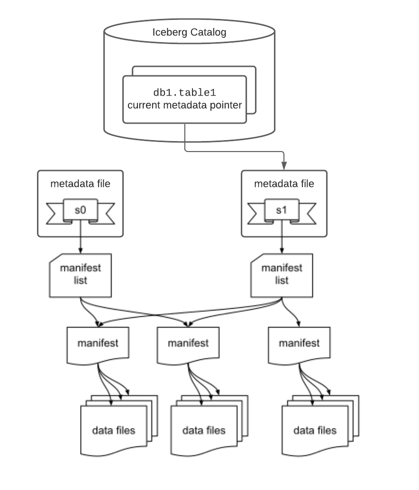

<!--
 - Licensed to the Apache Software Foundation (ASF) under one or more
 - contributor license agreements.  See the NOTICE file distributed with
 - this work for additional information regarding copyright ownership.
 - The ASF licenses this file to You under the Apache License, Version 2.0
 - (the "License"); you may not use this file except in compliance with
 - the License.  You may obtain a copy of the License at
 -
 -   http://www.apache.org/licenses/LICENSE-2.0
 -
 - Unless required by applicable law or agreed to in writing, software
 - distributed under the License is distributed on an "AS IS" BASIS,
 - WITHOUT WARRANTIES OR CONDITIONS OF ANY KIND, either express or implied.
 - See the License for the specific language governing permissions and
 - limitations under the License.
 -->

# Iceberg Table Spec

This is a specification for the Iceberg table format that is designed to manage a large, slow-changing collection of files in a distributed file system or key-value store as a table.

#### Version 1: Analytic Data Tables

**Iceberg format version 1 is the current version**. It defines how to manage large analytic tables using immutable file formats, like Parquet, Avro, and ORC.

#### Version 2: Row-level Deletes

The Iceberg community is currently working on version 2 of the Iceberg format that supports encoding row-level deletes. **The v2 specification is incomplete and may change until it is finished and adopted.** This document includes tentative v2 format requirements, but there are currently no compatibility guarantees with the unfinished v2 spec.

The goal of version 2 is to provide a way to encode row-level deletes. This update can be used to delete or replace individual rows in an immutable data file without rewriting the file.


## Goals

* **Snapshot isolation** -- Reads will be isolated from concurrent writes and always use a committed snapshot of a table’s data. Writes will support removing and adding files in a single operation and are never partially visible. Readers will not acquire locks.
* **Speed** -- Operations will use O(1) remote calls to plan the files for a scan and not O(n) where n grows with the size of the table, like the number of partitions or files.
* **Scale** -- Job planning will be handled primarily by clients and not bottleneck on a central metadata store. Metadata will include information needed for cost-based optimization.
* **Evolution** -- Tables will support full schema and partition spec evolution. Schema evolution supports safe column add, drop, reorder and rename, including in nested structures.
* **Dependable types** -- Tables will provide well-defined and dependable support for a core set of types.
* **Storage separation** -- Partitioning will be table configuration. Reads will be planned using predicates on data values, not partition values. Tables will support evolving partition schemes.
* **Formats** -- Underlying data file formats will support identical schema evolution rules and types. Both read- and write-optimized formats will be available.

## Overview

{.floating}

This table format tracks individual data files in a table instead of directories. This allows writers to create data files in-place and only adds files to the table in an explicit commit.

Table state is maintained in metadata files. All changes to table state create a new metadata file and replace the old metadata with an atomic swap. The table metadata file tracks the table schema, partitioning config, custom properties, and snapshots of the table contents. A snapshot represents the state of a table at some time and is used to access the complete set of data files in the table.

Data files in snapshots are tracked by one or more manifest files that contain a row for each data file in the table, the file's partition data, and its metrics. The data in a snapshot is the union of all files in its manifests. Manifest files are reused across snapshots to avoid rewriting metadata that is slow-changing. Manifests can track data files with any subset of a table and are not associated with partitions.

The manifests that make up a snapshot are stored in a manifest list file. Each manifest list stores metadata about manifests, including partition stats and data file counts. These stats are used to avoid reading manifests that are not required for an operation.

#### MVCC and Optimistic Concurrency

An atomic swap of one table metadata file for another provides serializable isolation. Readers use the snapshot that was current when they load the table metadata and are not affected by changes until they refresh and pick up a new metadata location.

Writers create table metadata files optimistically, assuming that the current version will not be changed before the writer's commit. Once a writer has created an update, it commits by swapping the table’s metadata file pointer from the base version to the new version.

If the snapshot on which an update is based is no longer current, the writer must retry the update based on the new current version. Some operations support retry by re-applying metadata changes and committing, under well-defined conditions. For example, a change that rewrites files can be applied to a new table snapshot if all of the rewritten files are still in the table.

#### File System Operations

Iceberg only requires that file systems support the following operations:

* **In-place write** -- Files are not moved or altered once they are written.
* **Seekable reads** -- Data file formats require seek support.
* **Deletes** -- Tables delete files that are no longer used.

These requirements are compatible with object stores, like S3.

Tables do not require random-access writes. Once written, data and metadata files are immutable until they are deleted.

Tables do not require rename, except for tables that use atomic rename to implement the commit operation for new metadata files.

## Specification

#### Terms

* **Schema** -- Names and types of fields in a table.
* **Partition spec** -- A definition of how partition values are derived from data fields.
* **Snapshot** -- The state of a table at some point in time, including the set of all data files.
* **Manifest** -- A file that lists data files; a subset of a snapshot.
* **Manifest list** -- A file that lists manifest files; one per snapshot.

### Schemas and Data Types

A table's **schema** is a list of named columns. All data types are either primitives or nested types, which are maps, lists, or structs. A table schema is also a struct type.

For the representations of these types in Avro, ORC, and Parquet file formats, see Appendix A.

#### Nested Types

A **`struct`** is a tuple of typed values. Each field in the tuple is named and has an integer id that is unique in the table schema. Each field can be either optional or required, meaning that values can (or cannot) be null. Fields may be any type. Fields may have an optional comment or doc string.

A **`list`** is a collection of values with some element type. The element field has an integer id that is unique in the table schema. Elements can be either optional or required. Element types may be any type.

A **`map`** is a collection of key-value pairs with a key type and a value type. Both the key field and value field each have an integer id that is unique in the table schema. Map keys are required and map values can be either optional or required. Both map keys and map values may be any type, including nested types.

#### Primitive Types

| Primitive type     | Description                                                              | Requirements                                     |
|--------------------|--------------------------------------------------------------------------|--------------------------------------------------|
| **`boolean`**      | True or false                                                            |                                                  |
| **`int`**          | 32-bit signed integers                                                   | Can promote to `long`                            |
| **`long`**         | 64-bit signed integers                                                   |                                                  |
| **`float`**        | [32-bit IEEE 754](https://en.wikipedia.org/wiki/IEEE_754) floating point | Can promote to double                            |
| **`double`**       | [64-bit IEEE 754](https://en.wikipedia.org/wiki/IEEE_754) floating point |                                                  |
| **`decimal(P,S)`** | Fixed-point decimal; precision P, scale S                                | Scale is fixed [1], precision must be 38 or less |
| **`date`**         | Calendar date without timezone or time                                   |                                                  |
| **`time`**         | Time of day without date, timezone                                       | Microsecond precision [2]                        |
| **`timestamp`**    | Timestamp without timezone                                               | Microsecond precision [2]                        |
| **`timestamptz`**  | Timestamp with timezone                                                  | Stored as UTC [2]                                |
| **`string`**       | Arbitrary-length character sequences                                     | Encoded with UTF-8 [3]                           |
| **`uuid`**         | Universally unique identifiers                                           | Should use 16-byte fixed                         |
| **`fixed(L)`**     | Fixed-length byte array of length L                                      |                                                  |
| **`binary`**       | Arbitrary-length byte array                                              |                                                  |

Notes:

1. Decimal scale is fixed and cannot be changed by schema evolution. Precision can only be widened.
2. All time and timestamp values are stored with microsecond precision.
Timestamps _with time zone_ represent a point in time: values are stored as UTC and do not retain a source time zone (`2017-11-16 17:10:34 PST` is stored/retrieved as `2017-11-17 01:10:34 UTC` and these values are considered identical).
Timestamps _without time zone_ represent a date and time of day regardless of zone: the time value is independent of zone adjustments (`2017-11-16 17:10:34` is always retrieved as `2017-11-16 17:10:34`). Timestamp values are stored as a long that encodes microseconds from the unix epoch.
3. Character strings must be stored as UTF-8 encoded byte arrays.

For details on how to serialize a schema to JSON, see Appendix C.


#### Schema Evolution

Schema evolution is limited to type promotion and adding, deleting, and renaming fields in structs (both nested structs and the top-level schema’s struct).

Valid type promotions are:

* `int` to `long`
* `float` to `double`
* `decimal(P, S)` to `decimal(P', S)` if `P' > P` -- widen the precision of decimal types.

Any struct, including a top-level schema, can evolve through deleting fields, adding new fields, renaming existing fields, or promoting a primitive using the valid type promotions. Adding a new field assigns a new ID for that field and for any nested fields. Renaming an existing field must change the name, but not the field ID. Deleting a field removes it from the current schema. Field deletion cannot be rolled back unless the field was nullable or if the current snapshot has not changed.

Grouping a subset of a struct’s fields into a nested struct is **not** allowed, nor is moving fields from a nested struct into its immediate parent struct (`struct<a, b, c> ↔ struct<a, struct<b, c>>`). Evolving primitive types to structs is **not** allowed, nor is evolving a single-field struct to a primitive (`map<string, int> ↔ map<string, struct<int>>`).


### Partitioning

Data files are stored in manifests with a tuple of partition values that are used in scans to filter out files that cannot contain records that match the scan’s filter predicate. Partition values for a data file must be the same for all records stored in the data file. (Manifests store data files from any partition, as long as the partition spec is the same for the data files.)

Tables are configured with a **partition spec** that defines how to produce a tuple of partition values from a record. A partition spec has a list of fields that consist of:

*   A **source column id** from the table’s schema
*   A **partition field id** that is used to identify a partition field, which is unique within a partition spec. In v2 table metadata, it will be unique across all partition specs.
*   A **transform** that is applied to the source column to produce a partition value
*   A **partition name**

The source column, selected by id, must be a primitive type and cannot be contained in a map or list, but may be nested in a struct. For details on how to serialize a partition spec to JSON, see Appendix C.

Partition specs capture the transform from table data to partition values. This is used to transform predicates to partition predicates, in addition to transforming data values. Deriving partition predicates from column predicates on the table data is used to separate the logical queries from physical storage: the partitioning can change and the correct partition filters are always derived from column predicates. This simplifies queries because users don’t have to supply both logical predicates and partition predicates. For more information, see Scan Planning below.


#### Partition Transforms

| Transform         | Description                                                  | Source types                                                                                              | Result type |
|-------------------|--------------------------------------------------------------|-----------------------------------------------------------------------------------------------------------|-------------|
| **`identity`**    | Source value, unmodified                                     | Any                                                                                                       | Source type |
| **`bucket[N]`**   | Hash of value, mod `N` (see below)                           | `int`, `long`, `decimal`, `date`, `time`, `timestamp`, `timestamptz`, `string`, `uuid`, `fixed`, `binary` | `int`       |
| **`truncate[W]`** | Value truncated to width `W` (see below)                     | `int`, `long`, `decimal`, `string`                                                                        | Source type |
| **`year`**        | Extract a date or timestamp year, as years from 1970         | `date`, `timestamp(tz)`                                                                                   | `int`       |
| **`month`**       | Extract a date or timestamp month, as months from 1970-01-01 | `date`, `timestamp(tz)`                                                                                   | `int`       |
| **`day`**         | Extract a date or timestamp day, as days from 1970-01-01     | `date`, `timestamp(tz)`                                                                                   | `date`      |
| **`hour`**        | Extract a timestamp hour, as hours from 1970-01-01 00:00:00  | `timestamp(tz)`                                                                                           | `int`       |

All transforms must return `null` for a `null` input value.


#### Bucket Transform Details

Bucket partition transforms use a 32-bit hash of the source value. The 32-bit hash implementation is the 32-bit Murmur3 hash, x86 variant, seeded with 0.

Transforms are parameterized by a number of buckets [1], `N`. The hash mod `N` must produce a positive value by first discarding the sign bit of the hash value. In pseudo-code, the function is:

```
  def bucket_N(x) = (murmur3_x86_32_hash(x) & Integer.MAX_VALUE) % N
```

Notes:

1. Changing the number of buckets as a table grows is possible by evolving the partition spec.

For hash function details by type, see Appendix B.


#### Truncate Transform Details

| **Type**      | **Config**            | **Truncate specification**                                       | **Examples**                     |
|---------------|-----------------------|------------------------------------------------------------------|----------------------------------|
| **`int`**     | `W`, width            | `v - (v % W)`	remainders must be positive	[1]                    | `W=10`: `1` ￫ `0`, `-1` ￫ `-10`  |
| **`long`**    | `W`, width            | `v - (v % W)`	remainders must be positive	[1]                    | `W=10`: `1` ￫ `0`, `-1` ￫ `-10`  |
| **`decimal`** | `W`, width (no scale) | `scaled_W = decimal(W, scale(v))` `v - (v % scaled_W)`		[1, 2] | `W=50`, `s=2`: `10.65` ￫ `10.50` |
| **`string`**  | `L`, length           | Substring of length `L`: `v.substring(0, L)`                     | `L=3`: `iceberg` ￫ `ice`         |

Notes:

1. The remainder, `v % W`, must be positive. For languages where `%` can produce negative values, the correct truncate function is: `v - (((v % W) + W) % W)`
2. The width, `W`, used to truncate decimal values is applied using the scale of the decimal column to avoid additional (and potentially conflicting) parameters.


### Manifests

A manifest is an immutable Avro file that lists a set of data files, along with each file’s partition data tuple, metrics, and tracking information. One or more manifest files are used to store a snapshot, which tracks all of the files in a table at some point in time.

A manifest is a valid Iceberg data file. Files must use Iceberg schemas and column projection.

A manifest stores files for a single partition spec. When a table’s partition spec changes, old files remain in the older manifest and newer files are written to a new manifest. This is required because a manifest file’s schema is based on its partition spec (see below). This restriction also simplifies selecting files from a manifest because the same boolean expression can be used to select or filter all rows.

The partition spec for a manifest and the current table schema must be stored in the key-value properties of the manifest file. The partition spec is stored as a JSON string under the key `partition-spec`. The table schema is stored as a JSON string under the key `schema`.

The schema of a manifest file is a struct called `manifest_entry` with the following fields:

| Field id, name       | Type                                                      | Description                                                     |
|----------------------|-----------------------------------------------------------|-----------------------------------------------------------------|
| **`0  status`**      | `int` with meaning: `0: EXISTING` `1: ADDED` `2: DELETED` | Used to track additions and deletions                           |
| **`1  snapshot_id`** | `long`                                                    | Snapshot id where the file was added, or deleted if status is 2 |
| **`2  data_file`**   | `data_file` `struct` (see below)                          | File path, partition tuple, metrics, ...                        |

`data_file` is a struct with the following fields:

| Field id, name                    | Type                                  | Description                                                                                                                                                                                          |
|-----------------------------------|---------------------------------------|------------------------------------------------------------------------------------------------------------------------------------------------------------------------------------------------------|
| **`100  file_path`**              | `string`                              | Full URI for the file with FS scheme                                                                                                                                                                 |
| **`101  file_format`**            | `string`                              | String file format name, avro, orc or parquet                                                                                                                                                        |
| **`102  partition`**              | `struct<...>`                         | Partition data tuple, schema based on the partition spec                                                                                                                                             |
| **`103  record_count`**           | `long`                                | Number of records in this file                                                                                                                                                                       |
| **`104  file_size_in_bytes`**     | `long`                                | Total file size in bytes                                                                                                                                                                             |
| ~~**`105 block_size_in_bytes`**~~ | `long`                                | **Deprecated. Always write a default value and do not read.**                                                                                                                                        |
| ~~**`106  file_ordinal`**~~       | `optional int`                        | **Deprecated. Do not use.**                                                                                                                                                                          |
| ~~**`107  sort_columns`**~~       | `optional list`                       | **Deprecated. Do not use.**                                                                                                                                                                          |
| **`108  column_sizes`**           | `optional map`                        | Map from column id to the total size on disk of all regions that store the column. Does not include bytes necessary to read other columns, like footers. Leave null for row-oriented formats (Avro). |
| **`109  value_counts`**           | `optional map`                        | Map from column id to number of values in the column (including null values)                                                                                                                         |
| **`110  null_value_counts`**      | `optional map`                        | Map from column id to number of null values in the column                                                                                                                                            |
| ~~**`111 distinct_counts`**~~     | `optional map`                        | **Deprecated. Do not use.**                                                                                                                                                                          |
| **`125  lower_bounds`**           | `optional map<126: int, 127: binary>` | Map from column id to lower bound in the column serialized as binary [1]. Each value must be less than or equal to all values in the column for the file.                                            |
| **`128  upper_bounds`**           | `optional map<129: int, 130: binary>` | Map from column id to upper bound in the column serialized as binary [1]. Each value must be greater than or equal to all values in the column for the file.                                         |
| **`131  key_metadata`**           | `optional binary`                     | Implementation-specific key metadata for encryption                                                                                                                                                  |
| **`132  split_offsets`**          | `optional list`                       | Split offsets for the data file. For example, all row group offsets in a Parquet file. Must be sorted ascending.                                                                                     |

Notes:

1. Single-value serialization for lower and upper bounds is detailed in Appendix D.

The `partition` struct stores the tuple of partition values for each file. Its type is derived from the partition fields of the partition spec for the manifest file.

Each manifest file must store its partition spec and the current table schema in the Avro file’s key-value metadata. The partition spec is used to transform predicates on the table’s data rows into predicates on the manifest’s partition values during job planning.


#### Manifest Entry Fields

The manifest entry fields are used to keep track of the snapshot in which files were added or logically deleted. The `data_file` struct is nested inside of the manifest entry so that it can be easily passed to job planning without the manifest entry fields.

When a data file is added to the dataset, it’s manifest entry should store the snapshot ID in which the file was added and set status to 1 (added).

When a data file is replaced or deleted from the dataset, it’s manifest entry fields store the snapshot ID in which the file was deleted and status 2 (deleted). The file may be deleted from the file system when the snapshot in which it was deleted is garbage collected, assuming that older snapshots have also been garbage collected [1].

Notes:

1. Technically, data files can be deleted when the last snapshot that contains the file as “live” data is garbage collected. But this is harder to detect and requires finding the diff of multiple snapshots. It is easier to track what files are deleted in a snapshot and delete them when that snapshot expires.

### Snapshots

A snapshot consists of the following fields:

*   **`snapshot-id`** -- A unique long ID.
*   **`parent-snapshot-id`** -- (Optional) The snapshot ID of the snapshot’s parent. This field is not present for snapshots that have no parent snapshot, such as snapshots created before this field was added or the first snapshot of a table.
*   **`sequence-number`** -- A monotonically increasing long that tracks the order of snapshots in a table. (**v2 only**)
*   **`timestamp-ms`** -- A timestamp when the snapshot was created. This is used when garbage collecting snapshots.
*   **`manifests`** -- A list of manifest file locations. The data files in a snapshot are the union of all data files listed in these manifests. (Deprecated in favor of `manifest-list`)
*   **`manifest-list`** -- (Optional) The location of a manifest list file for this snapshot, which contains a list of manifest files with additional metadata. If present, the manifests field must be omitted.
*   **`summary`** -- (Optional) A summary that encodes the `operation` that produced the snapshot and other relevant information specific to that operation. This allows some operations like snapshot expiration to skip processing some snapshots. Possible values of `operation` are:
    *   `append` -- Data files were added and no files were removed.
    *   `replace` -- Data files were rewritten with the same data; i.e., compaction, changing the data file format, or relocating data files.
    *   `overwrite` -- Data files were deleted and added in a logical overwrite operation.
    *   `delete` -- Data files were removed and their contents logically deleted.

Snapshots can be split across more than one manifest. This enables:

*   Appends can add a new manifest to minimize the amount of data written, instead of adding new records by rewriting and appending to an existing manifest. (This is called a “fast append”.)
*   Tables can use multiple partition specs. A table’s partition configuration can evolve if, for example, its data volume changes. Each manifest uses a single partition spec, and queries do not need to change because partition filters are derived from data predicates.
*   Large tables can be split across multiple manifests so that implementations can parallelize job planning or reduce the cost of rewriting a manifest.

Valid snapshots are stored as a list in table metadata. For serialization, see Appendix C.


#### Scan Planning

Scans are planned by reading the manifest files for the current snapshot listed in the table metadata. Deleted entries in a manifest are not included in the scan.

For each manifest, scan predicates, which filter data rows, are converted to partition predicates, which filter data files. These partition predicates are used to select the data files in the manifest. This conversion uses the partition spec used to write the manifest file.

Scan predicates are converted to partition predicates using an inclusive projection: if a scan predicate matches a row, then the partition predicate must match that row’s partition. This is an _inclusive projection_ [1] because rows that do not match the scan predicate may be included in the scan by the partition predicate.

For example, an `events` table with a timestamp column named `ts` that is partitioned by `ts_day=day(ts)` is queried by users with ranges over the timestamp column: `ts > X`. The inclusive projection is `ts_day >= day(X)`, which is used to select files that may have matching rows. Note that, in most cases, timestamps just before `X` will be included in the scan because the file contains rows that match the predicate and rows that do not match the predicate.

Notes:

1. An alternative, *strict projection*, creates a partition predicate that will match a file if all of the rows in the file must match the scan predicate. These projections are used to calculate the residual predicates for each file in a scan.

#### Manifest Lists

Snapshots are embedded in table metadata, but the list of manifests for a snapshot can be stored in a separate manifest list file.

A manifest list encodes extra fields that can be used to avoid scanning all of the manifests in a snapshot when planning a table scan. 

Manifest list files store `manifest_file`, a struct with the following fields:

| Field id, name                 | Type                                   | Description                                                                                                                                          |
|--------------------------------|----------------------------------------|------------------------------------------------------------------------------------------------------------------------------------------------------|
| **`500 manifest_path`**        | `string`                               | Location of the manifest file                                                                                                                        |
| **`501 manifest_length`**      | `long`                                 | Length of the manifest file                                                                                                                          |
| **`502 partition_spec_id`**    | `int`                                  | ID of a partition spec for the table; must be listed in table metadata `partition-specs`                                                             |
| **`503 added_snapshot_id`**    | `long`                                 | ID of the snapshot where the  manifest file was added                                                                                                |
| **`504 added_files_count`**    | `int`                                  | Number of entries in the manifest that have status `ADDED` (1)                                                                                       |
| **`505 existing_files_count`** | `int`                                  | Number of entries in the manifest that have status `EXISTING` (0)                                                                                    |
| **`506 deleted_files_count`**  | `int`                                  | Number of entries in the manifest that have status `DELETED` (2)                                                                                     |
| **`507 partitions`**           | `list<508: field_summary>` (see below) | A list of field summaries for each partition field in the spec. Each field in the list corresponds to a field in the manifest file’s partition spec. |
| **`512 added_rows_count`**     | `long`                                 | Number of rows in all of files in the manifest that have status `ADDED`                                                                              |
| **`513 existing_rows_count`**  | `long`                                 | Number of rows in all of files in the manifest that have status `EXISTING`                                                                           |
| **`514 deleted_rows_count`**   | `long`                                 | Number of rows in all of files in the manifest that have status `DELETED`                                                                            |

`field_summary` is a struct with the following fields

| Field id, name          | Type                    | Description                                                                                 |
|-------------------------|-------------------------|---------------------------------------------------------------------------------------------|
| **`509 contains_null`** | `boolean`               | Whether the manifest contains at least one partition with a null value for the field.       |
| **`510 lower_bound`**   | `optional bytes`    [1] | Lower bound for the non-null values in the partition field, or null if all values are null. |
| **`511 upper_bound`**   | `optional bytes`    [1] | Upper bound for the non-null values in the partition field, or null if all values are null. |

Notes:

1. Lower and upper bounds are serialized to bytes using the single-object serialization in Appendix D. The type of used to encode the value is the type of the partition field data.


### Table Metadata

Table metadata is stored as JSON. Each table metadata change creates a new table metadata file that is committed by an atomic operation. This operation is used to ensure that a new version of table metadata replaces the version on which it was based. This produces a linear history of table versions and ensures that concurrent writes are not lost.

The atomic operation used to commit metadata depends on how tables are tracked and is not standardized by this spec. See the sections below for examples.

#### Table Metadata Fields

Table metadata consists of the following fields:

| Format v1  | Format v2  | Field | Description |
| ---------- | ---------- | ----- | ----------- |
| _required_ | _required_ | **`format-version`** | An integer version number for the format. Currently, this is always 1. Implementations must throw an exception if a table's version is higher than the supported version. |
| _optional_ | _required_ | **`table-uuid`** | A UUID that identifies the table, generated when the table is created. Implementations must throw an exception if a table's UUID does not match the expected UUID after refreshing metadata. |
| _required_ | _required_ | **`location`**| The table's base location. This is used by writers to determine where to store data files, manifest files, and table metadata files. |
| _omitted_  | _required_ | **`sequence-number`**| The table's highest assigned sequence number, a monotonically increasing long that tracks the order of snapshots in a table. |
| _required_ | _required_ | **`last-updated-ms`**| Timestamp in milliseconds from the unix epoch when the table was last updated. Each table metadata file should update this field just before writing. |
| _required_ | _required_ | **`last-column-id`**| An integer; the highest assigned column ID for the table. This is used to ensure columns are always assigned an unused ID when evolving schemas. |
| _required_ | _required_ | **`schema`**| The table’s current schema. |
| _required_ | _omitted_  | **`partition-spec`**| The table’s current partition spec, stored as only fields. Note that this is used by writers to partition data, but is not used when reading because reads use the specs stored in manifest files. (**Deprecated**: use `partition-specs` and `default-spec-id`instead ) |
| _optional_ | _required_ | **`partition-specs`**| A list of partition specs, stored as full partition spec objects. |
| _optional_ | _required_ | **`default-spec-id`**| ID of the “current” spec that writers should use by default. |
| _optional_ | _optional_ | **`properties`**| A string to string map of table properties. This is used to control settings that affect reading and writing and is not intended to be used for arbitrary metadata. For example, `commit.retry.num-retries` is used to control the number of commit retries. |
| _optional_ | _optional_ | **`current-snapshot-id`**| `long` ID of the current table snapshot. |
| _optional_ | _optional_ | **`snapshots`**| A list of valid snapshots. Valid snapshots are snapshots for which all data files exist in the file system. A data file must not be deleted from the file system until the last snapshot in which it was listed is garbage collected. |
| _optional_ | _optional_ | **`snapshot-log`**| A list (optional) of timestamp and snapshot ID pairs that encodes changes to the current snapshot for the table. Each time the current-snapshot-id is changed, a new entry should be added with the last-updated-ms and the new current-snapshot-id. When snapshots are expired from the list of valid snapshots, all entries before a snapshot that has expired should be removed. |

For serialization details, see Appendix C.


#### Commit Conflict Resolution and Retry

When two commits happen at the same time and are based on the same version, only one commit will succeed. In most cases, the failed commit can be applied to the new current version of table metadata and retried. Updates verify the conditions under which they can be applied to a new version and retry if those conditions are met.

*   Append operations have no requirements and can always be applied.
*   Replace operations must verify that the files that will be deleted are still in the table. Examples of replace operations include format changes (replace an Avro file with a Parquet file) and compactions (several files are replaced with a single file that contains the same rows).
*   Delete operations must verify that specific files to delete are still in the table. Delete operations based on expressions can always be applied (e.g., where timestamp < X).
*   Table schema updates and partition spec changes must validate that the schema has not changed between the base version and the current version.


#### File System Tables

An atomic swap can be implemented using atomic rename in file systems that support it, like HDFS or most local file systems [1].

Each version of table metadata is stored in a metadata folder under the table’s base location using a file naming scheme that includes a version number, `V`: `v<V>.metadata.json`. To commit a new metadata version, `V+1`, the writer performs the following steps:

1. Read the current table metadata version `V`.
2. Create new table metadata based on version `V`.
3. Write the new table metadata to a unique file: `<random-uuid>.metadata.json`.
4. Rename the unique file to the well-known file for version `V`: `v<V+1>.metadata.json`.
    1. If the rename succeeds, the commit succeeded and `V+1` is the table’s current version
    2. If the rename fails, go back to step 1.

Notes:

1. The file system table scheme is implemented in [HadoopTableOperations](/javadoc/master/index.html?org/apache/iceberg/hadoop/HadoopTableOperations.html).

#### Metastore Tables

The atomic swap needed to commit new versions of table metadata can be implemented by storing a pointer in a metastore or database that is updated with a check-and-put operation [1]. The check-and-put validates that the version of the table that a write is based on is still current and then makes the new metadata from the write the current version.

Each version of table metadata is stored in a metadata folder under the table’s base location using a naming scheme that includes a version and UUID: `<V>-<uuid>.metadata.json`. To commit a new metadata version, `V+1`, the writer performs the following steps:

2. Create a new table metadata file based on the current metadata.
3. Write the new table metadata to a unique file: `<V+1>-<uuid>.metadata.json`.
4. Request that the metastore swap the table’s metadata pointer from the location of `V` to the location of `V+1`.
    1. If the swap succeeds, the commit succeeded. `V` was still the latest metadata version and the metadata file for `V+1` is now the current metadata.
    2. If the swap fails, another writer has already created `V+1`. The current writer goes back to step 1.

Notes:

1. The metastore table scheme is partly implemented in [BaseMetastoreTableOperations](/javadoc/master/index.html?org/apache/iceberg/BaseMetastoreTableOperations.html).


### Delete Formats

This section details how to encode row-level deletes in Iceberg metadata. Row-level deletes are not supported in the current format version 1. This part of the spec is not yet complete and will be completed as format version 2.

#### Position-based Delete Files

Position-based delete files identify rows in one or more data files that have been deleted.

Position-based delete files store `file_position_delete`, a struct with the following fields:

| Field id, name          | Type                            | Description                                                                                                              |
|-------------------------|---------------------------------|--------------------------------------------------------------------------------------------------------------------------|
| **`1  file_path`**     | `required string`               | The full URI of a data file with FS scheme. This must match the `file_path` of the target data file in a manifest entry.   |
| **`2  position`**      | `required long`                 | The ordinal position of a deleted row in the target data file identified by `file_path`, starting at `0`.                    |

The rows in the delete file must be sorted by `file_path` then `position` to optimize filtering rows while scanning. 

*  Sorting by `file_path` allows filter pushdown by file in columnar storage formats.
*  Sorting by `position` allows filtering rows while scanning, to avoid keeping deletes in memory.

Though the delete files can be written using any supported data file format in Iceberg, it is recommended to write delete files with same file format as the table's file format.


## Appendix A: Format-specific Requirements


### Avro

**Data Type Mappings**

Values should be stored in Avro using the Avro types and logical type annotations in the table below.

Optional fields, array elements, and map values must be wrapped in an Avro `union` with `null`. This is the only union type allowed in Iceberg data files.

Optional fields must always set the Avro field default value to null.

Maps with non-string keys must use an array representation with the `map` logical type. The array representation or Avro’s map type may be used for maps with string keys.

|Type|Avro type|Notes|
|--- |--- |--- |
|**`boolean`**|`boolean`||
|**`int`**|`int`||
|**`long`**|`long`||
|**`float`**|`float`||
|**`double`**|`double`||
|**`decimal(P,S)`**|`{ "type": "fixed",`<br />&nbsp;&nbsp;`"size": minBytesRequired(P),`<br />&nbsp;&nbsp;`"logicalType": "decimal",`<br />&nbsp;&nbsp;`"precision": P,`<br />&nbsp;&nbsp;`"scale": S }`|Stored as fixed using the minimum number of bytes for the given precision.|
|**`date`**|`{ "type": "int",`<br />&nbsp;&nbsp;`"logicalType": "date" }`|Stores days from the 1970-01-01.|
|**`time`**|`{ "type": "long",`<br />&nbsp;&nbsp;`"logicalType": "time-micros" }`|Stores microseconds from midnight.|
|**`timestamp`**|`{ "type": "long",`<br />&nbsp;&nbsp;`"logicalType": "timestamp-micros",`<br />&nbsp;&nbsp;`"adjust-to-utc": false }`|Stores microseconds from 1970-01-01 00:00:00.000000.|
|**`timestamptz`**|`{ "type": "long",`<br />&nbsp;&nbsp;`"logicalType": "timestamp-micros",`<br />&nbsp;&nbsp;`"adjust-to-utc": true }`|Stores microseconds from 1970-01-01 00:00:00.000000 UTC.|
|**`string`**|`string`||
|**`uuid`**|`{ "type": "fixed",`<br />&nbsp;&nbsp;`"size": 16,`<br />&nbsp;&nbsp;`"logicalType": "uuid" }`||
|**`fixed(L)`**|`{ "type": "fixed",`<br />&nbsp;&nbsp;`"size": L }`||
|**`binary`**|`bytes`||
|**`struct`**|`record`||
|**`list`**|`array`||
|**`map`**|`array` of key-value records, or `map` when keys are strings (optional).|Array storage must use logical type name `map` and must store elements that are 2-field records. The first field is a non-null key and the second field is the value.|


**Field IDs**

Iceberg struct, list, and map types identify nested types by ID. When writing data to Avro files, these IDs must be stored in the Avro schema to support ID-based column pruning.

IDs are stored as JSON integers in the following locations:

|ID|Avro schema location|Property|Example|
|--- |--- |--- |--- |
|**Struct field**|Record field object|`field-id`|`{ "type": "record", ...`<br />&nbsp;&nbsp;`"fields": [`<br />&nbsp;&nbsp;&nbsp;&nbsp;`{ "name": "l",`<br />&nbsp;&nbsp;&nbsp;&nbsp;&nbsp;&nbsp;`"type": ["null", "long"],`<br />&nbsp;&nbsp;&nbsp;&nbsp;&nbsp;&nbsp;`"default": null,`<br />&nbsp;&nbsp;&nbsp;&nbsp;&nbsp;&nbsp;`"field-id": 8 }`<br />&nbsp;&nbsp;`] }`|
|**List element**|Array schema object|`element-id`|`{ "type": "array",`<br />&nbsp;&nbsp;`"items": "int",`<br />&nbsp;&nbsp;`"element-id": 9 }`|
|**String map key**|Map schema object|`key-id`|`{ "type": "map",`<br />&nbsp;&nbsp;`"values": "int",`<br />&nbsp;&nbsp;`"key-id": 10,`<br />&nbsp;&nbsp;`"value-id": 11 }`|
|**String map value**|Map schema object|`value-id`||
|**Map key, value**|Key, value fields in the element record.|`field-id`|`{ "type": "array",`<br />&nbsp;&nbsp;`"logicalType": "map",`<br />&nbsp;&nbsp;`"items": {`<br />&nbsp;&nbsp;&nbsp;&nbsp;`"type": "record",`<br />&nbsp;&nbsp;&nbsp;&nbsp;`"name": "k12_v13",`<br />&nbsp;&nbsp;&nbsp;&nbsp;`"fields": [`<br />&nbsp;&nbsp;&nbsp;&nbsp;&nbsp;&nbsp;`{ "name": "key",`<br />&nbsp;&nbsp;&nbsp;&nbsp;&nbsp;&nbsp;&nbsp;&nbsp;`"type": "int",`<br />&nbsp;&nbsp;&nbsp;&nbsp;&nbsp;&nbsp;&nbsp;&nbsp;`"field-id": 12 },`<br />&nbsp;&nbsp;&nbsp;&nbsp;&nbsp;&nbsp;`{ "name": "value",`<br />&nbsp;&nbsp;&nbsp;&nbsp;&nbsp;&nbsp;&nbsp;&nbsp;`"type": "string",`<br />&nbsp;&nbsp;&nbsp;&nbsp;&nbsp;&nbsp;&nbsp;&nbsp;`"field-id": 13 }`<br />&nbsp;&nbsp;&nbsp;&nbsp;`] } }`|

Note that the string map case is for maps where the key type is a string. Using Avro’s map type in this case is optional. Maps with string keys may be stored as arrays.


### Parquet

**Data Type Mappings**

Values should be stored in Parquet using the types and logical type annotations in the table below. Column IDs are required.

Lists must use the [3-level representation](https://github.com/apache/parquet-format/blob/master/LogicalTypes.md#lists).

| Type               | Parquet physical type                                              | Logical type                                | Notes                                                          |
|--------------------|--------------------------------------------------------------------|---------------------------------------------|----------------------------------------------------------------|
| **`boolean`**      | `boolean`                                                          |                                             |                                                                |
| **`int`**          | `int`                                                              |                                             |                                                                |
| **`long`**         | `long`                                                             |                                             |                                                                |
| **`float`**        | `float`                                                            |                                             |                                                                |
| **`double`**       | `double`                                                           |                                             |                                                                |
| **`decimal(P,S)`** | `P <= 9`: `int32`,<br />`P <= 18`: `int64`,<br />`fixed` otherwise | `DECIMAL(P,S)`                              | Fixed must use the minimum number of bytes that can store `P`. |
| **`date`**         | `int32`                                                            | `DATE`                                      | Stores days from the 1970-01-01.                               |
| **`time`**         | `int64`                                                            | `TIME_MICROS` with `adjustToUtc=false`      | Stores microseconds from midnight.                             |
| **`timestamp`**    | `int64`                                                            | `TIMESTAMP_MICROS` with `adjustToUtc=false` | Stores microseconds from 1970-01-01 00:00:00.000000.           |
| **`timestamptz`**  | `int64`                                                            | `TIMESTAMP_MICROS` with `adjustToUtc=true`  | Stores microseconds from 1970-01-01 00:00:00.000000 UTC.       |
| **`string`**       | `binary`                                                           | `UTF8`                                      | Encoding must be UTF-8.                                        |
| **`uuid`**         | `fixed_len_byte_array[16]`                                         | `UUID`                                      |                                                                |
| **`fixed(L)`**     | `fixed_len_byte_array[L]`                                          |                                             |                                                                |
| **`binary`**       | `binary`                                                           |                                             |                                                                |
| **`struct`**       | `group`                                                            |                                             |                                                                |
| **`list`**         | `3-level list`                                                     | `LIST`                                      | See Parquet docs for 3-level representation.                   |
| **`map`**          | `3-level map`                                                      | `MAP`                                       | See Parquet docs for 3-level representation.                   |


### ORC

**Data Type Mappings**

| Type               | ORC type            | ORC type attributes                                  | Notes                                                                                   |
|--------------------|---------------------|------------------------------------------------------|-----------------------------------------------------------------------------------------|
| **`boolean`**      | `boolean`           |                                                      |                                                                                         |
| **`int`**          | `int`               |                                                      | ORC `tinyint` and `smallint` would also map to **`int`**.                               |
| **`long`**         | `long`              |                                                      |                                                                                         |
| **`float`**        | `float`             |                                                      |                                                                                         |
| **`double`**       | `double`            |                                                      |                                                                                         |
| **`decimal(P,S)`** | `decimal`           |                                                      |                                                                                         |
| **`date`**         | `date`              |                                                      |                                                                                         |
| **`time`**         | `long`              | `iceberg.long-type`=`TIME`                           | Stores microseconds from midnight.                                                      |
| **`timestamp`**    | `timestamp`         |                                                      | [1]                                                                                     |
| **`timestamptz`**  | `timestamp_instant` |                                                      | [1]                                                                                     |
| **`string`**       | `string`            |                                                      | ORC `varchar` and `char` would also map to **`string`**.                                |
| **`uuid`**         | `binary`            | `iceberg.binary-type`=`UUID`                         |                                                                                         |
| **`fixed(L)`**     | `binary`            | `iceberg.binary-type`=`FIXED` & `iceberg.length`=`L` | The length would not be checked by the ORC reader and should be checked by the adapter. |
| **`binary`**       | `binary`            |                                                      |                                                                                         |
| **`struct`**       | `struct`            |                                                      |                                                                                         |
| **`list`**         | `array`             |                                                      |                                                                                         |
| **`map`**          | `map`               |                                                      |                                                                                         |

Notes:

1. ORC's [TimestampColumnVector](https://orc.apache.org/api/hive-storage-api/org/apache/hadoop/hive/ql/exec/vector/TimestampColumnVector.html) comprises of a time field (milliseconds since epoch) and a nanos field (nanoseconds within the second). Hence the milliseconds within the second are reported twice; once in the time field and again in the nanos field. The read adapter should only use milliseconds within the second from one of these fields. The write adapter should also report milliseconds within the second twice; once in the time field and again in the nanos field. ORC writer is expected to correctly consider millis information from one of the fields. More details at https://issues.apache.org/jira/browse/ORC-546

One of the interesting challenges with this is how to map Iceberg’s schema evolution (id based) on to ORC’s (name based). In theory, we could use Iceberg’s column ids as the column and field names, but that would suck from a user’s point of view. 

The column IDs must be stored in ORC type attributes using the key `iceberg.id`, and `iceberg.required` to store `"true"` if the Iceberg column is required, otherwise it will be optional.

Iceberg would build the desired reader schema with their schema evolution rules and pass that down to the ORC reader, which would then use its schema evolution to map that to the writer’s schema. Basically, Iceberg would need to change the names of columns and fields to get the desired mapping.

|Iceberg writer|ORC writer|Iceberg reader|ORC reader|
|--- |--- |--- |--- |
|`struct<a (1): int, b (2): string>`|`struct<a: int, b: string>`|`struct<a (2): string, c (3): date>`|`struct<b: string, c: date>`|
|`struct<a (1): struct<b (2): string, c (3): date>>`|`struct<a: struct<b:string, c:date>>`|`struct<aa (1): struct<cc (3): date, bb (2): string>>`|`struct<a: struct<c:date, b:string>>`|

## Appendix B: 32-bit Hash Requirements

The 32-bit hash implementation is 32-bit Murmur3 hash, x86 variant, seeded with 0.

| Primitive type     | Hash specification                        | Test value                                 |
|--------------------|-------------------------------------------|--------------------------------------------|
| **`int`**          | `hashLong(long(v))`			[1]          | `34` ￫ `2017239379`                        |
| **`long`**         | `hashBytes(littleEndianBytes(v))`         | `34L` ￫ `2017239379`                       |
| **`decimal(P,S)`** | `hashBytes(minBigEndian(unscaled(v)))`[2] | `14.20` ￫ `-500754589`                     |
| **`date`**         | `hashInt(daysFromUnixEpoch(v))`           | `2017-11-16` ￫ `-653330422`                |
| **`time`**         | `hashLong(microsecsFromMidnight(v))`      | `22:31:08` ￫ `-662762989`                  |
| **`timestamp`**    | `hashLong(microsecsFromUnixEpoch(v))`     | `2017-11-16T22:31:08` ￫ `-2047944441`      |
| **`timestamptz`**  | `hashLong(microsecsFromUnixEpoch(v))`     | `2017-11-16T14:31:08-08:00`￫ `-2047944441` |
| **`string`**       | `hashBytes(utf8Bytes(v))`                 | `iceberg` ￫ `1210000089`                   |
| **`uuid`**         | `hashBytes(uuidBytes(v))`		[3]      | `f79c3e09-677c-4bbd-a479-3f349cb785e7` ￫ `1488055340`               |
| **`fixed(L)`**     | `hashBytes(v)`                            | `00 01 02 03` ￫ `188683207`                |
| **`binary`**       | `hashBytes(v)`                            | `00 01 02 03` ￫ `188683207`                |

The types below are not currently valid for bucketing, and so are not hashed. However, if that changes and a hash value is needed, the following table shall apply:

| Primitive type     | Hash specification                        | Test value                                 |
|--------------------|-------------------------------------------|--------------------------------------------|
| **`boolean`**      | `false: hashInt(0)`, `true: hashInt(1)`   | `true` ￫ `1392991556`                      |
| **`float`**        | `hashDouble(double(v))`         [4]       | `1.0F` ￫ `-142385009`                      |
| **`double`**       | `hashLong(doubleToLongBits(v))`           | `1.0D` ￫ `-142385009`                      |

Notes:

1. Integer and long hash results must be identical for all integer values. This ensures that schema evolution does not change bucket partition values if integer types are promoted.
2. Decimal values are hashed using the minimum number of bytes required to hold the unscaled value as a two’s complement big-endian; this representation does not include padding bytes required for storage in a fixed-length array.
Hash results are not dependent on decimal scale, which is part of the type, not the data value.
3. UUIDs are encoded using big endian. The test UUID for the example above is: `f79c3e09-677c-4bbd-a479-3f349cb785e7`. This UUID encoded as a byte array is:
`F7 9C 3E 09 67 7C 4B BD A4 79 3F 34 9C B7 85 E7`
4. Float hash values are the result of hashing the float cast to double to ensure that schema evolution does not change hash values if float types are promoted.


## Appendix C: JSON serialization


### Schemas

Schemas are serialized to JSON as a struct. Types are serialized according to this table:

|Type|JSON representation|Example|
|--- |--- |--- |
|**`boolean`**|`JSON string: "boolean"`|`"boolean"`|
|**`int`**|`JSON string: "int"`|`"int"`|
|**`long`**|`JSON string: "long"`|`"long"`|
|**`float`**|`JSON string: "float"`|`"float"`|
|**`double`**|`JSON string: "double"`|`"double"`|
|**`date`**|`JSON string: "date"`|`"date"`|
|**`time`**|`JSON string: "time"`|`"time"`|
|**`timestamp without zone`**|`JSON string: "timestamp"`|`"timestamp"`|
|**`timestamp with zone`**|`JSON string: "timestamptz"`|`"timestamptz"`|
|**`string`**|`JSON string: "string"`|`"string"`|
|**`uuid`**|`JSON string: "uuid"`|`"uuid"`|
|**`fixed(L)`**|`JSON string: "fixed[<L>]"`|`"fixed[16]"`|
|**`binary`**|`JSON string: "binary"`|`"binary"`|
|**`decimal(P, S)`**|`JSON string: "decimal(<P>,<S>)"`|`"decimal(9,2)"`,<br />`"decimal(9, 2)"`|
|**`struct`**|`JSON object: {`<br />&nbsp;&nbsp;`"type": "struct",`<br />&nbsp;&nbsp;`"fields": [ {`<br />&nbsp;&nbsp;&nbsp;&nbsp;`"id": <field id int>,`<br />&nbsp;&nbsp;&nbsp;&nbsp;`"name": <name string>,`<br />&nbsp;&nbsp;&nbsp;&nbsp;`"required": <boolean>,`<br />&nbsp;&nbsp;&nbsp;&nbsp;`"type": <type JSON>,`<br />&nbsp;&nbsp;&nbsp;&nbsp;`"doc": <comment string>`<br />&nbsp;&nbsp;&nbsp;&nbsp;`}, ...`<br />&nbsp;&nbsp;`] }`|`{`<br />&nbsp;&nbsp;`"type": "struct",`<br />&nbsp;&nbsp;`"fields": [ {`<br />&nbsp;&nbsp;&nbsp;&nbsp;`"id": 1,`<br />&nbsp;&nbsp;&nbsp;&nbsp;`"name": "id",`<br />&nbsp;&nbsp;&nbsp;&nbsp;`"required": true,`<br />&nbsp;&nbsp;&nbsp;&nbsp;`"type": "uuid"`<br />&nbsp;&nbsp;`}, {`<br />&nbsp;&nbsp;&nbsp;&nbsp;`"id": 2,`<br />&nbsp;&nbsp;&nbsp;&nbsp;`"name": "data",`<br />&nbsp;&nbsp;&nbsp;&nbsp;`"required": false,`<br />&nbsp;&nbsp;&nbsp;&nbsp;`"type": {`<br />&nbsp;&nbsp;&nbsp;&nbsp;&nbsp;&nbsp;`"type": "list",`<br />&nbsp;&nbsp;&nbsp;&nbsp;&nbsp;&nbsp;`...`<br />&nbsp;&nbsp;&nbsp;&nbsp;`}`<br />&nbsp;&nbsp;`} ]`<br />`}`|
|**`list`**|`JSON object: {`<br />&nbsp;&nbsp;`"type": "list",`<br />&nbsp;&nbsp;`"element-id": <id int>,`<br />&nbsp;&nbsp;`"element-required": <bool>`<br />&nbsp;&nbsp;`"element": <type JSON>`<br />`}`|`{`<br />&nbsp;&nbsp;`"type": "list",`<br />&nbsp;&nbsp;`"element-id": 3,`<br />&nbsp;&nbsp;`"element-required": true,`<br />&nbsp;&nbsp;`"element": "string"`<br />`}`|
|**`map`**|`JSON object: {`<br />&nbsp;&nbsp;`"type": "map",`<br />&nbsp;&nbsp;`"key-id": <key id int>,`<br />&nbsp;&nbsp;`"key": <type JSON>,`<br />&nbsp;&nbsp;`"value-id": <val id int>,`<br />&nbsp;&nbsp;`"value-required": <bool>`<br />&nbsp;&nbsp;`"value": <type JSON>`<br />`}`|`{`<br />&nbsp;&nbsp;`"type": "map",`<br />&nbsp;&nbsp;`"key-id": 4,`<br />&nbsp;&nbsp;`"key": "string",`<br />&nbsp;&nbsp;`"value-id": 5,`<br />&nbsp;&nbsp;`"value-required": false,`<br />&nbsp;&nbsp;`"value": "double"`<br />`}`|


### Partition Specs

Partition specs are serialized as a JSON object with the following fields:

|Field|JSON representation|Example|
|--- |--- |--- |
|**`spec-id`**|`JSON int`|`0`|
|**`fields`**|`JSON list: [`<br />&nbsp;&nbsp;`<partition field JSON>,`<br />&nbsp;&nbsp;`...`<br />`]`|`[ {`<br />&nbsp;&nbsp;`"source-id": 4,`<br />&nbsp;&nbsp;`"field-id": 1000,`<br />&nbsp;&nbsp;`"name": "ts_day",`<br />&nbsp;&nbsp;`"transform": "day"`<br />`}, {`<br />&nbsp;&nbsp;`"source-id": 1,`<br />&nbsp;&nbsp;`"field-id": 1001,`<br />&nbsp;&nbsp;`"name": "id_bucket",`<br />&nbsp;&nbsp;`"transform": "bucket[16]"`<br />`} ]`|

Each partition field in the fields list is stored as an object. See the table for more detail:

|Transform or Field|JSON representation|Example|
|--- |--- |--- |
|**`identity`**|`JSON string: "identity"`|`"identity"`|
|**`bucket[N]`**|`JSON string: "bucket<N>]"`|`"bucket[16]"`|
|**`truncate[W]`**|`JSON string: "truncate[<W>]"`|`"truncate[20]"`|
|**`year`**|`JSON string: "year"`|`"year"`|
|**`month`**|`JSON string: "month"`|`"month"`|
|**`day`**|`JSON string: "day"`|`"day"`|
|**`hour`**|`JSON string: "hour"`|`"hour"`|
|**`Partition Field`**|`JSON object: {`<br />&nbsp;&nbsp;`"source-id": <id int>,`<br />&nbsp;&nbsp;`"field-id": <field id int>,`<br />&nbsp;&nbsp;`"name": <name string>,`<br />&nbsp;&nbsp;`"transform": <transform JSON>`<br />`}`|`{`<br />&nbsp;&nbsp;`"source-id": 1,`<br />&nbsp;&nbsp;`"field-id": 1000,`<br />&nbsp;&nbsp;`"name": "id_bucket",`<br />&nbsp;&nbsp;`"transform": "bucket[16]"`<br />`}`|

In some cases partition specs are stored using only the field list instead of the object format that includes the spec ID, like the deprecated `partition-spec` field in table metadata. The object format should be used unless otherwise noted in this spec.


### Table Metadata and Snapshots

Table metadata is serialized as a JSON object according to the following table. Snapshots are not serialized separately. Instead, they are stored in the table metadata JSON.

|Metadata field|JSON representation|Example|
|--- |--- |--- |
|**`format-version`**|`JSON int`|`1`|
|**`table-uuid`**|`JSON string`|`"fb072c92-a02b-11e9-ae9c-1bb7bc9eca94"`|
|**`location`**|`JSON string`|`"s3://b/wh/data.db/table"`|
|**`last-updated-ms`**|`JSON long`|`1515100955770`|
|**`last-column-id`**|`JSON int`|`22`|
|**`schema`**|`JSON schema (object)`|`See above`|
|**`partition-spec`**|`JSON partition fields (list)`|`See above, read partition-specs instead`|
|**`partition-specs`**|`JSON partition specs (list of objects)`|`See above`|
|**`default-spec-id`**|`JSON int`|`0`|
|**`properties`**|`JSON object: {`<br />&nbsp;&nbsp;`"<key>": "<val>",`<br />&nbsp;&nbsp;`...`<br />`}`|`{`<br />&nbsp;&nbsp;`"write.format.default": "avro",`<br />&nbsp;&nbsp;`"commit.retry.num-retries": "4"`<br />`}`|
|**`current-snapshot-id`**|`JSON long`|`3051729675574597004`|
|**`snapshots`**|`JSON list of objects: [ {`<br />&nbsp;&nbsp;`"snapshot-id": <id>,`<br />&nbsp;&nbsp;`"timestamp-ms": <timestamp-in-ms>,`<br />&nbsp;&nbsp;`"summary": {`<br />&nbsp;&nbsp;&nbsp;&nbsp;`"operation": <operation>,`<br />&nbsp;&nbsp;&nbsp;&nbsp;`... },`<br />&nbsp;&nbsp;`"manifest-list": "<location>"`<br />&nbsp;&nbsp;`},`<br />&nbsp;&nbsp;`...`<br />`]`|`[ {`<br />&nbsp;&nbsp;`"snapshot-id": 3051729675574597004,`<br />&nbsp;&nbsp;`"timestamp-ms": 1515100955770,`<br />&nbsp;&nbsp;`"summary": {`<br />&nbsp;&nbsp;&nbsp;&nbsp;`"operation": "append"`<br />&nbsp;&nbsp;`},`<br />&nbsp;&nbsp;`"manifest-list": "s3://b/wh/.../s1.avro"`<br />`} ]`|
|**`snapshot-log`**|`JSON list of objects: [`<br />&nbsp;&nbsp;`{`<br />&nbsp;&nbsp;`"snapshot-id": ,`<br />&nbsp;&nbsp;`"timestamp-ms": `<br />&nbsp;&nbsp;`},`<br />&nbsp;&nbsp;`...`<br />`]`|`[ {`<br />&nbsp;&nbsp;`"snapshot-id": 30517296...,`<br />&nbsp;&nbsp;`"timestamp-ms": 1515100...`<br />`} ]`|


## Appendix D: Single-value serialization

This serialization scheme is for storing single values as individual binary values in the lower and upper bounds maps of manifest files.

| Type                         | Binary serialization                                                                                         |
|------------------------------|--------------------------------------------------------------------------------------------------------------|
| **`boolean`**                | `0x00` for false, non-zero byte for true                                                                     |
| **`int`**                    | Stored as 4-byte little-endian                                                                               |
| **`long`**                   | Stored as 8-byte little-endian                                                                               |
| **`float`**                  | Stored as 4-byte little-endian                                                                               |
| **`double`**                 | Stored as 8-byte little-endian                                                                               |
| **`date`**                   | Stores days from the 1970-01-01 in an 4-byte little-endian int                                               |
| **`time`**                   | Stores microseconds from midnight in an 8-byte little-endian long                                            |
| **`timestamp without zone`** | Stores microseconds from 1970-01-01 00:00:00.000000 in an 8-byte little-endian long                          |
| **`timestamp with zone`**    | Stores microseconds from 1970-01-01 00:00:00.000000 UTC in an 8-byte little-endian long                      |
| **`string`**                 | UTF-8 bytes (without length)                                                                                 |
| **`uuid`**                   | 16-byte big-endian value, see example in Appendix B                                                          |
| **`fixed(L)`**               | Binary value                                                                                                 |
| **`binary`**                 | Binary value (without length)                                                                                |
| **`decimal(P, S)`**          | Stores unscaled value as two’s-complement big-endian binary, using the minimum number of bytes for the value |
| **`struct`**                 | Not supported                                                                                                |
| **`list`**                   | Not supported                                                                                                |
| **`map`**                    | Not supported                                                                                                |


## Format version changes

### Version 2

Writing v1 metadata:
* Table metadata field `last-sequence-number` should not be written.
* Snapshot field `sequence-number` should not be written.

Reading v1 metadata:
* Table metadata field `last-sequence-number` must default to 0.
* Snapshot field `sequence-number` must default to 0.

Writing v2 metadata:
* Table metadata added required field `last-sequence-number`.
* Table metadata now requires field `table-uuid`.
* Table metadata now requires field `partition-specs`.
* Table metadata now requires field `default-spec-id`.
* Table metadata field `partition-spec` is no longer required and may be omitted.
* Snapshot added required field field `sequence-number`.
* Snapshot now requires field `manifest-list`.
* Snapshot field `manifests` is no longer allowed.

Note that these requirements apply when writing data to a v2 table. Tables that are upgraded from v1 may contain metadata that does not follow these requirements. Implementations should remain backward-compatible with v1 metadata requirements.
